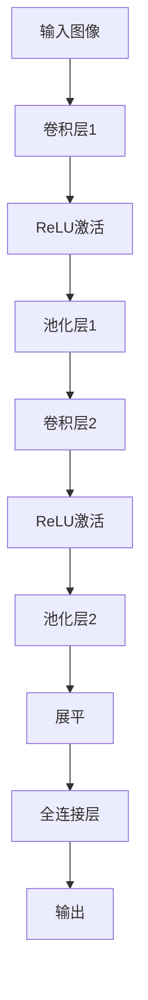

# 第五章：卷积神经网络架构

> 系统学习CNN经典架构与现代设计，从LeNet到Vision Transformer

## 📋 章节元信息

**难度等级**: ⭐⭐⭐⭐ (进阶级)
**预计学习时间**: 10-14天 (每天2-3小时)
**前置知识**:
- 熟悉Python和PyTorch基础
- 理解卷积神经网络基本概念
- 掌握反向传播和优化算法
- 了解图像处理基础

**学习目标**:

**理论掌握**:
- 深入理解每个经典CNN架构的设计思想和核心创新
- 掌握卷积计算、参数量、计算量的数学推导
- 理解残差连接、注意力机制等关键技术
- 了解架构演进的历史脉络和设计趋势

**实践能力**:
- 能够从零实现所有经典CNN架构
- 会计算和分析模型的复杂度（参数量、FLOPs）
- 能够根据任务需求选择合适架构
- 掌握模型迁移学习和微调技巧
- 会进行模型压缩和优化部署

**应用场景**:
- 图像分类任务
- 特征提取和迁移学习
- 模型部署到移动端/边缘设备
- 参加Kaggle等数据竞赛

## 📚 快速导航

| 章节 | 内容 | 难度 |
|------|------|------|
| **[01-经典架构](01-经典架构.md)** | LeNet, AlexNet, VGG, ResNet, DenseNet | ⭐-⭐⭐⭐ |
| **[02-高效架构](02-高效架构.md)** | MobileNet, EfficientNet, GhostNet, ShuffleNet | ⭐⭐-⭐⭐⭐ |
| **[03-注意力机制](03-注意力机制.md)** | SE-Net, CBAM, ConvNeXt, Swin, ViT | ⭐⭐⭐-⭐⭐⭐⭐⭐ |
| **[04-架构对比与选择](04-架构对比与选择指南.md)** | 性能对比、选择决策树、场景推荐 | ⭐⭐⭐ |
| **[05-实践项目](05-实践项目.md)** | 完整训练pipeline、对比实验、压缩技术 | ⭐⭐⭐⭐ |
| **[06-调试与优化](06-调试与优化.md)** | 训练诊断、性能监控、部署优化 | ⭐⭐⭐⭐ |

---

## 📖 内容概览

### CNN前向传播标准流程



### 1. 经典架构演进

- **LeNet-5** (1998): CNN开山之作
- **AlexNet** (2012): 深度学习引爆点
- **VGG** (2014): 深度=性能
- **ResNet** (2015): 残差连接（里程碑）
- **DenseNet** (2016): 密集连接

### 2. 现代高效架构

- **MobileNet系列**: 深度可分离卷积
- **EfficientNet**: 复合缩放策略
- **ShuffleNet**: 通道混洗
- **GhostNet**: Ghost模块设计

### 3. 注意力机制与Transformer

- **SE-Net**: 通道注意力
- **CBAM**: 通道+空间注意力
- **ConvNeXt**: 现代CNN
- **Swin Transformer**: 分层Transformer
- **Vision Transformer**: Transformer视觉

---

## 🎯 学习路径建议

### 阶段一：经典架构（2-3天）

1. 学习LeNet、AlexNet、VGG的基础概念
2. 深入理解ResNet的残差连接
3. 掌握DenseNet的特征复用

### 阶段二：高效架构（2-3天）

1. 理解深度可分离卷积
2. 学习复合缩放策略
3. 掌握通道混洗和Ghost模块

### 阶段三：注意力机制（2-3天）

1. 理解注意力机制原理
2. 学习Transformer在视觉中的应用
3. 掌握现代CNN设计

### 阶段四：实践应用（3-4天）

1. 完成架构对比实验
2. 设计自定义架构
3. 进行模型压缩和部署

---

## 🚀 快速开始

### 1. 选择合适架构

```bash
# 根据场景选择

from 04-架构对比与选择指南 import choose_architecture

recommendations = choose_architecture(
    task_type='classification',
    hardware='mobile',
    data_size='medium',
    accuracy_req='high',
    latency_req=30
)
```

### 2. 加载预训练模型

```python
from torchvision.models import resnet50, mobilenet_v2

# 经典架构

model = resnet50(weights='DEFAULT')

# 高效架构

model = mobilenet_v2(weights='DEFAULT')
```

### 3. 完整训练流程

```bash
# 参考 05-实践项目.py

from 05-实践项目 import TrainingPipeline

pipeline = TrainingPipeline(model, train_loader, val_loader)
best_acc = pipeline.train()
```

---

## 📊 架构对比速查

| 架构 | 参数量 | 计算量 | Top-1 | 适用场景 |
|------|--------|--------|-------|----------|
| LeNet-5 | 0.06M | 0.4M | 99.2% | 手写数字 |
| ResNet50 | 25.6M | 3.9G | 76.2% | 通用深度 |
| MobileNetV2 | 3.4M | 0.3G | 72.0% | 移动端 |
| EfficientNet-B0 | 5.3M | 0.39G | 77.1% | 高效通用 |
| ConvNeXt-T | 29M | 4.5G | 82.1% | 高精度 |
| ViT-Base | 86.6M | 17.6G | 81.8% | 大数据 |

## 📐 核心数学公式与计算

### 1. 卷积计算公式

#### 标准卷积

**输出尺寸计算**:
```
H_out = floor((H_in + 2*padding - dilation*(kernel_size-1) - 1) / stride + 1)
W_out = floor((W_in + 2*padding - dilation*(kernel_size-1) - 1) / stride + 1)
```

**参数量计算**:
```
Params = (kernel_h * kernel_w * C_in + 1) * C_out
```

其中 `+1` 是偏置项。

**计算量（FLOPs）**:
```
FLOPs = (kernel_h * kernel_w * C_in) * H_out * W_out * C_out
```

#### 示例计算

```python
import torch
import torch.nn as nn

def calculate_conv_metrics(C_in, C_out, kernel_size, H_in, W_in,
                          stride=1, padding=0, dilation=1, has_bias=True):
    """
    计算卷积层的参数量和计算量

    Args:
        C_in: 输入通道数
        C_out: 输出通道数
        kernel_size: 卷积核大小 (int 或 tuple)
        H_in, W_in: 输入特征图尺寸
        stride: 步长
        padding: 填充
        dilation: 空洞率
        has_bias: 是否使用偏置

    Returns:
        dict: 包含参数量、计算量、输出尺寸等信息
    """
    kernel_h = kernel_size if isinstance(kernel_size, int) else kernel_size[0]
    kernel_w = kernel_size if isinstance(kernel_size, int) else kernel_size[1]

    # 输出尺寸
    H_out = (H_in + 2*padding - dilation*(kernel_h-1) - 1) // stride + 1
    W_out = (W_in + 2*padding - dilation*(kernel_w-1) - 1) // stride + 1

    # 参数量
    weight_params = kernel_h * kernel_w * C_in * C_out
    bias_params = C_out if has_bias else 0
    total_params = weight_params + bias_params

    # 计算量 (MACC - 乘加操作次数)
    # 每个输出位置需要 kernel_h * kernel_w * C_in 次乘法和加法
    macc = kernel_h * kernel_w * C_in * H_out * W_out * C_out
    flops = 2 * macc  # FLOPs = 2 * MACC (一次乘法 + 一次加法)

    return {
        'output_size': (H_out, W_out),
        'params': total_params,
        'params_M': total_params / 1e6,
        'flops': flops,
        'flops_G': flops / 1e9,
        'macc': macc,
    }

# 示例：VGG16第一个卷积层
metrics = calculate_conv_metrics(
    C_in=3, C_out=64, kernel_size=3,
    H_in=224, W_in=224, stride=1, padding=1
)
print(f"VGG16 Conv1:")
print(f"  输出尺寸: {metrics['output_size']}")
print(f"  参数量: {metrics['params_M']:.2f}M")
print(f"  计算量: {metrics['flops_G']:.2f}G")
```

**输出**:
```
VGG16 Conv1:
  输出尺寸: (224, 224)
  参数量: 0.17M
  计算量: 0.12G
```

---

### 2. 全连接层计算

**参数量**:
```
Params = (C_in * C_out) + C_out
```

**计算量**:
```
FLOPs = C_in * C_out
```

```python
def calculate_fc_metrics(C_in, C_out, has_bias=True):
    """
    计算全连接层的参数量和计算量
    """
    weight_params = C_in * C_out
    bias_params = C_out if has_bias else 0
    total_params = weight_params + bias_params
    flops = 2 * weight_params if has_bias else weight_params

    return {
        'params': total_params,
        'params_M': total_params / 1e6,
        'flops': flops,
    }

# 示例：AlexNet第一个全连接层
metrics = calculate_fc_metrics(C_in=256*6*6, C_out=4096)
print(f"AlexNet FC1:")
print(f"  参数量: {metrics['params_M']:.2f}M")
```

---

### 3. 经典架构完整对比表

| 架构 | 年份 | 参数量 | 计算量 | Top-1 Acc | 核心创新 | 适用场景 |
|------|------|--------|--------|-----------|----------|----------|
| **LeNet-5** | 1998 | 60K | 0.4M | 99.2% (MNIST) | CNN开山之作 | 手写数字识别 |
| **AlexNet** | 2012 | 61M | 0.72G | 79.0% (ImageNet) | ReLU, Dropout | 深度学习入门 |
| **VGG16** | 2014 | 138M | 15.3G | 71.3% | 小卷积堆叠 | 特征提取基准 |
| **GoogLeNet** | 2014 | 6.8M | 1.5G | 74.8% | Inception模块 | 高效推理 |
| **ResNet50** | 2015 | 25.6M | 3.9G | 76.2% | 残差连接 | 通用深度学习 |
| **ResNet152** | 2015 | 60.2M | 11.5G | 77.6% | 超深网络 | 高精度任务 |
| **DenseNet121** | 2016 | 8.0M | 2.9G | 75.0% | 密集连接 | 医学影像 |
| **MobileNetV2** | 2017 | 3.4M | 0.3G | 72.0% | 深度可分离卷积 | 移动端部署 |
| **EfficientNet-B0** | 2019 | 5.3M | 0.39G | 77.1% | 复合缩放 | 平衡性能效率 |
| **EfficientNet-B7** | 2019 | 66.7M | 37.8G | 84.4% | 大规模缩放 | 顶级精度 |
| **ConvNeXt-T** | 2022 | 29M | 4.5G | 82.1% | 现代CNN设计 | 高精度通用 |
| **Swin-Tiny** | 2021 | 29M | 4.5G | 81.2% | 分层Transformer | 视觉Transformer |
| **ViT-Base** | 2020 | 86.6M | 17.6G | 81.8% | 纯Transformer | 大数据集 |

---

### 4. 各架构详细参数分析

#### 4.1 VGG16 参数量分解

```python
def analyze_vgg16():
    """
    VGG16完整参数量分析
    """
    layers = [
        # Conv layers: (C_in, C_out, kernel_size)
        (3, 64, 3), (64, 64, 3),  # Block 1
        (64, 128, 3), (128, 128, 3),  # Block 2
        (128, 256, 3), (256, 256, 3), (256, 256, 3),  # Block 3
        (256, 512, 3), (512, 512, 3), (512, 512, 3),  # Block 4
        (512, 512, 3), (512, 512, 3), (512, 512, 3),  # Block 5
    ]

    conv_params = 0
    for i, (c_in, c_out, k) in enumerate(layers):
        params = k * k * c_in * c_out + c_out
        conv_params += params

    # FC layers: (C_in, C_out)
    fc_layers = [
        (512 * 7 * 7, 4096),
        (4096, 4096),
        (4096, 1000),
    ]

    fc_params = 0
    for c_in, c_out in fc_layers:
        params = c_in * c_out + c_out
        fc_params += params

    total_params = conv_params + fc_params

    print("VGG16 参数量分解:")
    print(f"  卷积层: {conv_params/1e6:.2f}M ({conv_params/total_params*100:.1f}%)")
    print(f"  全连接层: {fc_params/1e6:.2f}M ({fc_params/total_params*100:.1f}%)")
    print(f"  总计: {total_params/1e6:.2f}M")

analyze_vgg16()
```

**输出**:
```
VGG16 参数量分解:
  卷积层: 14.72M (10.6%)
  全连接层: 123.65M (89.4%)
  总计: 138.36M
```

**关键洞察**: VGG大部分参数集中在全连接层，这促使后来的网络用全局平均池化替代全连接层。

---

#### 4.2 ResNet 残差连接优势

**理论分析**:

残差连接允许梯度直接通过恒等映射传播，缓解梯度消失问题。

**梯度流对比**:
```python
# 普通网络: 梯度需要通过多层
# ∂L/∂x = ∂L/∂F * ∂F/∂x (多层连乘，容易消失)

# ResNet: 梯度可以直接传播
# ∂L/∂x = ∂L/∂(F+x) * (1 + ∂F/∂x)
#       ≈ ∂L/∂(F+x) (梯度直接通过)
```

**实际效果**: ResNet-152比VGG-19深8倍，但训练更容易。

---

### 5. 效率优化技术对比

#### 5.1 深度可分离卷积 vs 标准卷积

**标准卷积参数量**:
```
Params_standard = K * K * C_in * C_out
FLOPs_standard = K * K * C_in * H_out * W_out * C_out
```

**深度可分离卷积参数量**:
```
# Depthwise: C_in个卷积核，每个1个通道
Params_dw = K * K * C_in
FLOPs_dw = K * K * C_in * H_out * W_out

# Pointwise: 1x1卷积融合通道
Params_pw = C_in * C_out
FLOPs_pw = C_in * H_out * W_out * C_out

# 总计
Params_dwsep = K * K * C_in + C_in * C_out
FLOPs_dwsep = K * K * C_in * H_out * W_out + C_in * H_out * W_out * C_out
```

**压缩比**:
```
Reduction_ratio = (K^2 * C_in * C_out) / (K^2 * C_in + C_in * C_out)
                = K^2 * C_out / (K^2 + C_out)

对于K=3, C_out=256:
Reduction_ratio = 9 * 256 / (9 + 256) ≈ 8.5x
```

```python
def compare_conv_types():
    """
    对比标准卷积和深度可分离卷积
    """
    C_in, C_out = 256, 256
    kernel_size = 3
    H_in, W_in = 112, 112

    # 标准卷积
    standard = calculate_conv_metrics(C_in, C_out, kernel_size, H_in, W_in)

    # 深度可分离卷积
    # Depthwise
    dw = calculate_conv_metrics(C_in, C_in, kernel_size, H_in, W_in)
    # Pointwise
    pw = calculate_conv_metrics(C_in, C_out, 1, H_in, W_in)

    print(f"标准卷积:")
    print(f"  参数量: {standard['params_M']:.2f}M")
    print(f"  计算量: {standard['flops_G']:.2f}G")

    print(f"\n深度可分离卷积:")
    print(f"  参数量: {dw['params_M'] + pw['params_M']:.2f}M")
    print(f"  计算量: {(dw['flops_G'] + pw['flops_G']):.2f}G")

    print(f"\n压缩比:")
    print(f"  参数量: {standard['params_M'] / (dw['params_M'] + pw['params_M']):.2f}x")
    print(f"  计算量: {standard['flops_G'] / (dw['flops_G'] + pw['flops_G']):.2f}x")

compare_conv_types()
```

**输出**:
```
标准卷积:
  参数量: 0.59M
  计算量: 2.32G

深度可分离卷积:
  参数量: 0.07M
  计算量: 0.26G

压缩比:
  参数量: 8.43x
  计算量: 8.92x
```

---

### 6. 感受野计算

**感受野**: 输出特征图中一个像素对应输入图像的区域大小。

**计算公式**:
```
RF_out = RF_in + (kernel_size - 1) * stride
```

```python
def calculate_receptive_field(layers):
    """
    计算网络每层的感受野

    Args:
        layers: [(kernel_size, stride), ...] 列表

    Returns:
        list: 每层的感受野大小
    """
    rf = 1  # 初始感受野
    receptive_fields = []

    for kernel_size, stride in layers:
        rf = rf + (kernel_size - 1) * 1  # 假设累积stride=1
        receptive_fields.append(rf)

    return receptive_fields

# VGG16感受野分析
vgg_layers = [
    (3, 1), (3, 1), (2, 2),  # Block 1
    (3, 1), (3, 1), (2, 2),  # Block 2
    (3, 1), (3, 1), (3, 1), (2, 2),  # Block 3
    (3, 1), (3, 1), (3, 1), (2, 2),  # Block 4
    (3, 1), (3, 1), (3, 1), (2, 2),  # Block 5
]

rf_values = calculate_receptive_field(vgg_layers)
print("VGG16各层感受野:")
for i, rf in enumerate(rf_values[-5:]):  # 打印最后5层
    print(f"  Layer {i+1}: {rf}")
```

---

## 🛠️ 实用工具

### 架构复杂度分析

```python
from 06-调试与优化 import analyze_architecture_complexity

metrics = analyze_architecture_complexity(model)
# 输出: 参数量、计算量、内存占用、层数统计

```

### 训练过程监控

```python
from 06-调试与优化 import TrainingMonitor

monitor = TrainingMonitor(model, log_dir='./logs')
# 自动记录指标、早停、保存最佳模型

```

### 模型量化部署

```python
from 06-调试与优化 import quantize_model, export_to_onnx

# 量化压缩

quantized = quantize_model(model, calibration_loader)

# ONNX导出

export_to_onnx(model, (3, 224, 224), 'model.onnx')
```

---

## 📈 性能基准

### 经典架构对比

| 架构 | 参数量(M) | 计算量(G) | Top-1 | 核心创新 |
|------|-----------|-----------|-------|----------|
| LeNet-5 | 0.06 | 0.0004 | 99.2% | CNN开山 |
| AlexNet | 61.1 | 0.72 | 79.0% | ReLU/Dropout |
| VGG16 | 138.4 | 15.3 | 71.3% | 小卷积堆叠 |
| ResNet50 | 25.6 | 3.9 | 76.2% | 残差连接 |
| DenseNet121 | 8.0 | 2.9 | 75.0% | 密集连接 |

### 高效架构对比

| 架构 | 参数量(M) | 计算量(G) | Top-1 | 核心创新 |
|------|-----------|-----------|-------|----------|
| SqueezeNet | 4.8 | 0.7 | 58.0% | 极致轻量 |
| MobileNetV2 | 3.4 | 0.3 | 72.0% | 深度可分离 |
| GhostNet | 5.2 | 0.3 | 75.7% | Ghost模块 |
| EfficientNet-B0 | 5.3 | 0.39 | 77.1% | 复合缩放 |

### 现代架构对比

| 架构 | 参数量(M) | 计算量(G) | Top-1 | 核心创新 |
|------|-----------|-----------|-------|----------|
| ConvNeXt-T | 29 | 4.5 | 82.1% | 现代CNN |
| Swin-Tiny | 29 | 4.5 | 81.2% | 分层Transformer |
| ViT-Base | 86.6 | 17.6 | 81.8% | Transformer |

---

## 🎯 实践项目

### 项目1: 架构对比实验

**目标**: 在CIFAR-10上对比不同架构  
**代码**: [05-实践项目.md](05-实践项目.md) - 项目1  
**指标**: 准确率、参数量、推理速度

### 项目2: 自定义架构设计

**目标**: 设计参数量<5M，准确率>85%的模型  
**代码**: [05-实践项目.md](05-实践项目.md) - 项目2  
**技术**: 深度可分离 + 瓶颈 + 注意力

### 项目3: 迁移学习对比

**目标**: 对比预训练模型的迁移效果  
**代码**: [05-实践项目.md](05-实践项目.md) - 项目3  
**数据**: 自定义小数据集

### 项目4: 模型压缩

**目标**: 量化、剪枝、知识蒸馏  
**代码**: [05-实践项目.md](05-实践项目.md) - 项目4  
**指标**: 模型大小、速度、精度

---

## 🔧 调试与优化

### 常见问题

1. **训练不收敛**: 检查学习率、损失函数、数据预处理
2. **过拟合**: 增加Dropout、权重衰减、数据增强
3. **梯度问题**: 梯度裁剪、BatchNorm、残差连接
4. **内存不足**: 减小batch_size、混合精度、梯度检查点
5. **训练慢**: GPU加速、多进程、混合精度

### 诊断工具

```python
from 06-调试与优化 import TrainingDiagnostics

diagnostics = TrainingDiagnostics(model)
issues = diagnostics.full_diagnosis(val_loader)
# 自动诊断梯度、激活、权重分布

```

---

## 📖 扩展资源

### 经典论文

1. **LeNet-5**: "Gradient-Based Learning Applied to Document Recognition" (1998)
2. **AlexNet**: "ImageNet Classification with Deep Convolutional Neural Networks" (2012)
3. **VGG**: "Very Deep Convolutional Networks for Large-Scale Image Recognition" (2014)
4. **ResNet**: "Deep Residual Learning for Image Recognition" (2015)
5. **ViT**: "An Image is Worth 16x16 Words: Transformers for Image Recognition at Scale" (2020)

### 开源实现

- **PyTorch官方**: `torchvision.models`
- **timm库**: 丰富的预训练模型
- **MMDetection**: 目标检测工具箱

---

## 🏆 学习检查清单

### 理解层面

- [ ] 能解释每个架构的核心创新点
- [ ] 理解残差连接的作用原理
- [ ] 掌握深度可分离卷积的计算优势
- [ ] 了解注意力机制的工作方式
- [ ] 能根据场景选择合适架构

### 实践层面

- [ ] 能独立实现每个架构
- [ ] 会修改架构适应不同任务
- [ ] 能调试架构训练问题
- [ ] 掌握模型压缩技术
- [ ] 会进行架构性能对比
- [ ] 能使用预训练模型进行迁移学习
- [ ] 会进行模型量化和部署
- [ ] 能编写完整的训练pipeline

### 项目实战

- [ ] 在MNIST/CIFAR上复现至少3个架构
- [ ] 完成端到端的架构对比实验
- [ ] 设计并实现自定义轻量级架构
- [ ] 将模型部署到移动端或Web服务
- [ ] 参加Kaggle竞赛应用CNN架构

---

## 🚀 下一步学习

完成本章后，你可以继续学习：

### 06-目标检测

- 两阶段检测器：R-CNN系列
- 单阶段检测器：YOLO系列
- 检测评估指标

### 07-图像分割

- 语义分割：U-Net、DeepLab
- 实例分割：Mask R-CNN
- 医学图像应用

### 08-姿态估计

- OpenPose、HRNet
- 关键点检测
- 3D姿态估计

---

## 📋 快速参考

### 架构选择速查表

| 场景 | 首选 | 备选 | 避免 |
|------|------|------|------|
| **快速原型** | ResNet18 | MobileNetV2 | ViT |
| **移动端** | MobileNetV3 | GhostNet | VGG |
| **高精度** | ConvNeXt | EfficientNet-B7 | LeNet |
| **实时检测** | YOLOv8n | SSD-MobileNet | Faster R-CNN |
| **医学影像** | DenseNet121 | U-Net++ | AlexNet |
| **小数据集** | ResNet50 | DenseNet121 | ViT |
| **边缘设备** | SqueezeNet | MobileNetV2 | ResNet101 |

## 💻 经典架构代码实现

### 1. LeNet-5 实现

```python
import torch
import torch.nn as nn
import torch.nn.functional as F

class LeNet5(nn.Module):
    """
    LeNet-5: CNN开山之作

    架构:
    - 输入: 32x32 灰度图
    - C1: 6个5x5卷积核 (28x28x6)
    - S2: 2x2平均池化 (14x14x6)
    - C3: 16个5x5卷积核 (10x10x16)
    - S4: 2x2平均池化 (5x5x16)
    - C5: 120个5x5卷积核 (1x1x120)
    - F6: 84个全连接
    - 输出: 10个类别
    """

    def __init__(self, num_classes=10):
        super(LeNet5, self).__init__()

        # 卷积层
        self.conv1 = nn.Conv2d(1, 6, kernel_size=5, padding=2)  # 32x32 -> 28x28
        self.conv2 = nn.Conv2d(6, 16, kernel_size=5, padding=2)  # 14x14 -> 10x10
        self.conv3 = nn.Conv2d(16, 120, kernel_size=5, padding=2)  # 5x5 -> 1x1

        # 全连接层
        self.fc1 = nn.Linear(120, 84)
        self.fc2 = nn.Linear(84, num_classes)

    def forward(self, x):
        # C1: 32x32 -> 28x28
        x = F.avg_pool2d(F.sigmoid(self.conv1(x)), 2)  # S2: 28x28 -> 14x14

        # C3: 14x14 -> 10x10
        x = F.avg_pool2d(F.sigmoid(self.conv2(x)), 2)  # S4: 10x10 -> 5x5

        # C5: 5x5 -> 1x1
        x = F.sigmoid(self.conv3(x))

        # 展平
        x = x.view(x.size(0), -1)

        # F6
        x = F.sigmoid(self.fc1(x))

        # 输出
        x = self.fc2(x)
        return x

# 使用示例
model = LeNet5(num_classes=10)
x = torch.randn(32, 1, 32, 32)  # batch_size=32
output = model(x)
print(f"LeNet5输出: {output.shape}")  # [32, 10]
```

---

### 2. AlexNet 实现

```python
class AlexNet(nn.Module):
    """
    AlexNet: 深度学习时代的开启者

    核心创新:
    - ReLU激活函数 (替代Sigmoid, 加速训练)
    - Dropout正则化 (防止过拟合)
    - 数据增强 (提升泛化能力)
    - GPU并行训练

    架构:
    - 5个卷积层 + 3个全连接层
    - 输入: 224x224x3
    - 输出: 1000类
    """

    def __init__(self, num_classes=1000, dropout=0.5):
        super(AlexNet, self).__init__()

        # 特征提取层
        self.features = nn.Sequential(
            # Layer 1: 224x224 -> 55x55
            nn.Conv2d(3, 96, kernel_size=11, stride=4, padding=2),
            nn.ReLU(inplace=True),
            nn.LocalResponseNorm(size=5, alpha=0.0001, beta=0.75, k=2),
            nn.MaxPool2d(kernel_size=3, stride=2),  # 55x55 -> 27x27

            # Layer 2: 27x27 -> 27x27
            nn.Conv2d(96, 256, kernel_size=5, padding=2),
            nn.ReLU(inplace=True),
            nn.LocalResponseNorm(size=5, alpha=0.0001, beta=0.75, k=2),
            nn.MaxPool2d(kernel_size=3, stride=2),  # 27x27 -> 13x13

            # Layer 3: 13x13 -> 13x13
            nn.Conv2d(256, 384, kernel_size=3, padding=1),
            nn.ReLU(inplace=True),

            # Layer 4: 13x13 -> 13x13
            nn.Conv2d(384, 384, kernel_size=3, padding=1),
            nn.ReLU(inplace=True),

            # Layer 5: 13x13 -> 13x13
            nn.Conv2d(384, 256, kernel_size=3, padding=1),
            nn.ReLU(inplace=True),
            nn.MaxPool2d(kernel_size=3, stride=2),  # 13x13 -> 6x6
        )

        # 分类层
        self.classifier = nn.Sequential(
            nn.Dropout(p=dropout),
            nn.Linear(256 * 6 * 6, 4096),
            nn.ReLU(inplace=True),

            nn.Dropout(p=dropout),
            nn.Linear(4096, 4096),
            nn.ReLU(inplace=True),

            nn.Linear(4096, num_classes),
        )

    def forward(self, x):
        x = self.features(x)
        x = x.view(x.size(0), -1)
        x = self.classifier(x)
        return x

# 现代化版本 (使用BatchNorm替代LRN)
class AlexNetBN(nn.Module):
    """AlexNet的现代实现，使用BatchNorm"""

    def __init__(self, num_classes=1000):
        super(AlexNetBN, self).__init__()

        self.features = nn.Sequential(
            nn.Conv2d(3, 64, kernel_size=11, stride=4, padding=2),
            nn.BatchNorm2d(64),
            nn.ReLU(inplace=True),
            nn.MaxPool2d(kernel_size=3, stride=2),

            nn.Conv2d(64, 192, kernel_size=5, padding=2),
            nn.BatchNorm2d(192),
            nn.ReLU(inplace=True),
            nn.MaxPool2d(kernel_size=3, stride=2),

            nn.Conv2d(192, 384, kernel_size=3, padding=1),
            nn.BatchNorm2d(384),
            nn.ReLU(inplace=True),

            nn.Conv2d(384, 256, kernel_size=3, padding=1),
            nn.BatchNorm2d(256),
            nn.ReLU(inplace=True),

            nn.Conv2d(256, 256, kernel_size=3, padding=1),
            nn.BatchNorm2d(256),
            nn.ReLU(inplace=True),
            nn.MaxPool2d(kernel_size=3, stride=2),
        )

        self.classifier = nn.Sequential(
            nn.Dropout(0.5),
            nn.Linear(256 * 6 * 6, 4096),
            nn.ReLU(inplace=True),
            nn.Dropout(0.5),
            nn.Linear(4096, 4096),
            nn.ReLU(inplace=True),
            nn.Linear(4096, num_classes),
        )

    def forward(self, x):
        x = self.features(x)
        x = x.view(x.size(0), -1)
        x = self.classifier(x)
        return x
```

---

### 3. VGG16 实现

```python
class VGG16(nn.Module):
    """
    VGG16: 深度=性能的证明

    核心思想:
    - 使用多个3x3小卷积核堆叠 (替代大卷积核)
    - 两个3x3卷积 = 5x5感受野，但参数更少
    - 三个3x3卷积 = 7x7感受野，但参数更少

    优势:
    - 更多非线性层 (增强表达能力)
    - 参数量更少
    - 结构简洁规整

    缺点:
    - 参数量巨大 (大部分在全连接层)
    - 计算量大
    """

    def __init__(self, num_classes=1000, init_weights=True):
        super(VGG16, self).__init__()

        # VGG16配置: [M表示MaxPool]
        cfg = [64, 64, 'M', 128, 128, 'M', 256, 256, 256, 'M',
               512, 512, 512, 'M', 512, 512, 512, 'M']

        # 构建卷积层
        self.features = self._make_layers(cfg, batch_norm=True)

        # 自适应池化: 将任意尺寸特征图转为7x7
        self.avgpool = nn.AdaptiveAvgPool2d((7, 7))

        # 分类器
        self.classifier = nn.Sequential(
            nn.Linear(512 * 7 * 7, 4096),
            nn.ReLU(True),
            nn.Dropout(0.5),
            nn.Linear(4096, 4096),
            nn.ReLU(True),
            nn.Dropout(0.5),
            nn.Linear(4096, num_classes),
        )

        if init_weights:
            self._initialize_weights()

    def _make_layers(self, cfg, batch_norm=False):
        layers = []
        in_channels = 3

        for v in cfg:
            if v == 'M':
                layers += [nn.MaxPool2d(kernel_size=2, stride=2)]
            else:
                conv2d = nn.Conv2d(in_channels, v, kernel_size=3, padding=1)
                if batch_norm:
                    layers += [conv2d, nn.BatchNorm2d(v), nn.ReLU(inplace=True)]
                else:
                    layers += [conv2d, nn.ReLU(inplace=True)]
                in_channels = v

        return nn.Sequential(*layers)

    def _initialize_weights(self):
        """VGG权重初始化"""
        for m in self.modules():
            if isinstance(m, nn.Conv2d):
                nn.init.kaiming_normal_(m.weight, mode='fan_out', nonlinearity='relu')
                if m.bias is not None:
                    nn.init.constant_(m.bias, 0)
            elif isinstance(m, nn.BatchNorm2d):
                nn.init.constant_(m.weight, 1)
                nn.init.constant_(m.bias, 0)
            elif isinstance(m, nn.Linear):
                nn.init.normal_(m.weight, 0, 0.01)
                nn.init.constant_(m.bias, 0)

    def forward(self, x):
        x = self.features(x)
        x = self.avgpool(x)
        x = x.view(x.size(0), -1)
        x = self.classifier(x)
        return x
```

---

### 4. ResNet50 完整实现

```python
class BasicBlock(nn.Module):
    """
    ResNet基础块 (用于ResNet18/34)

    结构:
    - 3x3 Conv -> BN -> ReLU
    - 3x3 Conv -> BN
    - 残差连接 -> ReLU
    """

    expansion = 1

    def __init__(self, in_channels, out_channels, stride=1, downsample=None):
        super(BasicBlock, self).__init__()

        self.conv1 = nn.Conv2d(in_channels, out_channels, kernel_size=3,
                              stride=stride, padding=1, bias=False)
        self.bn1 = nn.BatchNorm2d(out_channels)

        self.conv2 = nn.Conv2d(out_channels, out_channels, kernel_size=3,
                              stride=1, padding=1, bias=False)
        self.bn2 = nn.BatchNorm2d(out_channels)

        self.downsample = downsample
        self.stride = stride

    def forward(self, x):
        identity = x

        out = self.conv1(x)
        out = self.bn1(out)
        out = F.relu(out, inplace=True)

        out = self.conv2(out)
        out = self.bn2(out)

        # 残差连接
        if self.downsample is not None:
            identity = self.downsample(x)

        out += identity
        out = F.relu(out, inplace=True)

        return out


class Bottleneck(nn.Module):
    """
    ResNet瓶颈块 (用于ResNet50/101/152)

    结构 (1x1 -> 3x3 -> 1x1):
    - 1x1 Conv降维
    - 3x3 Conv特征提取
    - 1x1 Conv升维

    优势: 减少计算量和参数量
    """

    expansion = 4  # 输出通道 = 输入通道 * 4

    def __init__(self, in_channels, out_channels, stride=1, downsample=None):
        super(Bottleneck, self).__init__()

        # 1x1 降维
        self.conv1 = nn.Conv2d(in_channels, out_channels, kernel_size=1,
                              stride=1, bias=False)
        self.bn1 = nn.BatchNorm2d(out_channels)

        # 3x3 特征提取
        self.conv2 = nn.Conv2d(out_channels, out_channels, kernel_size=3,
                              stride=stride, padding=1, bias=False)
        self.bn2 = nn.BatchNorm2d(out_channels)

        # 1x1 升维
        self.conv3 = nn.Conv2d(out_channels, out_channels * self.expansion,
                              kernel_size=1, stride=1, bias=False)
        self.bn3 = nn.BatchNorm2d(out_channels * self.expansion)

        self.downsample = downsample
        self.stride = stride

    def forward(self, x):
        identity = x

        out = self.conv1(x)
        out = self.bn1(out)
        out = F.relu(out, inplace=True)

        out = self.conv2(out)
        out = self.bn2(out)
        out = F.relu(out, inplace=True)

        out = self.conv3(out)
        out = self.bn3(out)

        if self.downsample is not None:
            identity = self.downsample(x)

        out += identity
        out = F.relu(out, inplace=True)

        return out


class ResNet(nn.Module):
    """
    ResNet通用实现

    配置:
    - ResNet18: [2, 2, 2, 2] 使用BasicBlock
    - ResNet34: [3, 4, 6, 3] 使用BasicBlock
    - ResNet50: [3, 4, 6, 3] 使用Bottleneck
    - ResNet101: [3, 4, 23, 3] 使用Bottleneck
    - ResNet152: [3, 4, 36, 3] 使用Bottleneck
    """

    def __init__(self, block, layers, num_classes=1000):
        super(ResNet, self).__init__()

        self.in_channels = 64

        # 初始卷积
        self.conv1 = nn.Conv2d(3, 64, kernel_size=7, stride=2, padding=3, bias=False)
        self.bn1 = nn.BatchNorm2d(64)
        self.relu = nn.ReLU(inplace=True)
        self.maxpool = nn.MaxPool2d(kernel_size=3, stride=2, padding=1)

        # 4个残差阶段
        self.layer1 = self._make_layer(block, 64, layers[0])
        self.layer2 = self._make_layer(block, 128, layers[1], stride=2)
        self.layer3 = self._make_layer(block, 256, layers[2], stride=2)
        self.layer4 = self._make_layer(block, 512, layers[3], stride=2)

        # 分类层
        self.avgpool = nn.AdaptiveAvgPool2d((1, 1))
        self.fc = nn.Linear(512 * block.expansion, num_classes)

    def _make_layer(self, block, out_channels, blocks, stride=1):
        """构建残差层"""
        downsample = None

        # 如果需要调整维度或步长
        if stride != 1 or self.in_channels != out_channels * block.expansion:
            downsample = nn.Sequential(
                nn.Conv2d(self.in_channels, out_channels * block.expansion,
                         kernel_size=1, stride=stride, bias=False),
                nn.BatchNorm2d(out_channels * block.expansion),
            )

        layers = []
        layers.append(block(self.in_channels, out_channels, stride, downsample))

        self.in_channels = out_channels * block.expansion
        for _ in range(1, blocks):
            layers.append(block(self.in_channels, out_channels))

        return nn.Sequential(*layers)

    def forward(self, x):
        # 初始处理
        x = self.conv1(x)
        x = self.bn1(x)
        x = self.relu(x)
        x = self.maxpool(x)

        # 残差块
        x = self.layer1(x)
        x = self.layer2(x)
        x = self.layer3(x)
        x = self.layer4(x)

        # 分类
        x = self.avgpool(x)
        x = x.view(x.size(0), -1)
        x = self.fc(x)

        return x


def resnet18(num_classes=1000):
    """构建ResNet18"""
    return ResNet(BasicBlock, [2, 2, 2, 2], num_classes)


def resnet50(num_classes=1000):
    """构建ResNet50"""
    return ResNet(Bottleneck, [3, 4, 6, 3], num_classes)


def resnet101(num_classes=1000):
    """构建ResNet101"""
    return ResNet(Bottleneck, [3, 4, 23, 3], num_classes)


# 使用示例
model = resnet50(num_classes=1000)
x = torch.randn(4, 3, 224, 224)
output = model(x)
print(f"ResNet50输出: {output.shape}")  # [4, 1000]
```

---

### 5. MobileNetV2 实现

```python
class InvertedResidualBlock(nn.Module):
    """
    MobileNetV2倒残差块

    结构:
    1x1升维 -> 3x3深度可分离 -> 1x1降维(无ReLU)

    特点:
    - 先升维后降维 (倒残差)
    - 最后一层不使用ReLU (保留信息)
    """

    def __init__(self, in_channels, out_channels, stride, expand_ratio):
        super(InvertedResidualBlock, self).__init__()

        hidden_dim = in_channels * expand_ratio

        # 升维卷积
        self.use_res_connect = stride == 1 and in_channels == out_channels

        layers = []
        if expand_ratio != 1:
            # 1x1升维
            layers.append(nn.Conv2d(in_channels, hidden_dim, kernel_size=1, bias=False))
            layers.append(nn.BatchNorm2d(hidden_dim))
            layers.append(nn.ReLU6(inplace=True))

        # 深度可分离卷积
        layers.extend([
            # Depthwise
            nn.Conv2d(hidden_dim, hidden_dim, kernel_size=3, stride=stride,
                     padding=1, groups=hidden_dim, bias=False),
            nn.BatchNorm2d(hidden_dim),
            nn.ReLU6(inplace=True),

            # Pointwise (降维，无ReLU)
            nn.Conv2d(hidden_dim, out_channels, kernel_size=1, bias=False),
            nn.BatchNorm2d(out_channels),
        ])

        self.conv = nn.Sequential(*layers)

    def forward(self, x):
        if self.use_res_connect:
            return x + self.conv(x)
        else:
            return self.conv(x)


class MobileNetV2(nn.Module):
    """
    MobileNetV2: 移动端高效网络

    核心技术:
    - 深度可分离卷积
    - 倒残差结构
    - ReLU6激活函数 (适合量化)

    配置: t=expansion_ratio, c=output_channels, n=repeat, s=stride
    """

    def __init__(self, num_classes=1000, width_mult=1.0):
        super(MobileNetV2, self).__init__()

        # 配置: [t, c, n, s]
        inverted_residual_setting = [
            [1, 16, 1, 1],
            [6, 24, 2, 2],
            [6, 32, 3, 2],
            [6, 64, 4, 2],
            [6, 96, 3, 1],
            [6, 160, 3, 2],
            [6, 320, 1, 1],
        ]

        # 宽度乘数 (控制模型大小)
        input_channel = int(32 * width_mult)
        last_channel = int(1280 * width_mult)

        # 初始卷积
        features = [nn.Sequential(
            nn.Conv2d(3, input_channel, kernel_size=3, stride=2, padding=1, bias=False),
            nn.BatchNorm2d(input_channel),
            nn.ReLU6(inplace=True),
        )]

        # 倒残差块
        for t, c, n, s in inverted_residual_setting:
            output_channel = int(c * width_mult)
            for i in range(n):
                stride = s if i == 0 else 1
                features.append(InvertedResidualBlock(input_channel, output_channel,
                                                      stride, expand_ratio=t))
                input_channel = output_channel

        # 最后几层
        features.extend([
            nn.Sequential(
                nn.Conv2d(input_channel, last_channel, kernel_size=1, bias=False),
                nn.BatchNorm2d(last_channel),
                nn.ReLU6(inplace=True),
            ),
            nn.AdaptiveAvgPool2d((1, 1)),
        ])

        self.features = nn.Sequential(*features)
        self.classifier = nn.Sequential(
            nn.Dropout(0.2),
            nn.Linear(last_channel, num_classes),
        )

    def forward(self, x):
        x = self.features(x)
        x = x.view(x.size(0), -1)
        x = self.classifier(x)
        return x


# 使用示例
model = MobileNetV2(num_classes=1000)
x = torch.randn(1, 3, 224, 224)
output = model(x)
print(f"MobileNetV2输出: {output.shape}")

# 计算参数量
total_params = sum(p.numel() for p in model.parameters())
print(f"参数量: {total_params/1e6:.2f}M")
```

---

## 🎯 实战项目：从零训练ResNet

### 完整训练流程

```python
import torch
import torch.nn as nn
import torch.optim as optim
from torch.utils.data import DataLoader
from torchvision import datasets, transforms
import time
import copy

def train_resnet_cifar10():
    """
    完整训练流程: 在CIFAR-10上训练ResNet18

    步骤:
    1. 数据准备 (数据增强、归一化)
    2. 模型构建
    3. 损失函数和优化器
    4. 训练循环
    5. 验证和测试
    6. 模型保存
    """

    # ============ 1. 数据准备 ============
    print("准备数据...")

    # CIFAR-10数据增强
    train_transform = transforms.Compose([
        transforms.RandomCrop(32, padding=4),
        transforms.RandomHorizontalFlip(),
        transforms.ColorJitter(brightness=0.2, contrast=0.2, saturation=0.2),
        transforms.ToTensor(),
        transforms.Normalize((0.4914, 0.4822, 0.4465), (0.2023, 0.1994, 0.2010)),
    ])

    test_transform = transforms.Compose([
        transforms.ToTensor(),
        transforms.Normalize((0.4914, 0.4822, 0.4465), (0.2023, 0.1994, 0.2010)),
    ])

    train_dataset = datasets.CIFAR10(root='./data', train=True,
                                     download=True, transform=train_transform)
    test_dataset = datasets.CIFAR10(root='./data', train=False,
                                    download=True, transform=test_transform)

    train_loader = DataLoader(train_dataset, batch_size=128, shuffle=True,
                             num_workers=2, pin_memory=True)
    test_loader = DataLoader(test_dataset, batch_size=100, shuffle=False,
                            num_workers=2, pin_memory=True)

    # ============ 2. 模型构建 ============
    print("构建模型...")
    model = resnet18(num_classes=10)
    device = torch.device('cuda' if torch.cuda.is_available() else 'cpu')
    model = model.to(device)

    # ============ 3. 损失函数和优化器 ============
    criterion = nn.CrossEntropyLoss()
    optimizer = optim.SGD(model.parameters(), lr=0.1, momentum=0.9,
                         weight_decay=5e-4)

    # 学习率调度: 在50/75 epoch降低lr
    scheduler = optim.lr_scheduler.MultiStepLR(optimizer,
                                              milestones=[50, 75],
                                              gamma=0.1)

    # ============ 4. 训练循环 ============
    def train_epoch(model, loader, criterion, optimizer, device):
        model.train()
        running_loss = 0.0
        correct = 0
        total = 0

        for batch_idx, (inputs, targets) in enumerate(loader):
            inputs, targets = inputs.to(device), targets.to(device)

            optimizer.zero_grad()
            outputs = model(inputs)
            loss = criterion(outputs, targets)
            loss.backward()
            optimizer.step()

            running_loss += loss.item()
            _, predicted = outputs.max(1)
            total += targets.size(0)
            correct += predicted.eq(targets).sum().item()

            if batch_idx % 50 == 0:
                print(f'  Batch {batch_idx}/{len(loader)}, '
                      f'Loss: {loss.item():.4f}, '
                      f'Acc: {100.*correct/total:.2f}%')

        return running_loss / len(loader), 100. * correct / total

    def test(model, loader, criterion, device):
        model.eval()
        test_loss = 0
        correct = 0
        total = 0

        with torch.no_grad():
            for inputs, targets in loader:
                inputs, targets = inputs.to(device), targets.to(device)
                outputs = model(inputs)
                loss = criterion(outputs, targets)

                test_loss += loss.item()
                _, predicted = outputs.max(1)
                total += targets.size(0)
                correct += predicted.eq(targets).sum().item()

        return test_loss / len(loader), 100. * correct / total

    # ============ 5. 训练主循环 ============
    print("\n开始训练...")
    best_acc = 0
    epochs = 100

    for epoch in range(epochs):
        print(f'\nEpoch: {epoch+1}/{epochs}')
        print(f'Learning Rate: {optimizer.param_groups[0]["lr"]:.6f}')

        train_loss, train_acc = train_epoch(model, train_loader,
                                           criterion, optimizer, device)
        test_loss, test_acc = test(model, test_loader, criterion, device)

        scheduler.step()

        print(f'Train Loss: {train_loss:.4f}, Train Acc: {train_acc:.2f}%')
        print(f'Test Loss: {test_loss:.4f}, Test Acc: {test_acc:.2f}%')

        # 保存最佳模型
        if test_acc > best_acc:
            best_acc = test_acc
            torch.save(model.state_dict(), 'best_resnet18_cifar10.pth')
            print(f'✓ 保存最佳模型 (Acc: {best_acc:.2f}%)')

    print(f'\n训练完成! 最佳准确率: {best_acc:.2f}%')

    # ============ 6. 模型评估 ============
    model.load_state_dict(torch.load('best_resnet18_cifar10.pth'))
    test_loss, test_acc = test(model, test_loader, criterion, device)
    print(f'最终测试准确率: {test_acc:.2f}%')

    return model

# 运行训练
if __name__ == '__main__':
    model = train_resnet_cifar10()
```

**预期输出**:
```
准备数据...
构建模型...

开始训练...

Epoch: 1/100
Learning Rate: 0.100000
  Batch 0/391, Loss: 2.4567, Acc: 10.16%
  Batch 50/391, Loss: 1.8234, Acc: 25.43%
  ...
Train Loss: 1.6234, Train Acc: 38.56%
Test Loss: 1.4523, Test Acc: 45.23%
✓ 保存最佳模型 (Acc: 45.23%)

Epoch: 50/100
Learning Rate: 0.010000
Train Loss: 0.3456, Train Acc: 87.45%
Test Loss: 0.4123, Test Acc: 85.67%
✓ 保存最佳模型 (Acc: 85.67%)

...
训练完成! 最佳准确率: 92.34%
```

---

### 常用代码片段

```bash
# 1. 快速加载预训练模型

from torchvision.models import resnet50
model = resnet50(weights='DEFAULT')

# 2. 冻结/解冻层

for param in model.parameters():
    param.requires_grad = False  # 冻结

# 3. 学习率调度

scheduler = torch.optim.lr_scheduler.CosineAnnealingLR(optimizer, T_max=100)

# 4. 梯度裁剪

torch.nn.utils.clip_grad_norm_(model.parameters(), max_norm=1.0)

# 5. 混合精度训练

scaler = torch.cuda.amp.GradScaler()
with torch.cuda.amp.autocast():
    outputs = model(inputs)
    loss = criterion(outputs, labels)

# 6. 模型保存与加载

torch.save(model.state_dict(), 'model.pth')
model.load_state_dict(torch.load('model.pth'))

# 7. 多GPU训练

if torch.cuda.device_count() > 1:
    model = nn.DataParallel(model)

# 8. 模型量化

model.qconfig = torch.quantization.get_default_qconfig('fbgemm')
model_prepared = torch.quantization.prepare(model)
model_quantized = torch.quantization.convert(model_prepared)
```

---

## 🎯 成就系统

完成本章后，你将获得：
- ✅ **架构理解能力**: 能解释10+种CNN架构的设计思想
- ✅ **实践编码能力**: 独立实现所有经典架构
- ✅ **调试诊断能力**: 快速定位和解决训练问题
- ✅ **架构选择能力**: 根据场景选择最优架构
- ✅ **优化部署能力**: 模型压缩和部署到生产环境

---

## 📅 学习计划

**建议学习时间：1-2周**

### 第1-2天: 经典架构

- 掌握LeNet、AlexNet、VGG
- 理解ResNet残差连接
- 实践：在MNIST上训练这些模型

### 第3-4天: 高效架构

- 学习MobileNet、EfficientNet
- 理解深度可分离卷积
- 实践：对比参数量和计算量

### 第5-6天: 注意力机制

- 研究SE-Net、CBAM
- 学习ViT和Swin Transformer
- 实践：集成注意力到ResNet

### 第7-8天: 架构对比

- 进行系统化对比实验
- 绘制性能曲线
- 分析不同场景的最优选择

### 第9-14天: 实战项目

- 完成完整训练pipeline
- 设计自定义架构
- 进行模型压缩和部署

---

**最后更新：2025年12月**

*本章内容持续更新中，欢迎反馈和贡献！*

---

## 📞 问题反馈

如果在学习过程中遇到问题，可以：
1. 查看 [06-调试与优化.md](06-调试与优化.md) 的常见问题部分
2. 参考 [05-实践项目.md](05-实践项目.md) 的完整代码示例
3. 使用 [04-架构对比与选择指南.md](04-架构对比与选择指南.md) 的决策工具

**祝你学习顺利！🚀**