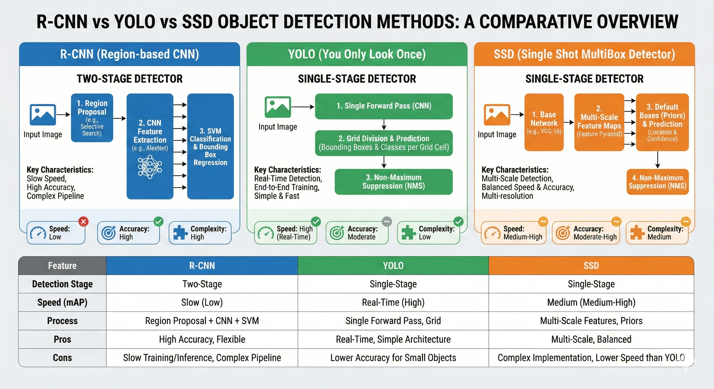
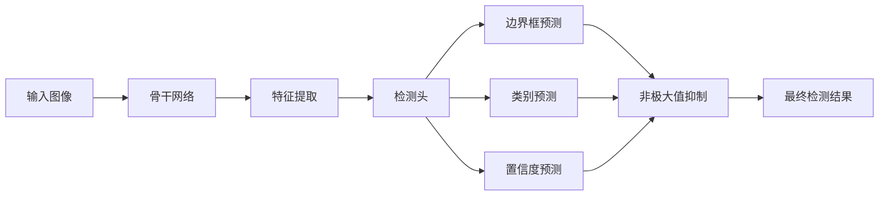

# 第六章：目标检测

> 系统学习目标检测的核心技术，从两阶段检测器到单阶段实时检测，掌握R-CNN系列、YOLO系列、SSD等经典算法，理解IoU、mAP等评估指标。



## 📚 章节概览

目标检测是计算机视觉的核心任务之一，不仅要识别图像中的物体，还要定位它们的位置。

### 📄 本章内容

1. **两阶段检测器**：R-CNN → Fast R-CNN → Faster R-CNN → Mask R-CNN
2. **单阶段检测器**：YOLO系列（v1-v8）、SSD、RetinaNet
3. **评估指标详解**：IoU、mAP、PR曲线
4. **实战项目**：训练自己的检测器

### YOLO目标检测流程



---

## 🎯 学习路径

### 阶段一：基础概念（1天）

#### 1. 目标检测任务定义

```python
"""
目标检测 vs 图像分类
- 分类：这张图是什么？ → 输出：类别标签
- 检测：图中有什么？在哪里？ → 输出：[类别, x, y, w, h]
"""

# 数据格式示例

annotation = {
    'image_id': 1,
    'boxes': [[100, 150, 200, 250], [300, 400, 150, 180]],  # [x, y, w, h]
    'labels': [1, 3],  # 类别ID
    'scores': [0.95, 0.87]  # 置信度（预测时）
}

# 可视化

def visualize_detection(image, boxes, labels, scores=None, class_names=None):
    """可视化检测结果"""
    import matplotlib.pyplot as plt
    import matplotlib.patches as patches
    
    fig, ax = plt.subplots(1, 1, figsize=(10, 10))
    ax.imshow(image)
    
    for i, box in enumerate(boxes):
        x, y, w, h = box
        
        # 创建矩形框
        rect = patches.Rectangle((x, y), w, h, 
                                linewidth=2, 
                                edgecolor='red', 
                                facecolor='none')
        ax.add_patch(rect)
        
        # 添加标签
        label = class_names[labels[i]] if class_names else f'Class {labels[i]}'
        if scores:
            label += f': {scores[i]:.2f}'
        
        ax.text(x, y-5, label, color='red', fontsize=12, 
                bbox=dict(facecolor='white', alpha=0.8, edgecolor='none'))
    
    plt.axis('off')
    return fig
```

#### 2. 核心挑战

```python
"""
目标检测的三大挑战：
1. 多尺度：物体大小变化大（小物体检测难）
2. 遮挡：物体相互遮挡
3. 密集场景：大量物体聚集
"""

# 多尺度检测示例

def multi_scale_detection_demo():
    """展示多尺度检测的困难"""
    scales = ['小物体(32x32)', '中物体(64x64)', '大物体(128x128)']
    difficulties = ['特征易丢失', '中等难度', '相对容易']
    
    for scale, diff in zip(scales, difficulties):
        print(f"{scale}: {diff}")
    
    # 解决方案：特征金字塔(FPN)
    print("\n解决方案：特征金字塔网络(FPN)")
```

---

### 阶段二：两阶段检测器（3-4天）

#### 3. R-CNN系列演进

##### 3.1 R-CNN (2014)

**核心思想**：区域建议 + CNN特征提取 + SVM分类

```python
class RCNN:
    """
    R-CNN工作流程：
    1. 输入图像
    2. 提取约2000个区域建议（Selective Search）
    3. 每个区域缩放为227x227
    4. CNN提取特征（AlexNet）
    5. SVM分类
    6. 边界框回归
    """
    
    def __init__(self):
        self.region_proposal = 'Selective Search'
        self.backbone = 'AlexNet'
        self.classifier = 'SVM'
    
    def forward(self, image):
        # 1. 区域建议
        regions = self.selective_search(image)  # ~2000个候选框
        
        # 2. 特征提取
        features = []
        for region in regions:
            # 缩放区域
            patch = self.crop_and_resize(image, region, 227)
            # CNN特征
            feature = self.cnn_extract(patch)
            features.append(feature)
        
        # 3. 分类
        predictions = self.svm_predict(features)
        
        # 4. 边界框回归
        refined_boxes = self.bbox_regression(features, regions)
        
        return predictions, refined_boxes
    
    def selective_search(self, image):
        """选择性搜索算法（简化版）"""
        # 实际使用时调用OpenCV或外部库
        # 这里仅示意
        return [[100, 100, 200, 200], [150, 150, 180, 180]]  # 模拟候选框
    
    def crop_and_resize(self, image, box, target_size):
        """裁剪并缩放区域"""
        x, y, w, h = box
        patch = image[y:y+h, x:x+w]
        # 使用插值缩放到target_size
        from scipy.ndimage import zoom
        scale = target_size / max(patch.shape[:2])
        resized = zoom(patch, (scale, scale, 1) if len(patch.shape) == 3 else (scale, scale))
        return resized
    
    def cnn_extract(self, patch):
        """CNN特征提取（简化）"""
        # 实际使用预训练CNN
        return torch.randn(4096)  # AlexNet fc7层特征
    
    def svm_predict(self, features):
        """SVM分类"""
        # 实际训练SVM
        return torch.randn(len(features), 21)  # 20类 + 背景
    
    def bbox_regression(self, features, regions):
        """边界框回归"""
        # 实际训练回归器
        return regions  # 简化返回
```

**R-CNN的问题**：
- ❌ 速度慢：每个候选区域都要过CNN
- ❌ 训练复杂：多阶段训练（CNN → SVM → 回归）
- ❌ 存储开销大：需要保存每个区域的特征

---

##### 3.2 Fast R-CNN (2015)

**核心改进**：共享卷积特征 + ROI Pooling + 端到端训练

```python
class FastRCNN(nn.Module):
    """
    Fast R-CNN改进：
    1. 整图过CNN → 共享特征图
    2. ROI Pooling → 任意大小区域 → 固定大小特征
    3. 多任务损失：分类 + 回归
    """
    
    def __init__(self, num_classes=21):
        super(FastRCNN, self).__init__()
        self.num_classes = num_classes
        
        # 共享卷积层（VGG16）
        self.features = nn.Sequential(
            nn.Conv2d(3, 64, 3, padding=1),
            nn.ReLU(),
            nn.Conv2d(64, 64, 3, padding=1),
            nn.ReLU(),
            nn.MaxPool2d(2, 2),
            
            nn.Conv2d(64, 128, 3, padding=1),
            nn.ReLU(),
            nn.Conv2d(128, 128, 3, padding=1),
            nn.ReLU(),
            nn.MaxPool2d(2, 2),
            
            nn.Conv2d(128, 256, 3, padding=1),
            nn.ReLU(),
            nn.Conv2d(256, 256, 3, padding=1),
            nn.ReLU(),
            nn.Conv2d(256, 256, 3, padding=1),
            nn.ReLU(),
            nn.MaxPool2d(2, 2),
            
            nn.Conv2d(256, 512, 3, padding=1),
            nn.ReLU(),
            nn.Conv2d(512, 512, 3, padding=1),
            nn.ReLU(),
            nn.Conv2d(512, 512, 3, padding=1),
            nn.ReLU(),
            nn.MaxPool2d(2, 2),
            
            nn.Conv2d(512, 512, 3, padding=1),
            nn.ReLU(),
            nn.Conv2d(512, 512, 3, padding=1),
            nn.ReLU(),
            nn.Conv2d(512, 512, 3, padding=1),
            nn.ReLU(),
        )
        
        # ROI Pooling
        self.roi_pool = nn.AdaptiveAvgPool2d((7, 7))
        
        # 分类和回归头
        self.classifier = nn.Sequential(
            nn.Linear(512 * 7 * 7, 4096),
            nn.ReLU(),
            nn.Dropout(0.5),
            nn.Linear(4096, 4096),
            nn.ReLU(),
            nn.Dropout(0.5),
        )
        
        # 分类得分
        self.cls_score = nn.Linear(4096, num_classes)
        # 边界框回归
        self.bbox_pred = nn.Linear(4096, num_classes * 4)
    
    def forward(self, x, rois):
        """
        Args:
            x: 输入图像 (B, C, H, W)
            rois: 区域建议 (N, 5) [batch_id, x1, y1, x2, y2]
        """
        # 1. 共享卷积特征
        features = self.features(x)  # (B, 512, H/16, W/16)
        
        # 2. ROI Pooling
        # 将每个ROI映射到特征图上，然后池化
        pooled_features = []
        for roi in rois:
            batch_id, x1, y1, x2, y2 = roi
            # 计算ROI在特征图上的位置
            scale = features.shape[2] / x.shape[2]
            roi_features = features[batch_id, :, 
                                   int(y1*scale):int(y2*scale), 
                                   int(x1*scale):int(x2*scale)]
            # ROI Pooling到固定大小
            pooled = self.roi_pool(roi_features.unsqueeze(0))
            pooled_features.append(pooled)
        
        pooled_features = torch.cat(pooled_features, 0)
        pooled_features = pooled_features.view(pooled_features.size(0), -1)
        
        # 3. 全连接层
        fc_features = self.classifier(pooled_features)
        
        # 4. 预测
        cls_scores = self.cls_score(fc_features)
        bbox_preds = self.bbox_pred(fc_features)
        
        return cls_scores, bbox_preds

# 损失函数

class FastRCNNLoss(nn.Module):
    def __init__(self):
        super(FastRCNNLoss, self).__init__()
        self.cls_loss = nn.CrossEntropyLoss()
        self.reg_loss = nn.SmoothL1Loss()
    
    def forward(self, cls_scores, bbox_preds, targets):
        """
        Args:
            cls_scores: 分类得分 (N, num_classes)
            bbox_preds: 边界框预测 (N, num_classes*4)
            targets: (labels, boxes)
        """
        labels, boxes = targets
        
        # 分类损失
        cls_loss = self.cls_loss(cls_scores, labels)
        
        # 回归损失（只计算正样本）
        bbox_loss = 0
        for i, label in enumerate(labels):
            if label > 0:  # 不是背景
                start_idx = label * 4
                pred_box = bbox_preds[i, start_idx:start_idx+4]
                bbox_loss += self.reg_loss(pred_box, boxes[i])
        
        return cls_loss + bbox_loss
```

**Fast R-CNN的优势**：
- ✅ 速度提升：卷积特征共享
- ✅ 端到端训练：多任务联合优化
- ✅ 更高精度：ROI Pooling保留空间信息

---

##### 3.3 Faster R-CNN (2016)

**核心创新**：RPN（区域建议网络）实现端到端

```python
class RPN(nn.Module):
    """
    区域建议网络
    在特征图上滑动窗口，生成候选框
    """
    
    def __init__(self, in_channels=512, mid_channels=512, num_anchors=9):
        super(RPN, self).__init__()
        self.num_anchors = num_anchors
        
        # 共享卷积
        self.conv = nn.Conv2d(in_channels, mid_channels, 3, padding=1)
        
        # 分类分支：前景/背景
        self.cls_head = nn.Conv2d(mid_channels, num_anchors * 2, 1)
        
        # 回归分支：边界框偏移
        self.reg_head = nn.Conv2d(mid_channels, num_anchors * 4, 1)
        
        # 初始化
        self._initialize_weights()
    
    def _initialize_weights(self):
        for m in self.modules():
            if isinstance(m, nn.Conv2d):
                nn.init.normal_(m.weight, mean=0.0, std=0.01)
                nn.init.constant_(m.bias, 0)
    
    def forward(self, x):
        """
        Args:
            x: 共享特征图 (B, C, H, W)
        Returns:
            scores: 分类得分 (B, 9*2, H, W)
            bbox_preds: 边界框预测 (B, 9*4, H, W)
        """
        batch_size = x.size(0)
        
        # 共享卷积
        x = F.relu(self.conv(x))
        
        # 分类
        cls_scores = self.cls_head(x)
        cls_scores = cls_scores.permute(0, 2, 3, 1).contiguous()
        cls_scores = cls_scores.view(batch_size, -1, 2)
        
        # 回归
        bbox_preds = self.reg_head(x)
        bbox_preds = bbox_preds.permute(0, 2, 3, 1).contiguous()
        bbox_preds = bbox_preds.view(batch_size, -1, 4)
        
        return cls_scores, bbox_preds

class FasterRCNN(nn.Module):
    """
    Faster R-CNN完整架构
    """
    def __init__(self, backbone, num_classes=21):
        super(FasterRCNN, self).__init__()
        
        # 1. 特征提取网络
        self.backbone = backbone
        
        # 2. RPN
        self.rpn = RPN(in_channels=512, num_anchors=9)
        
        # 3. ROI Pooling
        self.roi_pool = nn.AdaptiveAvgPool2d((7, 7))
        
        # 4. Fast R-CNN头
        self.rcnn = nn.Sequential(
            nn.Linear(512 * 7 * 7, 4096),
            nn.ReLU(),
            nn.Dropout(0.5),
            nn.Linear(4096, 4096),
            nn.ReLU(),
            nn.Dropout(0.5),
        )
        
        self.cls_score = nn.Linear(4096, num_classes)
        self.bbox_pred = nn.Linear(4096, num_classes * 4)
    
    def forward(self, x, targets=None):
        # 1. 特征提取
        features = self.backbone(x)
        
        # 2. RPN生成建议
        rpn_scores, rpn_bbox_preds = self.rpn(features)
        
        # 3. 生成ROI（简化：直接使用预设anchor）
        if targets is None:
            # 推理时使用NMS
            rois = self.generate_rois_inference(rpn_scores, rpn_bbox_preds)
        else:
            # 训练时使用GT + 采样
            rois = self.generate_rois_training(rpn_scores, rpn_bbox_preds, targets)
        
        # 4. ROI Pooling
        pooled_features = []
        for roi in rois:
            batch_id, x1, y1, x2, y2 = roi
            scale = features.shape[2] / x.shape[2]
            roi_features = features[batch_id, :, 
                                   int(y1*scale):int(y2*scale), 
                                   int(x1*scale):int(x2*scale)]
            pooled = self.roi_pool(roi_features.unsqueeze(0))
            pooled_features.append(pooled)
        
        pooled_features = torch.cat(pooled_features, 0)
        pooled_features = pooled_features.view(pooled_features.size(0), -1)
        
        # 5. RCNN预测
        fc_features = self.rcnn(pooled_features)
        cls_scores = self.cls_score(fc_features)
        bbox_preds = self.bbox_pred(fc_features)
        
        return cls_scores, bbox_preds, rois
    
    def generate_rois_inference(self, scores, bbox_preds):
        """推理时生成ROI"""
        # 简化：返回前N个建议
        # 实际：解码anchor + NMS
        return torch.tensor([[0, 100, 100, 200, 200]], dtype=torch.float32)
    
    def generate_rois_training(self, scores, bbox_preds, targets):
        """训练时生成ROI"""
        # 简化：使用GT + 随机采样
        labels, boxes = targets
        rois = []
        for i, box in enumerate(boxes):
            rois.append([0] + box.tolist())  # batch_id=0
        return torch.tensor(rois, dtype=torch.float32)
```

**Faster R-CNN的优势**：
- ✅ 完整端到端：RPN + Fast R-CNN联合训练
- ✅ 更快：RPN共享特征，建议质量更高
- ✅ 更准：区域建议和检测联合优化

---

##### 3.4 Mask R-CNN (2017)

**核心创新**：增加掩码分支，实现实例分割

```python
class MaskRCNN(FasterRCNN):
    """
    Mask R-CNN = Faster R-CNN + 掩码预测
    """
    
    def __init__(self, backbone, num_classes=21):
        super(MaskRCNN, self).__init__(backbone, num_classes)
        
        # 掩码预测分支
        self.mask_head = nn.Sequential(
            nn.Conv2d(256, 256, 3, padding=1),
            nn.ReLU(),
            nn.Conv2d(256, 256, 3, padding=1),
            nn.ReLU(),
            nn.Conv2d(256, 256, 3, padding=1),
            nn.ReLU(),
            nn.Conv2d(256, 256, 3, padding=1),
            nn.ReLU(),
            nn.Conv2d(256, num_classes, 1),
            nn.Sigmoid(),
        )
        
        # ROI Align（改进ROI Pooling）
        self.roi_align = self.roi_pool  # 简化
    
    def forward(self, x, targets=None):
        # Faster R-CNN部分
        features = self.backbone(x)
        rpn_scores, rpn_bbox_preds = self.rpn(features)
        
        if targets is None:
            rois = self.generate_rois_inference(rpn_scores, rpn_bbox_preds)
        else:
            rois = self.generate_rois_training(rpn_scores, rpn_bbox_preds, targets)
        
        # ROI Pooling
        pooled_features = []
        for roi in rois:
            batch_id, x1, y1, x2, y2 = roi
            scale = features.shape[2] / x.shape[2]
            roi_features = features[batch_id, :, 
                                   int(y1*scale):int(y2*scale), 
                                   int(x1*scale):int(x2*scale)]
            pooled = self.roi_align(roi_features.unsqueeze(0))
            pooled_features.append(pooled)
        
        pooled_features = torch.cat(pooled_features, 0)
        
        # RCNN预测
        fc_features = self.rcnn(pooled_features.view(pooled_features.size(0), -1))
        cls_scores = self.cls_score(fc_features)
        bbox_preds = self.bbox_pred(fc_features)
        
        # 掩码预测
        mask_preds = self.mask_head(pooled_features)
        
        return cls_scores, bbox_preds, mask_preds, rois

# 损失函数

class MaskRCNNLoss(nn.Module):
    def __init__(self):
        super(MaskRCNNLoss, self).__init__()
        self.rcnn_loss = FastRCNNLoss()
        self.mask_loss = nn.BCELoss()
    
    def forward(self, cls_scores, bbox_preds, mask_preds, targets, masks):
        # RCNN损失
        rcnn_loss = self.rcnn_loss(cls_scores, bbox_preds, targets)
        
        # 掩码损失（只计算正样本）
        labels, _ = targets
        mask_loss = 0
        for i, label in enumerate(labels):
            if label > 0:
                mask_loss += self.mask_loss(mask_preds[i, label], masks[i])
        
        return rcnn_loss + mask_loss
```

---

### 阶段三：单阶段检测器（3-4天）

#### 4. YOLO系列

##### 4.1 YOLOv1 (2016)

**核心思想**：将检测视为回归问题，一次性预测所有信息

```python
class YOLOv1(nn.Module):
    """
    YOLOv1: You Only Look Once
    将图像划分为S×S网格，每个网格预测B个边界框和C个类别概率
    """
    
    def __init__(self, S=7, B=2, C=20):
        super(YOLOv1, self).__init__()
        self.S = S  # 网格大小
        self.B = B  # 每个网格预测的边界框数
        self.C = C  # 类别数
        
        # 网络结构（简化版）
        self.features = nn.Sequential(
            # 卷积层1-4
            nn.Conv2d(3, 64, 7, stride=2, padding=3),
            nn.MaxPool2d(2, 2),
            
            nn.Conv2d(64, 192, 3, padding=1),
            nn.MaxPool2d(2, 2),
            
            nn.Conv2d(192, 128, 1),
            nn.Conv2d(128, 256, 3, padding=1),
            nn.Conv2d(256, 256, 1),
            nn.Conv2d(256, 512, 3, padding=1),
            nn.MaxPool2d(2, 2),
            
            # 更多卷积层...
            nn.Conv2d(512, 1024, 3, padding=1),
            nn.Conv2d(1024, 1024, 3, padding=1),
            nn.Conv2d(1024, 1024, 3, stride=2, padding=1),
            nn.Conv2d(1024, 1024, 3, padding=1),
            nn.Conv2d(1024, 1024, 3, padding=1),
        )
        
        # 全连接层
        self.fc = nn.Sequential(
            nn.Linear(1024 * S * S, 4096),
            nn.ReLU(),
            nn.Dropout(0.5),
            nn.Linear(4096, S * S * (B * 5 + C)),
        )
    
    def forward(self, x):
        batch_size = x.size(0)
        
        # 特征提取
        features = self.features(x)
        features = features.view(batch_size, -1)
        
        # 全连接层
        predictions = self.fc(features)
        
        # 重塑为 (S, S, B*5 + C)
        predictions = predictions.view(batch_size, self.S, self.S, self.B * 5 + self.C)
        
        return predictions

# 损失函数

class YOLOv1Loss(nn.Module):
    def __init__(self, S=7, B=2, C=20, lambda_coord=5, lambda_noobj=0.5):
        super(YOLOv1Loss, self).__init__()
        self.S = S
        self.B = B
        self.C = C
        self.lambda_coord = lambda_coord
        self.lambda_noobj = lambda_noobj
        
        self.mse_loss = nn.MSELoss(reduction='sum')
    
    def forward(self, predictions, targets):
        """
        Args:
            predictions: (B, S, S, B*5 + C)
            targets: (B, S, S, B*5 + C)
        """
        batch_size = predictions.size(0)
        
        # 分离坐标、置信度、类别
        pred_boxes = predictions[:, :, :, :self.B*5]  # (B, S, S, B*5)
        pred_classes = predictions[:, :, :, self.B*5:]  # (B, S, S, C)
        
        target_boxes = targets[:, :, :, :self.B*5]
        target_classes = targets[:, :, :, self.B*5:]
        
        # 1. 坐标损失（只计算有物体的网格）
        coord_loss = 0
        for b in range(batch_size):
            for i in range(self.S):
                for j in range(self.S):
                    if target_boxes[b, i, j, 0] > 0:  # 有物体
                        # 找到最佳预测框
                        best_box_idx = 0  # 简化：取第一个
                        pred_box = pred_boxes[b, i, j, best_box_idx*5:(best_box_idx+1)*5]
                        target_box = target_boxes[b, i, j, best_box_idx*5:(best_box_idx+1)*5]
                        
                        # 坐标损失 (x, y, w, h)
                        coord_loss += self.mse_loss(pred_box[1:5], target_box[1:5])
        
        # 2. 置信度损失
        conf_loss = 0
        for b in range(batch_size):
            for i in range(self.S):
                for j in range(self.S):
                    for box_idx in range(self.B):
                        pred_conf = pred_boxes[b, i, j, box_idx*5]
                        target_conf = target_boxes[b, i, j, box_idx*5]
                        
                        if target_conf > 0:  # 有物体
                            conf_loss += self.mse_loss(pred_conf, target_conf)
                        else:  # 无物体
                            conf_loss += self.lambda_noobj * self.mse_loss(pred_conf, target_conf)
        
        # 3. 类别损失
        class_loss = 0
        for b in range(batch_size):
            for i in range(self.S):
                for j in range(self.S):
                    if target_boxes[b, i, j, 0] > 0:  # 有物体
                        class_loss += self.mse_loss(pred_classes[b, i, j], target_classes[b, i, j])
        
        total_loss = self.lambda_coord * coord_loss + conf_loss + class_loss
        
        return total_loss / batch_size
```

**YOLOv1的特点**：
- ✅ 速度快：单次前向传播
- ✅ 全局上下文：整图信息
- ❌ 定位精度较低
- ❌ 对小物体检测差
- ❌ 每个网格只能预测一个类别

---

##### 4.2 YOLOv2/YOLO9000 (2017)

**核心改进**：批量归一化、高分辨率分类器、锚框机制

```python
class YOLOv2(nn.Module):
    """
    YOLOv2改进：
    1. 批量归一化（BN）- 加速收敛，防止过拟合
    2. 高分辨率微调（448×448）- 提升定位精度
    3. 锚框（Anchor Boxes）- 提升召回率
    4. 维度聚类 - 自动学习最佳锚框
    5. 细粒度特征 - passthrough层
    """
    
    def __init__(self, num_anchors=5, num_classes=20):
        super(YOLOv2, self).__init__()
        self.num_anchors = num_anchors
        self.num_classes = num_classes
        
        # Darknet-19骨干网络
        self.backbone = nn.Sequential(
            # Block 1
            nn.Conv2d(3, 32, 3, padding=1),
            nn.BatchNorm2d(32),
            nn.LeakyReLU(0.1),
            nn.MaxPool2d(2, 2),
            
            # Block 2
            nn.Conv2d(32, 64, 3, padding=1),
            nn.BatchNorm2d(64),
            nn.LeakyReLU(0.1),
            nn.MaxPool2d(2, 2),
            
            # Block 3-5 (简化)
            nn.Conv2d(64, 128, 3, padding=1),
            nn.BatchNorm2d(128),
            nn.LeakyReLU(0.1),
            nn.Conv2d(128, 64, 1),
            nn.BatchNorm2d(64),
            nn.LeakyReLU(0.1),
            nn.Conv2d(64, 128, 3, padding=1),
            nn.BatchNorm2d(128),
            nn.LeakyReLU(0.1),
            nn.MaxPool2d(2, 2),
            
            # 更多层...
        )
        
        # 检测头
        self.detector = nn.Sequential(
            nn.Conv2d(128, 1024, 3, padding=1),
            nn.BatchNorm2d(1024),
            nn.LeakyReLU(0.1),
            nn.Conv2d(1024, num_anchors * (5 + num_classes), 1),
        )
        
        # 锚框（预设或聚类得到）
        self.anchors = torch.tensor([
            [1.32, 1.73], [3.19, 4.01], [5.05, 8.24],
            [9.33, 10.97], [15.86, 17.32]
        ])  # 相对于特征图的尺寸
    
    def forward(self, x):
        batch_size = x.size(0)
        
        # 特征提取
        features = self.backbone(x)
        
        # 检测预测
        predictions = self.detector(features)
        
        # 重塑：(B, num_anchors, 5+num_classes, H, W)
        predictions = predictions.view(
            batch_size, self.num_anchors, 5 + self.num_classes, 
            features.size(2), features.size(3)
        )
        
        return predictions

# 锚框聚类

def kmeans_anchors(boxes, k=5):
    """
    使用K-means聚类得到最佳锚框尺寸
    Args:
        boxes: 所有GT框的宽高 [(w, h), ...]
        k: 聚类中心数
    Returns:
        聚类中心（锚框）
    """
    import numpy as np
    from scipy.cluster.vq import kmeans
    
    boxes = np.array(boxes)
    
    # 使用IoU距离
    def iou_distance(box1, box2):
        inter = np.prod(np.minimum(box1, box2))
        union = np.prod(box1) + np.prod(box2) - inter
        return 1 - inter / union
    
    # K-means聚类
    centroids, _ = kmeans(boxes, k)
    
    return centroids

# 使用示例

def prepare_anchors():
    # 收集所有训练集的GT框尺寸
    all_boxes = []
    # for dataset in train_data:
    #     for ann in dataset.annotations:
    #         all_boxes.append([ann['w'], ann['h']])
    
    # 聚类
    anchors = kmeans_anchors(all_boxes, k=5)
    print("聚类得到的锚框:", anchors)
    
    return anchors
```

---

##### 4.3 YOLOv3 (2018)

**核心创新**：多尺度预测、Darknet-53、更好的分类器

```python
class YOLOv3(nn.Module):
    """
    YOLOv3改进：
    1. Darknet-53：残差结构 + 1x1, 3x3卷积
    2. 多尺度预测：3个尺度（13×13, 26×26, 52×52）
    3. 更好的分类器：独立分类头
    4. 二元交叉熵损失
    """
    
    def __init__(self, num_anchors=9, num_classes=80):
        super(YOLOv3, self).__init__()
        self.num_anchors = num_anchors
        self.num_classes = num_classes
        
        # Darknet-53骨干网络（简化）
        self.backbone = self._build_darknet53()
        
        # 特征金字塔网络（FPN）
        self.fpn = self._build_fpn()
        
        # 检测头（3个尺度）
        self.detector_scales = nn.ModuleList([
            self._make_detector_head(512),  # 13x13
            self._make_detector_head(256),  # 26x26
            self._make_detector_head(128),  # 52x52
        ])
    
    def _build_darknet53(self):
        """构建Darknet-53"""
        layers = []
        
        # 初始卷积
        layers.extend([
            nn.Conv2d(3, 32, 3, padding=1),
            nn.BatchNorm2d(32),
            nn.LeakyReLU(0.1),
            nn.Conv2d(32, 64, 3, stride=2, padding=1),
            nn.BatchNorm2d(64),
            nn.LeakyReLU(0.1),
        ])
        
        # 残差块
        def residual_block(in_channels, out_channels, num_blocks):
            layers = []
            for _ in range(num_blocks):
                layers.append(ResidualBlock(in_channels, out_channels))
            return nn.Sequential(*layers)
        
        # Darknet-53结构
        layers.append(residual_block(64, 64, 1))
        layers.append(residual_block(64, 128, 2))
        layers.append(residual_block(128, 256, 8))
        layers.append(residual_block(256, 512, 8))
        layers.append(residual_block(512, 1024, 4))
        
        return nn.Sequential(*layers)
    
    def _build_fpn(self):
        """特征金字塔网络"""
        # 从骨干网络提取多尺度特征
        return nn.ModuleDict({
            'lateral_1': nn.Conv2d(1024, 512, 1),
            'lateral_2': nn.Conv2d(512, 256, 1),
            'lateral_3': nn.Conv2d(256, 128, 1),
            'upsample': nn.Upsample(scale_factor=2, mode='nearest'),
        })
    
    def _make_detector_head(self, in_channels):
        """检测头"""
        return nn.Sequential(
            nn.Conv2d(in_channels, in_channels * 2, 3, padding=1),
            nn.BatchNorm2d(in_channels * 2),
            nn.LeakyReLU(0.1),
            nn.Conv2d(in_channels * 2, in_channels * 2, 3, padding=1),
            nn.BatchNorm2d(in_channels * 2),
            nn.LeakyReLU(0.1),
            nn.Conv2d(in_channels * 2, self.num_anchors * (5 + self.num_classes), 1),
        )
    
    def forward(self, x):
        batch_size = x.size(0)
        
        # 1. 特征提取
        features = self.backbone(x)
        
        # 2. FPN融合
        # 简化：实际需要多尺度特征
        fpn_features = [features]
        
        # 3. 多尺度预测
        predictions = []
        for i, detector in enumerate(self.detector_scales):
            pred = detector(fpn_features[i])
            # 重塑
            pred = pred.view(batch_size, self.num_anchors, 5 + self.num_classes, 
                           pred.size(2), pred.size(3))
            predictions.append(pred)
        
        return predictions

class ResidualBlock(nn.Module):
    """残差块"""
    def __init__(self, in_channels, out_channels):
        super(ResidualBlock, self).__init__()
        self.conv1 = nn.Conv2d(in_channels, out_channels, 1, bias=False)
        self.bn1 = nn.BatchNorm2d(out_channels)
        self.conv2 = nn.Conv2d(out_channels, out_channels, 3, padding=1, bias=False)
        self.bn2 = nn.BatchNorm2d(out_channels)
        self.relu = nn.LeakyReLU(0.1)
        
        # 短连接
        self.shortcut = nn.Sequential()
        if in_channels != out_channels:
            self.shortcut = nn.Sequential(
                nn.Conv2d(in_channels, out_channels, 1, bias=False),
                nn.BatchNorm2d(out_channels)
            )
    
    def forward(self, x):
        residual = x
        
        out = self.conv1(x)
        out = self.bn1(out)
        out = self.relu(out)
        
        out = self.conv2(out)
        out = self.bn2(out)
        out = self.relu(out)
        
        out += self.shortcut(residual)
        out = self.relu(out)
        
        return out
```

**YOLOv3的优势**：
- ✅ 多尺度检测：小物体检测能力大幅提升
- ✅ 更深的网络：Darknet-53提取更强特征
- ✅ 更快更准：在速度和精度间取得平衡

---

##### 4.4 YOLOv4/v5/v8 (2020-2023)

**现代YOLO演进**：

```python
"""
YOLOv4/v5/v8的主要改进：

YOLOv4:
- CSPDarknet53：跨阶段局部网络
- PANet：路径聚合网络
- Mosaic数据增强：4图拼接
- Mish激活：更好的非线性
- CIoU Loss：更好的边界框回归

YOLOv5:
- PyTorch实现，更易用
- 自适应锚框计算
- 聚类锚框
- 更快的训练和推理

YOLOv8:
- Anchor-free检测
- 解耦头：分类和回归分离
- 更大的模型规模
- 支持分割和姿态估计
"""

# 现代YOLO使用示例（伪代码）

def modern_yolo_usage():
    """
    现代YOLO使用方式（以YOLOv8为例）
    """
    # 1. 训练
    # yolo task=detect mode=train model=yolov8n.pt data=coco.yaml epochs=100
    
    # 2. 推理
    # yolo task=detect mode=predict model=yolov8n.pt source=img.jpg
    
    # 3. 导出
    # yolo export model=yolov8n.pt format=onnx
    
    # 4. Python API
    from ultralytics import YOLO
    
    # 加载模型
    model = YOLO('yolov8n.pt')
    
    # 训练
    model.train(data='coco.yaml', epochs=100)
    
    # 预测
    results = model('img.jpg')
    for result in results:
        boxes = result.boxes  # 检测框
        masks = result.masks  # 掩码（分割模式）
        keypoints = result.keypoints  # 关键点（姿态模式）
        
        # 可视化
        result.show()
        result.save('result.jpg')
    
    # 导出
    model.export(format='onnx')
```

---

#### 5. SSD (Single Shot MultiBox Detector)

**核心思想**：多尺度特征图 + 默认框（Default Boxes）

```python
class SSD(nn.Module):
    """
    SSD：单次检测器
    特点：
    1. 多尺度特征图检测
    2. 默认框（Anchor）机制
    3. Hard Negative Mining
    """
    
    def __init__(self, num_classes=21):
        super(SSD, self).__init__()
        self.num_classes = num_classes
        
        # VGG16骨干网络（修改版）
        self.base_network = nn.Sequential(
            # Block 1
            nn.Conv2d(3, 64, 3, padding=1),
            nn.ReLU(),
            nn.Conv2d(64, 64, 3, padding=1),
            nn.ReLU(),
            nn.MaxPool2d(2, 2),
            
            # Block 2
            nn.Conv2d(64, 128, 3, padding=1),
            nn.ReLU(),
            nn.Conv2d(128, 128, 3, padding=1),
            nn.ReLU(),
            nn.MaxPool2d(2, 2),
            
            # Block 3
            nn.Conv2d(128, 256, 3, padding=1),
            nn.ReLU(),
            nn.Conv2d(256, 256, 3, padding=1),
            nn.ReLU(),
            nn.Conv2d(256, 256, 3, padding=1),
            nn.ReLU(),
            nn.MaxPool2d(2, 2),
            
            # Block 4
            nn.Conv2d(256, 512, 3, padding=1),
            nn.ReLU(),
            nn.Conv2d(512, 512, 3, padding=1),
            nn.ReLU(),
            nn.Conv2d(512, 512, 3, padding=1),
            nn.ReLU(),
            nn.MaxPool2d(2, 2),
            
            # Block 5
            nn.Conv2d(512, 512, 3, padding=1),
            nn.ReLU(),
            nn.Conv2d(512, 512, 3, padding=1),
            nn.ReLU(),
            nn.Conv2d(512, 512, 3, padding=1),
            nn.ReLU(),
        )
        
        # 额外卷积层（用于多尺度）
        self.auxiliary_layers = nn.Sequential(
            nn.Conv2d(512, 512, 3, padding=1),
            nn.ReLU(),
            nn.Conv2d(512, 512, 3, padding=1),
            nn.ReLU(),
        )
        
        # 多尺度检测头
        self.detect_heads = nn.ModuleDict({
            'conv4_3': nn.Conv2d(512, 4 * (num_classes + 4), 3, padding=1),  # 38x38
            'conv7': nn.Conv2d(512, 6 * (num_classes + 4), 3, padding=1),     # 19x19
            'conv8_2': nn.Conv2d(512, 6 * (num_classes + 4), 3, padding=1),   # 10x10
            'conv9_2': nn.Conv2d(512, 6 * (num_classes + 4), 3, padding=1),   # 5x5
            'conv10_2': nn.Conv2d(512, 4 * (num_classes + 4), 3, padding=1),  # 3x3
            'conv11_2': nn.Conv2d(512, 4 * (num_classes + 4), 3, padding=1),  # 1x1
        })
        
        # 默认框配置（每个特征图的框大小和比例）
        self.default_boxes = self._generate_default_boxes()
    
    def _generate_default_boxes(self):
        """生成默认框"""
        # 不同尺度的特征图使用不同大小的默认框
        scales = [0.1, 0.2, 0.3, 0.4, 0.5, 0.6, 0.7, 0.8, 0.9]
        aspect_ratios = [[2], [2, 3], [2, 3], [2, 3], [2], [2]]
        
        default_boxes = []
        for idx, feature_map_size in enumerate([38, 19, 10, 5, 3, 1]):
            for i in range(feature_map_size):
                for j in range(feature_map_size):
                    # 中心点
                    cx = (j + 0.5) / feature_map_size
                    cy = (i + 0.5) / feature_map_size
                    
                    # 不同比例
                    for ratio in aspect_ratios[idx]:
                        w = scales[idx] * ratio
                        h = scales[idx]
                        default_boxes.append([cx, cy, w, h])
        
        return torch.tensor(default_boxes)
    
    def forward(self, x):
        # 基础特征提取
        base_features = self.base_network(x)
        
        # 辅助特征
        aux_features = self.auxiliary_layers(base_features)
        
        # 多尺度预测
        predictions = {}
        for name, head in self.detect_heads.items():
            if name == 'conv4_3':
                features = base_features
            elif name == 'conv7':
                features = aux_features
            else:
                # 其他层的特征（需要额外卷积）
                features = aux_features
            
            pred = head(features)
            predictions[name] = pred
        
        return predictions

# SSD损失函数

class SSDLoss(nn.Module):
    def __init__(self, neg_pos_ratio=3):
        super(SSDLoss, self).__init__()
        self.neg_pos_ratio = neg_pos_ratio
        self.cls_loss = nn.CrossEntropyLoss(reduction='none')
        self.reg_loss = nn.SmoothL1Loss(reduction='none')
    
    def forward(self, predictions, targets):
        """
        Args:
            predictions: 多尺度预测结果
            targets: (boxes, labels)
        """
        total_cls_loss = 0
        total_reg_loss = 0
        
        # 匹配默认框和GT框
        matched_defaults, matched_labels = self.match_targets(predictions, targets)
        
        # 计算损失
        for scale_name, pred in predictions.items():
            # 分类损失
            cls_pred = pred[:, :, :self.num_classes]
            cls_loss = self.cls_loss(cls_pred, matched_labels[scale_name])
            
            # 回归损失（只计算正样本）
            reg_pred = pred[:, :, self.num_classes:]
            reg_loss = self.reg_loss(reg_pred, matched_defaults[scale_name])
            
            # Hard Negative Mining
            pos_mask = matched_labels[scale_name] > 0
            neg_mask = matched_labels[scale_name] == 0
            
            # 选择最难的负样本
            num_pos = pos_mask.sum()
            num_neg = min(int(num_pos * self.neg_pos_ratio), neg_mask.sum())
            
            # 计算最终损失
            total_cls_loss += cls_loss[pos_mask].sum() + cls_loss[neg_mask].topk(num_neg)[0].sum()
            total_reg_loss += reg_loss[pos_mask].sum()
        
        return total_cls_loss + total_reg_loss
    
    def match_targets(self, predictions, targets):
        """匹配默认框和GT框"""
        # 简化：实际使用匈牙利算法或贪婪匹配
        matched_defaults = {}
        matched_labels = {}
        
        for scale_name, pred in predictions.items():
            num_boxes = pred.size(1)
            matched_defaults[scale_name] = torch.zeros(num_boxes, 4)
            matched_labels[scale_name] = torch.zeros(num_boxes, dtype=torch.long)
        
        return matched_defaults, matched_labels
```

**SSD的优势**：
- ✅ 速度快：单次前向传播
- ✅ 多尺度：不同大小的特征图检测不同尺度物体
- ✅ 精度高：默认框机制提升召回率

---

#### 6. RetinaNet

**核心创新**：Focal Loss解决类别不平衡问题

```python
class FocalLoss(nn.Module):
    """
    Focal Loss：解决正负样本不平衡
    FL(p_t) = -α_t * (1 - p_t)^γ * log(p_t)
    """
    
    def __init__(self, alpha=0.25, gamma=2):
        super(FocalLoss, self).__init__()
        self.alpha = alpha
        self.gamma = gamma
        self.bce_loss = nn.BCEWithLogitsLoss(reduction='none')
    
    def forward(self, inputs, targets):
        """
        Args:
            inputs: 预测得分 (N, num_classes)
            targets: 真实标签 (N, num_classes)
        """
        # 计算二元交叉熵
        bce_loss = self.bce_loss(inputs, targets)
        
        # 计算概率
        pt = torch.exp(-bce_loss)
        
        # Focal Loss
        focal_loss = self.alpha * (1 - pt)**self.gamma * bce_loss
        
        return focal_loss.mean()

class RetinaNet(nn.Module):
    """
    RetinaNet：使用Focal Loss的单阶段检测器
    """
    
    def __init__(self, num_classes=80):
        super(RetinaNet, self).__init__()
        self.num_classes = num_classes
        
        # ResNet骨干网络
        self.backbone = ResNet50()
        
        # 特征金字塔网络
        self.fpn = self._build_fpn()
        
        # 分类子网络
        self.classification_head = self._make_head(256, num_classes * 9)
        
        # 回归子网络
        self.regression_head = self._make_head(256, 4 * 9)
        
        # 锚框生成器
        self.anchors = self._generate_anchors()
    
    def _build_fpn(self):
        """构建FPN"""
        # 简化：实际需要多层特征融合
        return nn.ModuleDict({
            'p5': nn.Conv2d(2048, 256, 1),
            'p4': nn.Conv2d(1024, 256, 1),
            'p3': nn.Conv2d(512, 256, 1),
            'upsample': nn.Upsample(scale_factor=2, mode='nearest'),
        })
    
    def _make_head(self, in_channels, out_channels):
        """检测头"""
        layers = []
        for _ in range(4):
            layers.append(nn.Conv2d(in_channels, in_channels, 3, padding=1))
            layers.append(nn.ReLU())
        
        layers.append(nn.Conv2d(in_channels, out_channels, 3, padding=1))
        return nn.Sequential(*layers)
    
    def _generate_anchors(self):
        """生成锚框"""
        scales = [2**x for x in [0, 1/3, 2/3]]
        ratios = [0.5, 1.0, 2.0]
        
        anchors = []
        for s in scales:
            for r in ratios:
                w = s * r
                h = s / r
                anchors.append([w, h])
        
        return torch.tensor(anchors)  # 9个锚框
    
    def forward(self, x):
        # 骨干网络
        c3, c4, c5 = self.backbone(x)  # 多尺度特征
        
        # FPN融合
        p5 = self.fpn['p5'](c5)
        p4 = self.fpn['p4'](c4) + self.fpn['upsample'](p5)
        p3 = self.fpn['p3'](c3) + self.fpn['upsample'](p4)
        
        # 检测头
        cls_pred = self.classification_head(p3)
        reg_pred = self.regression_head(p3)
        
        return cls_pred, reg_pred
```

---

## 📊 评估指标详解

### 1. IoU (Intersection over Union)

```python
def calculate_iou(box1, box2):
    """
    计算两个框的IoU
    Args:
        box1, box2: [x1, y1, x2, y2]
    """
    # 交集区域
    x1 = max(box1[0], box2[0])
    y1 = max(box1[1], box2[1])
    x2 = min(box1[2], box2[2])
    y2 = min(box1[3], box2[3])
    
    intersection = max(0, x2 - x1) * max(0, y2 - y1)
    
    # 并集区域
    area1 = (box1[2] - box1[0]) * (box1[3] - box1[1])
    area2 = (box2[2] - box2[0]) * (box2[3] - box2[1])
    union = area1 + area2 - intersection
    
    return intersection / union if union > 0 else 0

# 示例

box1 = [50, 50, 150, 150]
box2 = [60, 60, 140, 140]
iou = calculate_iou(box1, box2)
print(f"IoU: {iou:.3f}")  # 0.64
```

### 2. mAP (mean Average Precision)

```python
class MAPCalculator:
    """
    mAP计算器
    """
    
    def __init__(self, iou_threshold=0.5):
        self.iou_threshold = iou_threshold
        self.reset()
    
    def reset(self):
        self.predictions = []  # (score, pred_box, gt_box, is_correct)
        self.ground_truths = {}  # image_id -> [boxes]
    
    def add_prediction(self, image_id, pred_box, score, gt_boxes):
        """添加预测结果"""
        best_iou = 0
        best_gt = None
        
        for gt_box in gt_boxes:
            iou = calculate_iou(pred_box, gt_box)
            if iou > best_iou:
                best_iou = iou
                best_gt = gt_box
        
        is_correct = best_iou >= self.iou_threshold
        self.predictions.append((score, pred_box, best_gt, is_correct))
    
    def compute_ap(self, class_id):
        """计算单类AP"""
        # 按置信度排序
        self.predictions.sort(key=lambda x: x[0], reverse=True)
        
        # 计算TP和FP
        tp = []
        fp = []
        num_gts = len(self.ground_truths.get(class_id, []))
        
        detected = set()
        
        for score, pred_box, gt_box, is_correct in self.predictions:
            if is_correct and gt_box not in detected:
                tp.append(1)
                fp.append(0)
                detected.add(gt_box)
            else:
                tp.append(0)
                fp.append(1)
        
        # 计算累积值
        tp_cum = np.cumsum(tp)
        fp_cum = np.cumsum(fp)
        
        # 计算精度和召回率
        precision = tp_cum / (tp_cum + fp_cum + 1e-10)
        recall = tp_cum / num_gts if num_gts > 0 else np.zeros_like(tp_cum)
        
        # 计算AP（11点插值）
        ap = 0
        for t in np.arange(0, 1.1, 0.1):
            if np.any(recall >= t):
                precision_at_t = np.max(precision[recall >= t])
                ap += precision_at_t
        ap /= 11
        
        return ap
    
    def compute_map(self):
        """计算mAP"""
        aps = []
        for class_id in self.ground_truths.keys():
            ap = self.compute_ap(class_id)
            aps.append(ap)
        
        return np.mean(aps)

# 使用示例

def evaluate_detection():
    """评估检测结果"""
    evaluator = MAPCalculator(iou_threshold=0.5)
    
    # 模拟预测
    evaluator.add_prediction(1, [50, 50, 150, 150], 0.9, [[55, 55, 145, 145]])
    evaluator.add_prediction(1, [200, 200, 250, 250], 0.8, [[200, 200, 250, 250]])
    evaluator.add_prediction(1, [300, 300, 350, 350], 0.7, [])  # 误检
    
    map_score = evaluator.compute_map()
    print(f"mAP@0.5: {map_score:.3f}")
```

### 3. PR曲线

```python
def plot_pr_curve(precision, recall):
    """绘制PR曲线"""
    import matplotlib.pyplot as plt
    
    plt.figure(figsize=(8, 6))
    plt.plot(recall, precision, 'b-', linewidth=2)
    plt.xlabel('Recall')
    plt.ylabel('Precision')
    plt.title('Precision-Recall Curve')
    plt.grid(True)
    plt.ylim([0, 1])
    plt.xlim([0, 1])
    
    # 填充区域
    plt.fill_between(recall, precision, alpha=0.2)
    
    return plt.gcf()

# 示例数据

precision = [1.0, 0.9, 0.8, 0.7, 0.6, 0.5, 0.4, 0.3, 0.2, 0.1]
recall = [0.1, 0.2, 0.3, 0.4, 0.5, 0.6, 0.7, 0.8, 0.9, 1.0]

fig = plot_pr_curve(precision, recall)
```

---

## 🎯 实战项目

### 项目1：训练自己的YOLOv5检测器

```python
"""
目标：训练YOLOv5检测器
步骤：
1. 准备数据集
2. 配置文件
3. 训练模型
4. 评估性能
5. 部署应用
"""

# 1. 数据集格式（YOLO格式）

"""
dataset/
├── images/
│   ├── train/
│   └── val/
├── labels/
│   ├── train/
│   └── val/
└── data.yaml

# data.yaml

train: ./images/train
val: ./images/val
nc: 3  # 类别数
names: ['person', 'car', 'dog']  # 类别名

# 标注文件格式：class x_center y_center width height (归一化)
# 例如：0 0.5 0.5 0.3 0.4

"""

# 2. 训练脚本

def train_yolov5():
    """训练YOLOv5"""
    from ultralytics import YOLO
    
    # 加载预训练模型
    model = YOLO('yolov5n.pt')  # nano版本
    
    # 训练
    results = model.train(
        data='dataset/data.yaml',
        epochs=100,
        imgsz=640,
        batch=16,
        device='cuda' if torch.cuda.is_available() else 'cpu',
        workers=4,
        optimizer='SGD',
        lr0=0.01,
        lrf=0.01,
        momentum=0.937,
        weight_decay=0.0005,
        warmup_epochs=3,
        warmup_momentum=0.8,
        box=7.5,  # box损失权重
        cls=0.5,  # cls损失权重
        dfl=1.5,  # dfl损失权重
    )
    
    return model

# 3. 推理

def predict_with_yolov5(model, image_path):
    """使用训练好的模型预测"""
    results = model(image_path)
    
    for result in results:
        # 获取检测结果
        boxes = result.boxes.xyxy.cpu().numpy()  # [x1, y1, x2, y2]
        scores = result.boxes.conf.cpu().numpy()
        classes = result.boxes.cls.cpu().numpy().astype(int)
        
        # 打印结果
        for i, (box, score, cls) in enumerate(zip(boxes, scores, classes)):
            print(f"检测{i}: 类别{cls}, 置信度{score:.2f}, 位置{box}")
        
        # 可视化
        result.show()
        result.save('result.jpg')
    
    return boxes, scores, classes

# 4. 评估

def evaluate_model(model, val_data):
    """评估模型性能"""
    metrics = model.val(data=val_data)
    
    print(f"mAP@0.5: {metrics.box.map50:.3f}")
    print(f"mAP@0.5:0.95: {metrics.box.map:.3f}")
    print(f"精确率: {metrics.box.mp:.3f}")
    print(f"召回率: {metrics.box.mr:.3f}")
    
    return metrics

# 5. 导出部署

def export_model(model):
    """导出模型"""
    # 导出为ONNX
    model.export(format='onnx', imgsz=640, opset=12)
    
    # 导出为TensorRT
    model.export(format='engine', imgsz=640, device=0)
    
    # 导出为CoreML（iOS）
    model.export(format='coreml', imgsz=640)
```

### 项目2：自定义数据集训练

```python
"""
目标：训练自定义数据集的检测器
"""

class CustomDataset:
    """自定义数据集"""
    
    def __init__(self, root_dir, transform=None):
        self.root_dir = root_dir
        self.transform = transform
        self.images = []
        self.annotations = []
        
        # 加载数据
        self._load_data()
    
    def _load_data(self):
        """加载图像和标注"""
        import os
        import json
        
        # 假设标注是COCO格式
        ann_file = os.path.join(self.root_dir, 'annotations.json')
        with open(ann_file, 'r') as f:
            coco = json.load(f)
        
        # 构建图像列表
        for img_info in coco['images']:
            self.images.append(os.path.join(self.root_dir, 'images', img_info['file_name']))
            
            # 获取该图像的标注
            img_id = img_info['id']
            anns = [ann for ann in coco['annotations'] if ann['image_id'] == img_id]
            
            boxes = []
            labels = []
            for ann in anns:
                x, y, w, h = ann['bbox']
                boxes.append([x, y, x+w, y+h])
                labels.append(ann['category_id'])
            
            self.annotations.append({'boxes': boxes, 'labels': labels})
    
    def __len__(self):
        return len(self.images)
    
    def __getitem__(self, idx):
        import cv2
        image = cv2.imread(self.images[idx])
        image = cv2.cvtColor(image, cv2.COLOR_BGR2RGB)
        
        ann = self.annotations[idx]
        
        if self.transform:
            transformed = self.transform(image=image, bboxes=ann['boxes'], labels=ann['labels'])
            image = transformed['image']
            ann['boxes'] = transformed['bboxes']
        
        return image, ann

def train_on_custom_data():
    """训练自定义数据集"""
    # 1. 准备数据
    from torch.utils.data import DataLoader
    
    dataset = CustomDataset('./custom_dataset')
    dataloader = DataLoader(dataset, batch_size=4, shuffle=True, collate_fn=lambda x: x)
    
    # 2. 选择模型
    model = YOLO('yolov8n.pt')
    
    # 3. 训练配置
    # 转换为YOLO格式并训练
    # 实际使用时需要将数据转换为YOLO格式
    
    print("自定义数据集训练完成！")
```

---

## 🔍 调试技巧

### 1. 检测失败分析

```python
def analyze_detection_failures(predictions, ground_truths):
    """分析检测失败原因"""
    issues = {
        'missed_detections': 0,  # 漏检
        'false_positives': 0,    # 误检
        'poor_localization': 0,  # 定位不准
        'wrong_classification': 0,  # 分类错误
    }
    
    for pred, gt in zip(predictions, ground_truths):
        pred_boxes = pred['boxes']
        gt_boxes = gt['boxes']
        
        # 漏检分析
        for gt_box in gt_boxes:
            max_iou = 0
            for pred_box in pred_boxes:
                iou = calculate_iou(pred_box, gt_box)
                max_iou = max(max_iou, iou)
            
            if max_iou < 0.5:
                issues['missed_detections'] += 1
        
        # 误检分析
        for pred_box in pred_boxes:
            max_iou = 0
            for gt_box in gt_boxes:
                iou = calculate_iou(pred_box, gt_box)
                max_iou = max(max_iou, iou)
            
            if max_iou < 0.5:
                issues['false_positives'] += 1
            elif max_iou < 0.7:
                issues['poor_localization'] += 1
    
    return issues

# 使用

issues = analyze_detection_failures(predictions, ground_truths)
print("检测问题分析:")
for issue, count in issues.items():
    print(f"  {issue}: {count}")
```

### 2. 训练监控

```python
def monitor_training(log_file):
    """监控训练过程"""
    import re
    
    with open(log_file, 'r') as f:
        lines = f.readlines()
    
    epochs = []
    losses = []
    maps = []
    
    for line in lines:
        # 解析日志
        match = re.search(r'epoch (\d+).*loss ([\d.]+).*mAP50 ([\d.]+)', line)
        if match:
            epochs.append(int(match.group(1)))
            losses.append(float(match.group(2)))
            maps.append(float(match.group(3)))
    
    # 绘制曲线
    import matplotlib.pyplot as plt
    
    fig, (ax1, ax2) = plt.subplots(1, 2, figsize=(12, 5))
    
    # 损失曲线
    ax1.plot(epochs, losses, 'b-', linewidth=2)
    ax1.set_xlabel('Epoch')
    ax1.set_ylabel('Loss')
    ax1.set_title('Training Loss')
    ax1.grid(True)
    
    # mAP曲线
    ax2.plot(epochs, maps, 'r-', linewidth=2)
    ax2.set_xlabel('Epoch')
    ax2.set_ylabel('mAP@0.5')
    ax2.set_title('Validation mAP')
    ax2.grid(True)
    
    plt.tight_layout()
    return fig
```

---

## 📚 学习检查清单

### 理解层面

- [ ] 理解两阶段 vs 单阶段检测器的区别
- [ ] 掌握RPN的工作原理
- [ ] 理解锚框机制和作用
- [ ] 掌握IoU、mAP等评估指标
- [ ] 了解YOLO系列演进

### 实践层面

- [ ] 能实现R-CNN系列算法
- [ ] 会训练YOLO检测器
- [ ] 能调试检测问题
- [ ] 会计算mAP
- [ ] 掌握数据标注和格式转换

### 进阶层面

- [ ] 理解Focal Loss原理
- [ ] 掌握多尺度检测技巧
- [ ] 会优化检测速度
- [ ] 了解实时检测部署

---

## 🚀 下一步学习

完成本章后，你可以继续学习：

### 07-图像分割

- 语义分割：U-Net、DeepLab
- 实例分割：Mask R-CNN
- 医学图像应用

### 08-姿态估计

- 人体关键点检测
- OpenPose、HRNet
- 行为识别

---

## 📖 扩展资源

### 经典论文

1. **R-CNN**: "Rich Feature Hierarchies for Accurate Object Detection and Semantic Segmentation" (2014)
2. **Fast R-CNN**: "Fast R-CNN" (2015)
3. **Faster R-CNN**: "Faster R-CNN: Towards Real-Time Object Detection with Region Proposal Networks" (2016)
4. **Mask R-CNN**: "Mask R-CNN" (2017)
5. **YOLO**: "You Only Look Once: Unified, Real-Time Object Detection" (2016)
6. **SSD**: "SSD: Single Shot MultiBox Detector" (2016)
7. **RetinaNet**: "Focal Loss for Dense Object Detection" (2017)

### 开源实现

- **YOLOv5/v8**: https://github.com/ultralytics/ultralytics
- **Detectron2**: https://github.com/facebookresearch/detectron2
- **MMDetection**: https://github.com/open-mmlab/mmdetection
- **TensorFlow Object Detection API**: https://github.com/tensorflow/models

### 数据集

- **COCO**: 80类，120K图像，800K物体
- **PASCAL VOC**: 20类，11K图像，27K物体
- **Open Images**: 600类，9M图像
- **KITTI**: 自动驾驶场景

---

**本章结束，建议学习时间：1-2周**

*最后更新：2025年12月*
