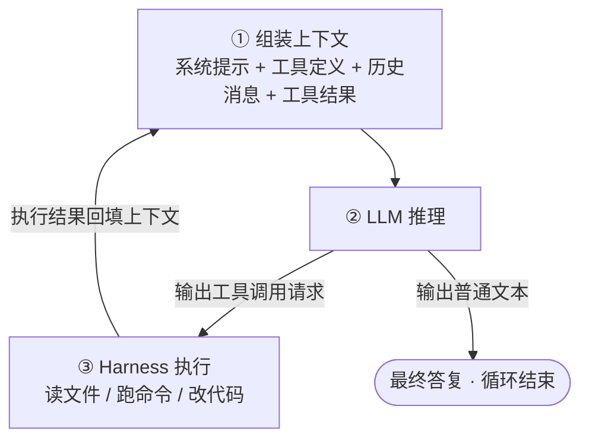
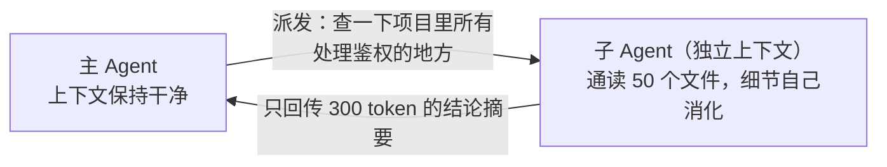

# Agent 原理：LLM + 工具 + 循环

> Agent（智能体）= 一个语言模型，配上工具，放进循环里。
> 它没有魔法，只有这三样东西的组合。

## 1. 为什么需要 Agent

先看裸聊天的语言模型有什么局限：

| 局限 | 表现 |
| --- | --- |
| 只能说，不能做 | 能给你写出"删除 tmp 目录"的命令，但自己执行不了 |
| 无状态 | 每次对话都是一张白纸，上次聊过的东西这次不知道 |
| 看不到世界 | 不知道你磁盘上有什么文件、代码长什么样 |
| 一次成型 | 一次性输出全部答案，中途不能根据反馈调整 |

Agent 的思路很朴素：**既然模型只会生成文本，那就把"做事"也变成文本游戏**——

1. 给模型一份"工具清单"，每个工具是一段声明（名字、参数、用途）；
2. 模型想做事时，输出一段特殊格式的文本表示"我要调用某某工具，参数如下"；
3. 外部程序（称为 **harness / 运行时**，比如 ZCode 本身）解析这段文本，真正去执行；
4. 把执行结果作为新的输入喂回给模型；
5. 循环，直到模型认为任务完成，输出普通文本作为最终答复。

所以每次你看到 agent"读了一个文件""跑了一条命令"，实际发生的是：模型说了一句结构化的"我想 Read 这个文件"，ZCode 替它读了，把内容贴回对话。模型自始至终只做一件事：**生成下一个 token**。

## 2. 核心循环（The Agent Loop）



一轮 = 一次模型推理 + 零或一次工具执行。一个任务通常要走几十轮。

**这个循环为什么有效？** 因为它把"一次性的概率输出"变成了"带反馈的迭代过程"：

- 模型改完代码 → 跑测试 → 测试挂了 → 结果回填 → 模型看到报错 → 修正 → 再跑。
- 每一轮的错误都会变成下一轮的输入。单步 90% 的正确率，循环几轮后收敛到接近 100%——前提是反馈信号（测试、编译错误）足够清晰。

这也是为什么 agent 特别适合编程任务：**代码是世界上反馈信号最密集的领域**，编译器、测试、类型检查器都是现成的裁判。

## 3. 上下文窗口：Agent 的工作记忆

上下文窗口（context window）是模型一次推理能"看见"的全部内容，以 token 计。对 agent 来说，它是唯一的工作记忆：

| 上下文里的区块 | 装的是什么 |
| --- | --- |
| 系统提示 | 角色设定、行为规则、安全约束 |
| 工具定义 | 每个工具的 JSON Schema（也要占 token！） |
| Skills 索引 | 所有技能的 name + description |
| 对话历史 | 用户消息 + 模型答复 |
| 工具结果 | 文件内容、命令输出、报错信息……（大头在这里） |

三个推论，理解了它们就理解了 agent 工程的一半：

1. **一切皆 token，窗口是稀缺资源。** 读一个 2000 行的文件可能烧掉几万 token；工具定义太多，还没干活就占掉一大块。所以工具要精选、文件要按需读、大任务要拆。
2. **模型只知道上下文里有的东西。** 它没有隐藏记忆——你上一个会话聊的内容、你没贴进来的文件，它统统不知道。"幻觉"很多时候就是模型在上下文缺信息时硬编。
3. **上下文会被污染。** 一堆无关的搜索结果、失败的尝试留在历史里，会持续干扰后续推理。所以需要下面说的子代理和压缩机制。

围绕"怎么花好窗口里每一个 token"的工程实践，现在有个名字叫 **Context Engineering（上下文工程）**——Skills 的整个设计（见下一篇）就是它的典型产物。

## 4. 工具调用（Tool Calling）的原理

模型并不能真的"执行"什么。工具调用的完整链路是：

**第 1 步：声明。** harness 把每个工具的名字、用途、参数结构（JSON Schema）注入上下文。对模型来说，这些只是系统提示里的一段文字。

**第 2 步：请求。** 模型在推理中决定用工具时，按约定格式输出一段结构化文本：

```json
{ "tool": "Bash", "input": { "command": "python -m pytest tests/", "description": "运行测试" } }
```

这段文本如果被当作普通回复显示出来，你看到的就是一坨 JSON——harness 会拦截它，不展示、不当作回答。

**第 3 步：执行。** harness 解析请求，在本机真正执行（这一步是普通代码，和 AI 无关）。

**第 4 步：回填。** 执行结果被包装成 `tool result` 消息追加进对话历史，然后发起下一轮推理。模型"看到"结果，决定下一步。

关键理解：**工具调用能力不是模型自己长出来的功能，而是"格式约定 + 训练对齐 + 运行时配合"三者合起来的一场约定俗成**。模型被训练过输出这种格式，运行时负责兑现执行。二者缺一不可。

顺带一提，这就是为什么同一套 MCP 工具能被不同 agent 复用——协议（格式约定）是标准化的。

## 5. Agent 的四个关键配套机制

裸循环只是骨架，能用的 agent 还依赖这些机制（ZCode 里都有）：

### 5.1 权限模式（Permission）

工具能删文件、能发网络请求，不能每次都让模型随意来。所以在"请求"和"执行"之间加一道闸：harness 根据当前权限模式决定放行、询问用户还是拒绝。你看到的"是否允许运行这条命令？"就是这个闸门在工作。权限是 agent 安全性的第一道也是最重要的一道防线。

### 5.2 子代理（Subagent）

主 agent 可以派出一个子 agent（独立线程、独立上下文）去干脏活累活——大范围搜索、通读几十个文件：



本质是**用"上下文隔离"换"主上下文的干净"**：探索过程的垃圾不进主线程，只有蒸馏后的结论进来。还可以并行派出多个子代理。代价是子代理看不到主对话，指令必须自包含。

### 5.3 上下文压缩（Compaction）

会话太长时，harness 把早期历史摘要成一段"压缩包"，替换掉原文。信息有损，但换来继续干活的空间。这就是长会话"聊着聊着忘记早期细节"的原因——那部分已经从字面历史变成了摘要。

### 5.4 记忆（Memory）

跨会话的持久化：把重要事实（用户偏好、项目约定）写进磁盘上的文件，下次会话开始时再加载进上下文。模型本身无状态，**所谓"记住你"，全靠外部存储 + 每次重新注入**。

## 6. 走一遍真实流程

以"修复一个失败的测试"为例，看循环怎么转：

```text
用户：tests/test_login.py 有个测试挂了，修一下

轮 1  Agent: Bash("python -m pytest tests/test_login.py")     → 跑测试
轮 2  Agent: Read("app/auth.py")                              → 读相关源码
轮 3  Agent: Edit("app/auth.py", 旧代码 → 新代码)               → 改代码
轮 4  Agent: Bash("python -m pytest tests/test_login.py")     → 复跑验证
轮 5  Agent: 文本回复："问题是 token 过期判断写反了，已修复，测试通过。"
```

注意两个细节：

- 轮 4 的**复跑验证**是好 agent 和坏 agent 的分水岭——改完不验证就汇报，等于没完成任务。这条原则（先验证再汇报）通常直接写进系统提示。
- 每轮的工具结果都留在上下文里，所以越到后面，模型对自己前面做过什么越清楚——工作记忆是热乎的。

## 7. 去魅：Agent 不是什么

- **不是自主意识。** 它是"概率性决策（模型）+ 确定性执行（运行时）"的混合体，每一轮都在重新预测下一个 token。
- **不是完全可靠。** 每一步都有出错概率，循环只能收敛错误，不能消灭错误。所以权限闸门、测试验证、人在回路（human in the loop）是必需品而非装饰。
- **不是越多的工具越好。** 工具定义占上下文、增加选择困难。好 agent 的工具箱是精选的。
- **不会有隐藏记忆。** 它知道的 = 此刻上下文里的。觉得它"应该知道"而它不知道时，先想想是不是没进上下文。

## 8. 小结

| 概念 | 一句话 |
| --- | --- |
| Agent | LLM + 工具 + 循环，用反馈迭代收敛到结果 |
| Harness | 模型外面的运行时（如 ZCode），负责执行工具、管权限、管上下文 |
| 上下文窗口 | 唯一的工作记忆，稀缺资源，一切工程围绕它展开 |
| 工具调用 | 模型输出结构化"请求"，运行时兑现执行，结果回填 |
| 子代理 | 独立上下文干脏活，回传摘要，保护主上下文 |

下一篇讲 Skills：当"如何花好上下文里每一个 token"成为核心矛盾，Skills 给出了最优雅的答案之一——渐进式披露。
