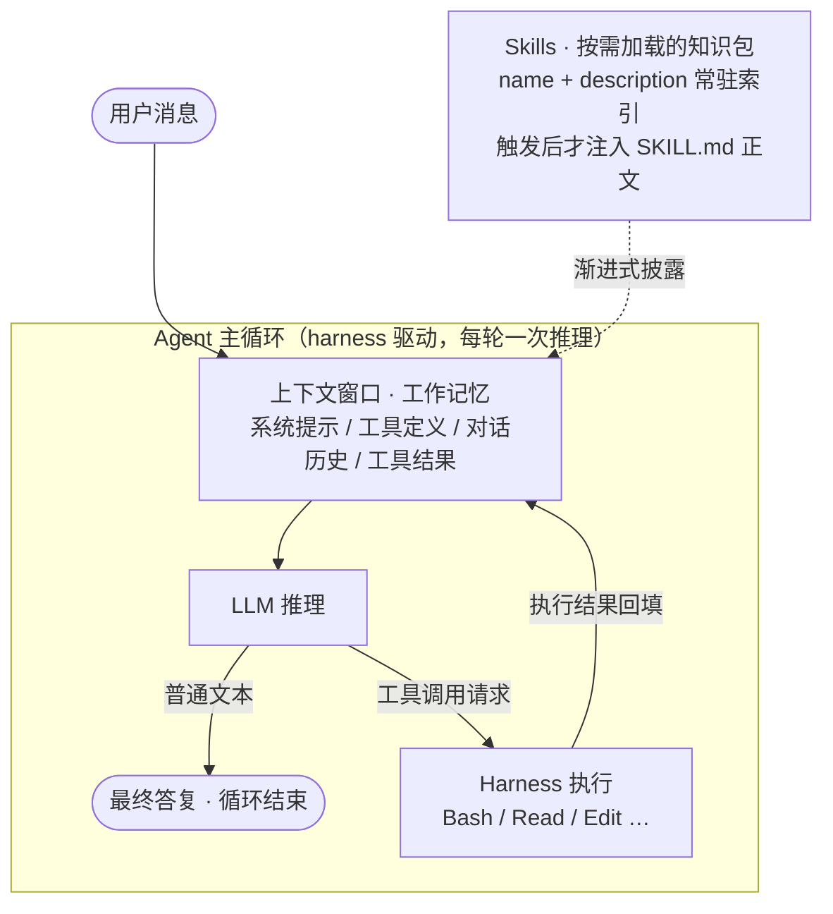

# Agent 与 Skills 原理

这个文件夹把两个概念讲清楚：**Agent（智能体）** 和 **Skills（技能）**。

它们是当下 AI 编程助手（ZCode、Claude Code 等）背后的两块核心机械：

- **Agent 回答的问题是**：怎么让一个"只会生成文本"的语言模型，真正去*做事*——读代码、改文件、跑命令？
- **Skills 回答的问题是**：领域知识和最佳实践那么多，上下文窗口塞不下，怎么*按需加载*给模型？

一句话概括二者关系：

> **Agent 是发动机（模型 + 工具 + 循环），Skills 是随车手册（按需加载的专家知识包）。**

## 文档列表

| 文件 | 内容 | 适合谁 |
| --- | --- | --- |
| [01-Agent原理.md](01-Agent原理.md) | Agent = LLM + 工具 + 循环；上下文窗口；工具调用机制；子代理；上下文管理 | 想理解 AI 编程助手"为什么能干活"的人 |
| [02-Skills原理.md](02-Skills原理.md) | SKILL.md 结构；渐进式披露；触发机制；编写要点；与 MCP/子代理的对比 | 想给自己或团队写 skill 的人 |

建议先读 Agent 原理——Skills 本质上是给 Agent 这台机器设计的供弹系统，不懂发动机就很难理解为什么手册要那样设计。

## 一张表看懂四个易混概念

| 概念 | 本质 | 解决什么 | 类比 |
| --- | --- | --- | --- |
| **Agent** | 模型 + 工具 + 循环的运行时 | 让模型能*做事* | 一整个工人 |
| **Tool（工具）** | 可执行的函数（读文件、跑命令…） | 给模型*能力* | 工人的手 |
| **Skill（技能）** | 一个文件夹 + SKILL.md | 给模型*知识和流程* | 操作手册（SOP） |
| **MCP** | 标准化的外部服务接入协议 | 让第三方系统能被接入 | 外包协作接口 |

工具决定"能不能做"，Skill 决定"怎么做最好"。
