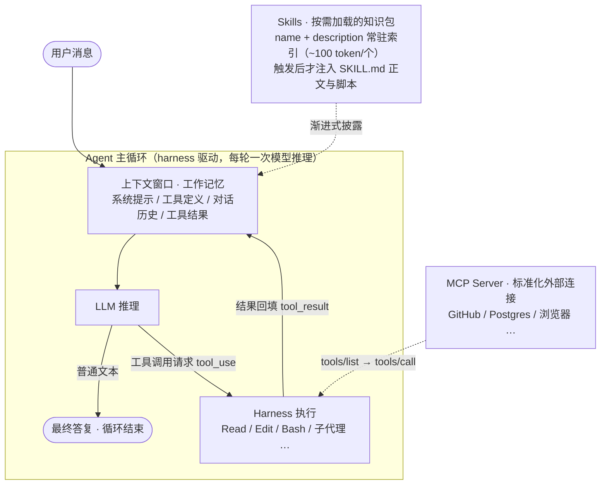

# Agent 与 Skills 原理

这个文件夹用两篇文档讲清楚当下 AI 编程助手（TRAE、Claude Code、Cursor、Codex 等）背后的两块核心机械：**Agent（智能体）** 和 **Skills（技能）**。

- **Agent 回答的问题是**：怎么让一个"只会生成文本"的语言模型，真正去*做事*——读代码、改文件、跑命令？
- **Skills 回答的问题是**：领域知识和最佳实践那么多，上下文窗口塞不下，怎么*按需加载*给模型？

一句话概括二者关系：

> **Agent 是发动机（模型 + 工具 + 循环），Skills 是随车手册（按需加载的专家知识包）。**

## 总览图

## 阅读路径

| 文件 | 内容 | 适合谁 |
| --- | --- | --- |
| [01-Agent原理.md](01-Agent原理.md) | LLM 基础（token / 上下文 / 幻觉）→ ReAct 与核心循环 → 工具调用 API 机制 → 上下文工程（压缩 / 子代理）→ 五种工作流模式 → 多智能体 → 记忆系统 → MCP → 安全 | 想理解 AI 编程助手"为什么能干活"的人 |
| [02-Skills原理.md](02-Skills原理.md) | SKILL.md 规范 → 渐进式披露 → 触发机制 → 目录与跨工具兼容 → 官方仓库样本 → 编写最佳实践 → 15 分钟动手写一个 | 想给自己或团队写 skill 的人 |

建议先读 Agent 原理——Skills 本质上是给 Agent 这台机器设计的"供弹系统"，不懂发动机就很难理解为什么手册要那样设计。两篇都为零基础读者准备了"人话版"导读块。

## 一张表看懂六个易混概念

| 概念 | 本质 | 解决什么 | 类比 |
| --- | --- | --- | --- |
| **Agent** | 模型 + 工具 + 循环的运行时 | 让模型能*做事* | 一整个工人 |
| **Tool（工具）** | harness 内置的可执行函数 | 给模型*能力* | 工人的手 |
| **Skill（技能）** | 一个文件夹 + SKILL.md | 给模型*知识和流程*（按需加载） | 操作手册（SOP） |
| **MCP** | 标准化的外部服务接入协议 | 让第三方系统被统一接入 | 外包协作接口 / USB-C |
| **子代理** | 独立上下文的分身 agent | 隔离脏活、并行探索 | 派出去的助手 |
| **AGENTS.md / CLAUDE.md** | 常驻项目说明文件 | 全程生效的项目背景 | 贴在墙上的厂规 |

工具决定"能不能做"，Skill 决定"怎么做最好"，MCP 决定"连得上谁"，规则文件决定"这个项目的常识"。

## 关键时间线

| 时间 | 事件 |
| --- | --- |
| 2022-10 | ReAct 论文确立 Thought→Action→Observation 循环范式 |
| 2023 | OpenAI Function Calling / Anthropic Tool Use 成为原生 API 能力 |
| 2024-11 | Anthropic 开源 MCP（Model Context Protocol） |
| 2024-12 | 《Building Effective Agents》：简单可组合的模式胜过复杂框架 |
| 2025 | Coding Agent 走向生产；上下文工程、多智能体系统成型 |
| 2025-10 | Anthropic 发布 Agent Skills |
| 2025-12 | Skills 成为开放标准（agentskills.io） |
| 2026 | 各主流工具全面支持 Skills 与 MCP，生态收敛 |

> 文中数字与产品细节截至 2026 年中，该领域迭代极快；两篇文末均附一手来源链接，可顺藤摸瓜看最新版。
