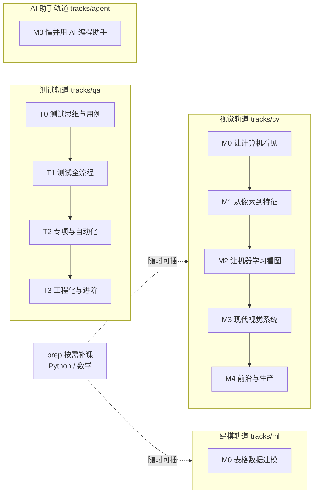

# ROADMAP · 全局地图与进度

四条轨道，各自独立，随时可换。**勾掉一个里程碑的唯一标准：过关清单全绿 + 项目做完。**

## 技能树

## 我的进度

### 视觉 [TRACK](tracks/cv/TRACK.md)

- [ ] [M0 让计算机看见](tracks/cv/M0/README.md) —— 产出：MNIST 分类器
- [ ] [M1 从像素到特征](tracks/cv/M1/README.md) —— 产出：图像处理小工具
- [ ] [M2 让机器学习看图](tracks/cv/M2/README.md) —— 产出：手写反向传播
- [ ] [M3 现代视觉系统](tracks/cv/M3/README.md) —— 产出：CIFAR-10 训练 + YOLO 检测
- [ ] [M4 前沿与生产](tracks/cv/M4/README.md) —— 产出：自选 capstone

### 测试 [TRACK](tracks/qa/TRACK.md)

- [ ] [T0 测试思维与用例](tracks/qa/T0/README.md) —— 产出：一份高质量用例集
- [ ] [T1 测试全流程](tracks/qa/T1/README.md) —— 产出：完整测试计划
- [ ] [T2 专项与自动化](tracks/qa/T2/README.md) —— 产出：自动化脚本套件
- [ ] [T3 工程化与进阶](tracks/qa/T3/README.md) —— 产出：测试方案设计

### 建模 [TRACK](tracks/ml/TRACK.md)

- [ ] [M0 表格数据建模](tracks/ml/M0/README.md) —— 产出：Kaggle 成绩 + 调参报告

### AI 助手 [TRACK](tracks/agent/TRACK.md)

- [ ] [M0 懂并用 AI 编程助手](tracks/agent/M0/README.md) —— 产出：亲手写的 skill

## 学习循环（每天照此执行）

1. **学一课**（1-2 小时）：为什么 → 概念 → 动手 → 自测
2. **自测不过**：当天回读，别带着糊涂进入下一课
3. **周五复习**：运行 `python3 tools/quiz.py tracks/cv` 做 10 道检索题（间隔重复）
4. **每完成一个里程碑**：项目存进你的作品仓库，回来勾掉上面的框

## 位置速查

| 我想要… | 去… |
| --- | --- |
| 配环境 | [references/env.md](references/env.md) |
| 查术语 | [references/glossary-cv.md](references/glossary-cv.md) / [glossary-qa.md](references/glossary-qa.md) |
| 查公式 / 速查卡 | [references/loss-math.md](references/loss-math.md)、[quickref-dl.md](references/quickref-dl.md) |
| 补数学 / Python | [prep/](prep/README.md) |
| 找练习题 | 各里程碑 practice.md + [视觉题池](tracks/cv/practice-pool.md) |
| 了解这套系统为什么这样设计 | [system/METHOD.md](system/METHOD.md) |
