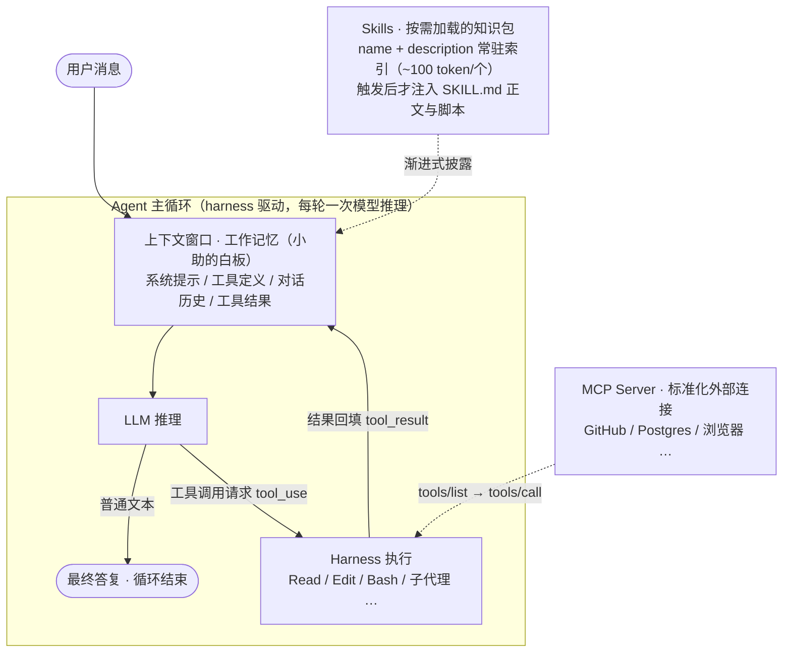

# AI 编程助手轨道 · 懂原理，会定制

**学会的标志**：向别人讲清 AI 编程助手为什么能读代码、改文件、跑命令（Agent 循环与上下文工程）；亲手写一个能被稳定触发的 skill，并按"渐进式披露"设计它的结构。

这条轨道讲当下 AI 编程助手（TRAE、Claude Code、Cursor、Codex 等）背后的两块核心机械：

- **Agent 回答的问题是**：怎么让一个"只会生成文本"的语言模型，真正去*做事*——读代码、改文件、跑命令？
- **Skills 回答的问题是**：领域知识和最佳实践那么多，上下文窗口塞不下，怎么*按需加载*给模型？
- **实战篇回答的问题是**：给一个专业领域，怎么从 0 到 1 设计出一整套生产级 skill？

一句话概括二者关系：

> **Agent 是发动机（模型 + 工具 + 循环），Skills 是随车手册（按需加载的专家知识包）。**

**适合谁**：任何想把 AI 编程助手用到极致的人——零基础可读（每课有"人话版"比喻），开发者可深挖（真实 API 报文与实测数字）。
**投入**：每周 6h 约 1-2 周。

## 里程碑

| 关卡 | 回答的问题 | 过关项目 | 预计 |
| --- | --- | --- | --- |
| [M0 懂并用 AI 编程助手](M0/README.md) | 助手为什么能干活？怎么给它加专业知识？ | 亲手写一个自己的 skill | 1-2 周 |

## 阅读路径（M0 内三课）

| 课 | 结构 | 适合谁 |
| --- | --- | --- |
| [L01-Agent原理](M0/L01-Agent原理.md) | LLM 三个底层设定 → 循环解剖 → 工具调用（含裸 prompt 版）→ 上下文工程 → 编排与多智能体 → **40 行代码手写 Agent + 练习场** → 记忆/安全 → 自测清单 | 想理解 AI 编程助手"为什么能干活"的人 |
| [L02-Skills原理](M0/L02-Skills原理.md) | 周报故事开场 → SKILL.md 规范 → 渐进式披露（带数字的完整时序）→ 触发机制与排障 → **15 分钟手写一个技能（含调试迭代）** → 自测清单 | 想给自己或团队写 skill 的人 |
| [L03-实战解析](M0/L03-实战解析.md) | **重新发明式教程**：跟着把 qa-skills 造一遍——10 个技能、core/ 共享库、薄编排流水线、证据体系 E0–E4、十轴决策矩阵、评测闭环，每章"踩坑→动手→对上仓库实物"，读完它就像你自己写的 | 想深入理解 qa-skills 架构、或想为自己的领域设计整套 skill 框架的人 |

建议先读 Agent 原理——Skills 本质上是给 Agent 这台机器设计的"供弹系统"，不懂发动机就很难理解为什么手册要那样设计。前两课共用主角"小助"讲原理（学会干活 → 学会翻手册）；第三课换成**你亲自下场**：跟着把 qa-skills 重新发明一遍。

## 教学设计说明

写法上参考了三个公认的优秀课程，并在中文语境下重新组织：

| 参考对象 | 借鉴的手法 |
| --- | --- |
| 微软《AI Agents for Beginners》（18 课） | **贯穿全文的案例**（"程序员和 AI 助手小助"）、**反例教学**（四种上下文事故）、**行为动词自测清单** |
| Hugging Face《Agents Course》 | **故事先行、定义后置**（先看小助翻车再给定义）、**能力阶梯**（最小代码差分辨析概念）、**先手搓再讲框架**（40 行代码写 Agent） |
| Datawhale《hello-agents》（中文开源） | **"会用轮子也会造轮子"的三层递进**：原理 → 手写 → 再看工具产品 |

两个特点：

1. **零基础友好**：每章都有"人话版"比喻块（玻璃房顾问、白板、目录卡片、点菜系统），跳过代码和表格也能读通；
2. **专业深度**：正文包含真实 API 报文、实测数字（58 个工具 ≈ 55K token、多智能体 15× 消耗、压缩前后 335K→169K）、可跟着敲的代码，以及全部一手来源链接。

## 总览图

## 一张表看懂六个易混概念

| 概念 | 本质 | 解决什么 | 类比 |
| --- | --- | --- | --- |
| **Agent** | 模型 + 工具 + 循环的运行时 | 让模型能*做事* | 一整个工人 |
| **Tool（工具）** | harness 内置的可执行函数 | 给模型*能力* | 工人的手 |
| **Skill（技能）** | 一个文件夹 + SKILL.md | 给模型*知识和流程*（按需加载） | 操作手册（SOP） |
| **MCP** | 标准化的外部服务接入协议 | 让第三方系统被统一接入 | 外包协作接口 / USB-C |
| **子代理** | 独立上下文的分身 agent | 隔离脏活、并行探索 | 派出去的助手 |
| **AGENTS.md / CLAUDE.md** | 常驻项目说明文件 | 全程生效的项目背景 | 贴在墙上的厂规 |

工具决定"能不能做"，Skill 决定"怎么做最好"，MCP 决定"连得上谁"，规则文件决定"这个项目的常识"。

## 关键时间线

| 时间 | 事件 |
| --- | --- |
| 2022-10 | ReAct 论文确立 Thought→Action→Observation 循环范式 |
| 2023 | OpenAI Function Calling / Anthropic Tool Use 成为原生 API 能力 |
| 2024-11 | Anthropic 开源 MCP（Model Context Protocol） |
| 2024-12 | 《Building Effective Agents》：简单可组合的模式胜过复杂框架 |
| 2025 | Coding Agent 走向生产；上下文工程、多智能体系统成型 |
| 2025-10 | Anthropic 发布 Agent Skills |
| 2025-12 | Skills 成为开放标准（agentskills.io） |
| 2026 | 各主流工具全面支持 Skills 与 MCP，生态收敛 |

> 文中数字与产品细节截至 2026 年中，该领域迭代极快；各课文末均附一手来源链接，可顺藤摸瓜看最新版。
