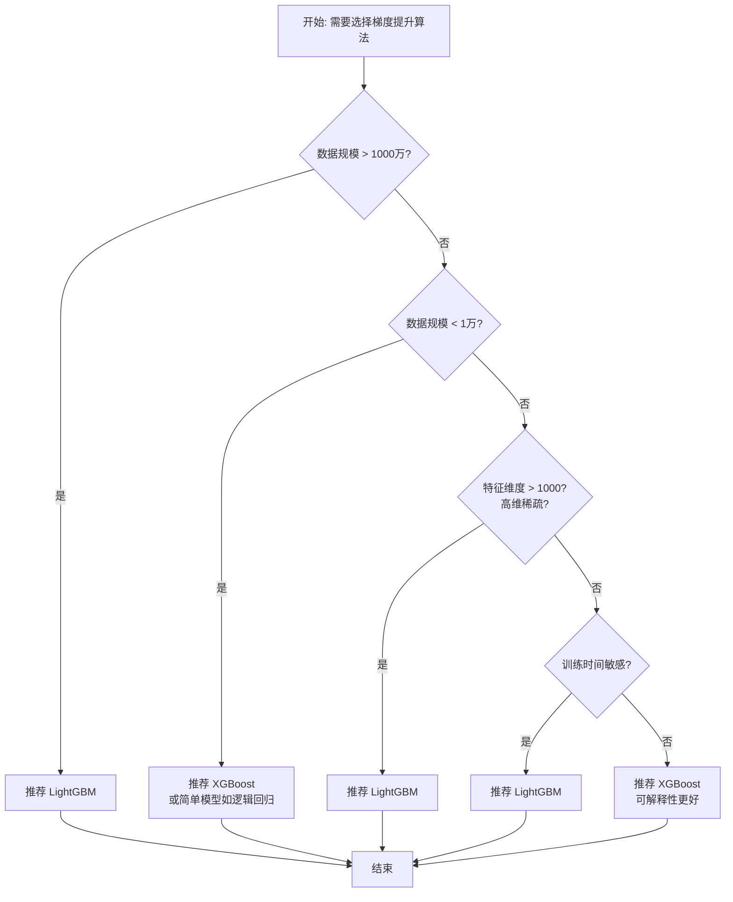

# 第四部分：实践指南

> 原理学完，怎么落地？算法选择决策图、参数调优模板、常见陷阱清单，最后用一个完整流程把数据变成可提交的模型。本篇是"照着做"的一篇。

**前置知识**：[第一](L01-%E6%A2%AF%E5%BA%A6%E6%8F%90%E5%8D%87.md)、[第二](L02-XGBoost.md)、[第三部分](L03-LightGBM.md)。
**预计投入**：60 分钟 + 上手练习 1 小时。

**上一篇**: [第三部分](L03-LightGBM.md) | **下一篇**: [第五部分：进阶话题](L05-%E8%BF%9B%E9%98%B6%E8%AF%9D%E9%A2%98.md)

---

## 上篇回顾：LightGBM 实战案例与小结

LightGBM 在某广告点击率（CTR）预测场景的调参配置：

```python
params = {
    'objective': 'binary',
    'max_depth': 6,               # 限制深度，防止过拟合
    'num_leaves': 50,             # < 2^max_depth
    'learning_rate': 0.02,
    'n_estimators': 1000,
    'feature_fraction': 0.8,      # 特征采样
    'bagging_fraction': 0.8,      # 数据采样
    'bagging_freq': 5,
}
```

**效果对比**：

| 指标 | XGBoost | LightGBM | 提升 |
|------|---------|----------|------|
| 训练时间 | 4.5 小时 | 35 分钟 | **7.7 倍** |
| CTR 预测 AUC | 0.78 | 0.81 | 提升 **3.8%** |
| 广告收入 | 基准 | +15% | - |

**业务价值**：
- CTR 预测准确率提升 **10-20%**
- 广告收入提升 **15%**
- 训练成本降低 **80%**

---

**小结**：LightGBM 是"效率优先"的梯度提升框架

**四大技术创新**：
1. **Leaf-wise 生长**：集中火力降低误差
2. **直方图算法**：用空间换时间
3. **GOSS**：保留重要样本
4. **EFB**：降低特征维度

**何时选择 LightGBM**：
- 大规模数据（> 1000 万样本）
- 高维稀疏特征（> 1000 维）
- 训练时间敏感

---

### 4.1 如何选择算法？
#### 决策流程图


**教学要点**：
- 数据规模是最重要的决策因素
- 高维稀疏特征（如 one-hot 编码）优先选择 LightGBM
- 需要可解释性时选择 XGBoost
- 训练时间敏感时选择 LightGBM

#### 决策流程（文字版）
1. **数据规模 > 1000 万？**
   - 是 → **LightGBM**
   - 否 → 继续

2. **数据规模 < 1 万？**
   - 是 → **XGBoost** 或简单模型（如逻辑回归）
   - 否 → 继续

3. **特征维度 > 1000（高维稀疏）？**
   - 是 → **LightGBM**
   - 否 → XGBoost

4. **训练时间敏感？**
   - 是 → **LightGBM**
   - 否 → XGBoost

#### 快速对比表
| 应用场景 | 推荐算法 | 理由 |
|----------|----------|------|
| 金融风控（中小规模） | XGBoost | 数据质量高，需要可解释性 |
| 金融风控（大规模） | LightGBM | 数据量大，训练时间敏感 |
| 推荐系统 | LightGBM | 高维稀疏特征，频繁更新 |
| 搜索排序 | LightGBM | 大规模查询-文档对 |
| 医疗诊断 | XGBoost | 数据量中等，需要可解释性 |
| 点击率预测 | LightGBM | 超大规模数据，实时性要求 |

---

### 4.2 快速上手
#### 环境准备
```bash
# 安装 XGBoost 和 LightGBM
pip install xgboost lightgbm scikit-learn
```

#### XGBoost 示例
```python
from xgboost import XGBClassifier
from sklearn.model_selection import train_test_split
from sklearn.metrics import accuracy_score
import pandas as pd

# 加载数据
X = df.drop('target', axis=1)  # 特征
y = df['target']               # 标签

# 划分训练集和测试集
X_train, X_test, y_train, y_test = train_test_split(
    X, y, test_size=0.2, random_state=42
)

# 训练模型
model = XGBClassifier(
    max_depth=6,           # 树深度
    learning_rate=0.1,     # 学习率
    n_estimators=100,      # 树的数量
    random_state=42
)
model.fit(X_train, y_train)

# 预测
y_pred = model.predict(X_test)

# 评估
accuracy = accuracy_score(y_test, y_pred)
print(f"Accuracy: {accuracy:.3f}")
```

#### LightGBM 示例
```python
import lightgbm as lgb
from sklearn.model_selection import train_test_split
from sklearn.metrics import accuracy_score

# 加载数据
X = df.drop('target', axis=1)
y = df['target']

# 划分训练集和测试集
X_train, X_test, y_train, y_test = train_test_split(
    X, y, test_size=0.2, random_state=42
)

# 创建数据集
train_data = lgb.Dataset(X_train, label=y_train)
test_data = lgb.Dataset(X_test, label=y_test, reference=train_data)

# 训练模型
params = {
    'objective': 'binary',          # 二分类
    'max_depth': 6,
    'num_leaves': 50,               # < 2^max_depth
    'learning_rate': 0.02,
    'metric': 'binary_logloss'
}

model = lgb.train(
    params,
    train_data,
    num_boost_round=1000,
    valid_sets=[test_data],
    early_stopping_rounds=10
)

# 预测
y_pred = model.predict(X_test)
y_pred_binary = [1 if p > 0.5 else 0 for p in y_pred]

# 评估
accuracy = accuracy_score(y_test, y_pred_binary)
print(f"Accuracy: {accuracy:.3f}")
```

---

### 4.3 参数调优建议
#### XGBoost 关键参数
| 参数 | 说明 | 推荐值 |