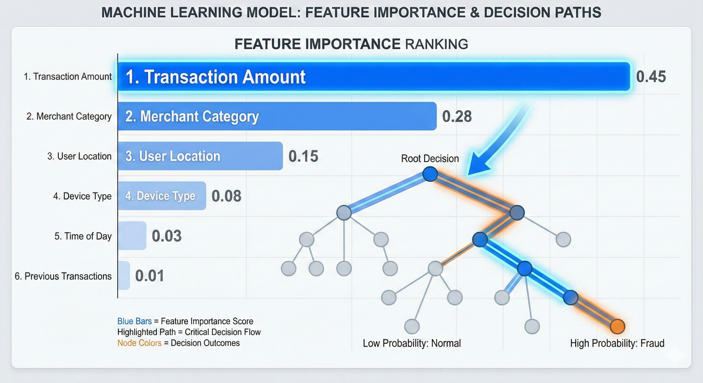

# 第二部分：XGBoost 详解

> **目标**：理解 XGBoost 的四大技术优势

**上一篇**: [第一部分](./01-梯度提升基础.md) | **下一篇**: [第三部分：LightGBM 详解](./03-lightgbm详解.md)

---


## 第二部分：XGBoost 详解

> **目标**：理解 XGBoost 的四大技术优势

### 2.1 XGBoost 是什么？

**XGBoost** 全称是 **eXtreme Gradient Boosting**（极致梯度提升）。

它不是一个新的算法，而是对传统 GBDT 的**工程化极致优化版本**。

**类比**：如果说 GBDT 是一个"复习小组"，那么 XGBoost 就是一个：
- 装备精良的"超级复习小组"
- 不仅知道错了，还知道**为什么错**（二阶导数）
- 有严格的质量控制（正则化）
- 分工明确，效率极高（并行计算）

**为什么叫"极致"（eXtreme）？**
- **速度极致**：训练速度比传统 GBDT 快 10 倍以上
- **精度极致**：预测精度更高（尤其是复杂数据）
- **可扩展性极致**：支持分布式计算，可处理十亿级样本

**历史背景**：
- 发布时间：2014年
- 作者：陈天奇（当时是华盛顿大学博士生）
- 影响：迅速成为 Kaggle 竞赛的获胜算法，被誉为"竞赛神器"

---

### 2.2 四大核心技术

XGBoost 的优势来自四大技术创新，我们逐一讲解。

---

#### 2.2.1 正则化（Regularization）

**通俗解释**：给模型设定"复杂度税"，避免过度拟合训练数据。

**问题**：如果让模型无限复杂，它会记住所有训练数据，但无法应对新数据（过拟合）。

**XGBoost 的解决方案**：在目标函数中加入**正则化项**。

$$
\mathcal{L}^{(t)} = \sum_{i=1}^{n} l(y_i, \hat{y}_i^{(t-1)} + f_t(x_i)) + \Omega(f_t)
$$

其中正则化项：

$$
\Omega(f) = \gamma T + \frac{1}{2}\lambda \sum_{j=1}^{T} w_j^2
$$

**变量解释**：
- $T$：树中叶子节点的数量
- $w_j$：第 $j$ 个叶子节点的预测值（权重）
- $\gamma$：叶子节点数量的惩罚系数（控制树的复杂度）
- $\lambda$：叶子权重的L2正则化系数（控制权重的平滑度）

**通俗理解**：
- $\gamma T$：树越复杂（叶子越多），惩罚越大
- $\frac{1}{2}\lambda \sum w_j^2$：叶子权重越平滑，惩罚越小

**效果**：
- 简化树结构，避免过度复杂
- 提升泛化能力，减少过拟合
- 类似"奥卡姆剃刀"原理：简单即美

---

#### 2.2.2 稀疏性处理（Sparsity Awareness）

**通俗解释**：自动识别并跳过缺失值，无需手动填补。

**传统方法**：需要手动填补缺失值（均值、中位数、0等）

**XGBoost 方法**：
1. 训练时自动为缺失值找到最佳分支方向
2. 预测时遇到缺失值，自动走最优分支
3. 计算时直接跳过缺失值，减少计算量

**技术细节**：
- 数据采用 **CSC（压缩稀疏列）** 格式存储
- 稀疏感知算法（Sparsity-aware Split Finding）
- 自动学习缺失值的默认方向

**效果**：
- 省去数据预处理步骤
- 内存占用减少 50%-90%（取决于稀疏程度）
- 处理高维稀疏数据（如文本、推荐系统）效率高

**应用场景**：
- 推荐系统：大量用户-物品交互是缺失的
- 医疗数据：许多实验室检查项目可能缺失
- 金融风控：部分用户的财务信息不完整

---

#### 2.2.3 加权分位数 Sketch（Weighted Quantile Sketch）

**通俗解释**：智能分组策略，确保每个组都"值得学习"。

**问题**：如何找到最优的特征分裂点？

**传统方法（Pre-sorted）**：
- 预先对所有特征值排序
- 每次分裂遍历所有可能切分点
- 时间复杂度：O(#data × #feature)
- **问题**：大数据集上非常慢

**XGBoost 方法**：
- 用**二阶梯度**作为权重
- 梯度大的样本（误差大的样本）分箱更细致
- 近似算法，支持分布式计算

**数据示例**：

原始特征值：
```
[0.1, 0.15, 0.3, 0.35, 0.8, 0.85, 0.9]
```

离散化为 3 个 bin：
```
Bin 1: [0.1, 0.15, 0.3]    → 梯度和: 50
Bin 2: [0.35, 0.8]         → 梯度和: 30
Bin 3: [0.85, 0.9]         → 梯度和: 20
```

**效果**：
- 找到最优分裂点速度提升 **10-100 倍**
- 大数据集（百万级样本）训练成为可能
- 几乎不损失精度（近似误差 < 1%）

**实际案例**：
- 处理千万级样本数据集
- 训练时间从小时级降至分钟级

---

#### 2.2.4 二阶导数优化

**通俗解释**：不仅知道"错了多少"，还知道"错误的变化趋势"。

**传统 GBDT**：
- 只用**一阶导数（梯度）**
- 类比：只知道"往山下走"的方向

**XGBoost 方法**：
- 使用**二阶泰勒展开**
- 同时利用**一阶导数和二阶导数**
- 类比：还知道"山坡的曲率"，步长更精确

**数学表达**：

$$
\mathcal{L}(y, \hat{y}^{(t)}) \approx \mathcal{L}(y, \hat{y}^{(t-1)}) + g_i f_t(x_i) + \frac{1}{2} h_i f_t^2(x_i)
$$

**变量解释**：
- $\hat{y}^{(t)}$：第 $t$ 轮的预测值
- $g_i$：一阶导数（梯度）：$g_i = \partial_{\hat{y}^{(t-1)}} l(y_i, \hat{y}^{(t-1)})$
- $h_i$：二阶导数（海森矩阵）：$h_i = \partial^2_{\hat{y}^{(t-1)}} l(y_i, \hat{y}^{(t-1)})$
- $f_t(x_i)$：第 $t$ 个树的预测

**通俗解释**：
- **$g_i$（一阶导数）**：告诉我们"往哪个方向走能减少误差"
- **$h_i$（二阶导数）**：告诉我们"这个方向的曲率如何"，帮助我们确定步长

**效果**：
- 收敛速度更快（迭代次数减少 **30%-50%**）
- 预测精度更高（尤其是复杂数据分布）

**实际案例**：
- 相同数据集上，XGBoost 仅需传统 GBDT **1/2 到 2/3** 的迭代次数
- 最终预测误差通常降低 **5%-15%**

---

### 2.3 何时使用 XGBoost？

**适合的场景**：

1. **数据规模**：中小规模（< 1000 万样本）
2. **特征类型**：混合型（数值 + 类别）
3. **数据质量**：有噪声、有缺失值
4. **可解释性**：中等需求（可以通过特征重要性分析）

**不适合的场景**：

1. **超大规模数据**（> 1000 万样本）→ 用 LightGBM
2. **极小数据**（< 1 万样本）→ 用简单模型（如逻辑回归）
3. **实时训练**（每小时更新）→ 用 LightGBM

---

### 2.4 真实案例：金融风控

**业务场景**：信用卡欺诈检测

**任务**：实时判断一笔信用卡交易是否为欺诈

**数据特点**：
- 样本量：千万级交易记录
- 特征：数百维（包含缺失值）
- 类别不平衡：欺诈交易占比 < 1%

**技术方案**：

**特征工程**：
- 时间特征：交易时间点、距离上次交易时长
- 空间特征：交易地点、常用地偏离度
- 行为特征：消费频率、金额变化趋势
- 网络特征：与历史欺诈交易关联度

**模型配置**：
```python
params = {
    'max_depth': 6,              # 限制深度，防止过拟合
    'learning_rate': 0.1,        # 学习率
    'n_estimators': 100,         # 树的数量
    'reg_alpha': 0.1,            # L1 正则
    'reg_lambda': 1.0,           # L2 正则
    'subsample': 0.8,            # 数据采样
    'colsample_bytree': 0.8,     # 特征采样
}
```

**评估指标**：
- 精确率（Precision）：识别出的欺诈中真欺诈比例
- 召回率（Recall）：所有欺诈中被识别出的比例
- AUC：整体区分能力（通常 > 0.95）

**业务价值**：
- 欺诈识别准确率提升 **15-20%**
- 误报率降低 **30%**（减少客户打扰）
- 挽回损失：每年数百万美元


