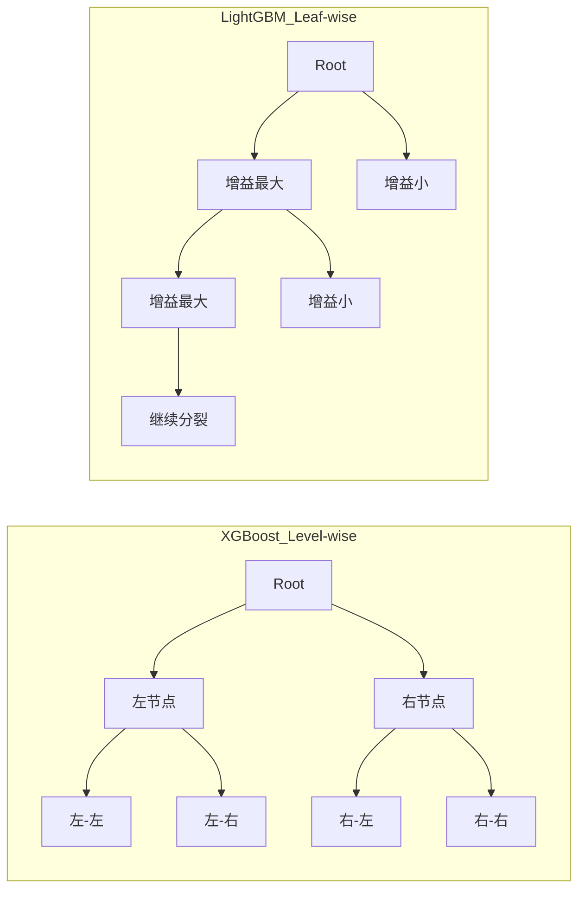
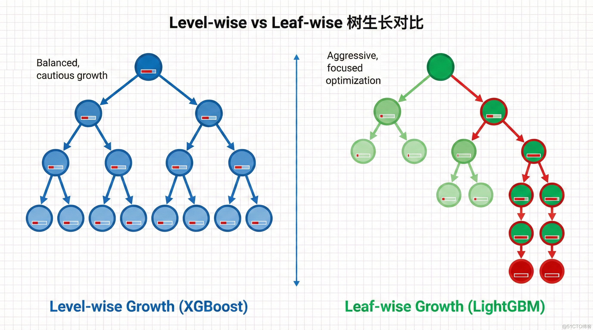

# 第三部分：LightGBM 详解

> **目标**：理解 LightGBM 的四大技术创新

**上一篇**: [第二部分](./02-xgboost详解.md) | **下一篇**: [第四部分：实践指南](./04-实践指南.md)

---

  2. "Time Since Last Transaction" - second most (medium thickness)
  3. "Merchant Category" - third
  4. "Location" - fourth
  5. "User Behavior Score" - least important (thinnest line)

  Visual elements:
  - Each feature connects to tree nodes with colored lines
  - Line thickness and opacity represent importance weight
  - A gradient color scale from dark blue (most important) to light gray (least important)
  - Small percentage labels next to each feature: "35%", "25%", "20%", "15%", "5%"

  Bottom right: A small pie chart showing the same distribution.

  Style: Modern data visualization, clean and professional.
  Color palette: Blue gradient with accent colors.
  Background: Light gray with subtle tech pattern.
  Mood: Analytical, informative, data-driven.

  Text: "Feature Importance: What Matters Most?" in bold at the top.

  Technical specs: 16:9 aspect ratio, high resolution, suitable for ML tutorials.

  Expected effect: 展示特征重要性的概念，用视觉元素（线条粗细、颜色）传达重要性
-->

---

### 2.5 小结

**核心价值**：XGBoost 是 GBDT 的**工程化极致优化版本**

**四大技术优势**：
1. **正则化**：控制复杂度，防止过拟合
2. **稀疏性处理**：自动处理缺失值
3. **加权分位数 Sketch**：快速找到最优分裂点
4. **二阶导数优化**：更精确地收敛

**何时选择 XGBoost**：
- 中小规模数据（< 1000 万样本）
- 数据有噪声、有缺失值
- 需要一定的可解释性

---

## 第三部分：LightGBM 详解

> **目标**：理解 LightGBM 的四大技术创新

### 3.1 LightGBM 是什么？

**LightGBM** 全称是 **Light Gradient Boosting Machine**（轻量级梯度提升机）。

它是微软开发的高效梯度提升框架，**专注于解决大规模数据的训练效率和内存占用问题**。

它的名字"Light"正是为了突出其**"轻量、快速"**的特性。

**核心价值**：
- ⚡ **快**：训练速度比 XGBoost 快 **3-7 倍**
- 💾 **省**：内存占用仅为 XGBoost 的 **20%-30%**
- 🎯 **准**：准确率与 XGBoost 相当甚至略优（< 1% 差异）

**开发者**：微软公司（Microsoft）

**适用场景**：
- 大规模数据（> 1000 万样本）
- 高维稀疏特征（> 1000 维）
- 频繁更新模型（每日/每小时）

---

### 3.2 四大技术创新

LightGBM 的优势来自四大技术创新，我们逐一讲解。

---

#### 3.2.1 Leaf-wise 生长策略

**传统方式（Level-wise，层级生长）**：
```
第1层：所有节点同时分裂
第2层：所有节点同时分裂
...
```
- **问题**：许多分裂增益很小，浪费计算资源

**LightGBM 方式（Leaf-wise，叶子生长）**：
```
每次只选择"增益最大"的叶子节点进行分裂
```
- **优势**：在相同分裂次数下，降低更多误差，精度更高
- **风险**：可能生成过深的树，导致过拟合
- **解决**：通过 `max_depth` 参数限制深度（一般设置为 3-8）

**形象比喻**：
- **Level-wise**：像"摊大饼"，平均用力
- **Leaf-wise**：像"打蛇打七寸"，集中火力攻克关键节点

**可视化对比**：



**教学要点**：
- XGBoost（Level-wise）：按层均衡生长，容易并行
- LightGBM（Leaf-wise）：找增益最大的叶子，可能过深
- LightGBM 通过 `max_depth` 防止过拟合



---

#### 3.2.2 直方图算法（Histogram-based）

**通俗解释**：用空间换时间，大幅提升计算速度。

**传统方法（Pre-sorted）**：
- 预先对所有特征值排序
- 每次分裂遍历所有可能切分点
- 时间复杂度：O(#data × #feature)
- **问题**：大数据集上非常慢

**LightGBM 方法（直方图）**：
```
连续浮点特征值 → 离散化为 k 个区间（如 255 个 bin）
→ 统计每个区间的梯度信息
→ 在直方图上找最优分裂点
```

**数据示例**：

原始特征值：
```
[0.1, 0.15, 0.3, 0.35, 0.8, 0.85, 0.9]
```

离散化为 3 个 bin：
```
Bin 1: [0.1, 0.15, 0.3]    → 梯度和: 50
Bin 2: [0.35, 0.8]         → 梯度和: 30
Bin 3: [0.85, 0.9]         → 梯度和: 20
```

**优势**：
- 内存占用降低：O(#bin) << O(#data)
- 计算加速：复杂度降为 O(#bin × #feature)
- 支持直方图作差加速：父节点直方图 - 子节点直方图 = 兄弟节点直方图

**效果**：
- 内存占用降低 **70%-80%**
- 计算加速 **70%-80%**

---

#### 3.2.3 GOSS（Gradient-based One-Side Sampling）

**通俗解释**：保留"重要"样本，随机丢弃"不重要"样本。

**核心思想**：不是所有样本都同等重要！

**算法步骤**：
1. 计算每个样本的梯度绝对值（梯度大 = 预测误差大 = 样本重要）
2. 保留梯度大的前 a% 样本（如 20%）
3. 从剩余样本中随机抽取 b% 样本（如 10%）
4. 对保留的小梯度样本乘以 (1-a)/b 的权重，补偿采样偏差

**生活类比**：
- 考试复习时，**重点复习错题**（高梯度），简单题快速浏览（低梯度采样）

**效果**：
- 数据量减少 **30%-50%**
- 计算速度大幅提升
- 精度几乎不损失（因为保留了关键样本）

---

#### 3.2.4 EFB（Exclusive Feature Bundling）

**通俗解释**：将"互斥"的特征捆绑在一起，减少特征数量。

**问题**：高维稀疏特征（如 one-hot 编码）导致特征数量爆炸。

**示例**：
```
原始特征：
  用户_北京: [1, 0, 0, ...]
  用户_上海: [0, 1, 0, ...]
  用户_深圳: [0, 0, 1, ...]
  （完全互斥）
```

**解决方案**：通过图着色算法，将低冲突特征捆绑。

**捆绑后**：
```
城市特征: [1, 11, 21, ...]
（1=北京, 11=上海, 21=深圳，通过偏移量区分）
```

**效果**：
- 特征数量减少 **5-10 倍**
- 内存占用和计算时间大幅降低

---

### 3.3 XGBoost vs LightGBM

| 特性 | XGBoost | LightGBM |
|------|---------|----------|
| **树生长策略** | Level-wise（按层生长） | Leaf-wise（叶子生长） |
| **分裂点查找** | Pre-sorted 算法 | 直方图算法 |
| **样本采样** | 随机采样 | GOSS（基于梯度采样） |
| **特征处理** | 稀疏优化 | EFB 捆绑 |
| **训练速度** | 基准 | 快 **3-7 倍** |
| **内存占用** | 基准 | 降低 **70%-80%** |
| **适用规模** | < 1000 万样本 | > 1000 万样本 |
| **准确率** | 基准 | 相当或略优（< 1%差异） |

**性能数据对比**：

数据集：电商点击日志（5000万样本，1000维特征）

| 指标 | XGBoost | LightGBM | 提升 |
|------|---------|----------|------|
| 训练时间 | 120 分钟 | 18 分钟 | **6.7 倍** |
| 内存占用 | 12GB | 3GB | 降低 **75%** |
| AUC | 0.825 | 0.827 | 略优 |

---

### 3.4 何时使用 LightGBM？

**适合的场景**：

1. **数据规模**：大规模（> 1000 万样本）
2. **特征维度**：高维稀疏（> 1000 维，大量 one-hot）
3. **训练频率**：频繁更新（每日/每小时）
4. **内存限制**：有限内存资源

**不适合的场景**：

1. **小数据集**（< 1 万样本）→ 用 XGBoost
2. **对可解释性要求极高** → 用决策树或逻辑回归
3. **特征维度 < 10** → 用简单模型

---

### 3.5 真实案例：推荐系统

**业务场景**：电商广告点击率（CTR）预测

**任务**：预测用户对某个广告/商品的点击概率

**数据特点**：
- 样本量：5000 万广告展示记录
- 特征维度：10 万+（大量 one-hot 编码）
- 稀疏性：90%+ 的特征值为 0

**技术方案**：

**特征工程**：
- 用户特征：年龄、性别、购买力、兴趣偏好
- 商品特征：类目、品牌、价格、历史销量
- 上下文特征：时间、位置、设备、来源
- 交互特征：用户-商品匹配度

**模型配置**：