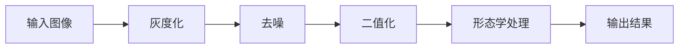

# 图像处理基础 - 练习与答案

> **一句话总结**: 图像处理基础 - 练习与答案的详细讲解与实战指南

> **难度等级**: ⭐⭐ (入门级)
> **预计学习时间**: 2-3天
> **前置知识**: 待补充
> **学习目标**:
> - 理论: 待补充
> - 实践: 待补充
> - 应用: 待补充

---


> **章节**: 02-图像处理基础
> **练习数量**: 5个练习
> **总预计时间**: 2.5-3.5小时
> **难度**: ⭐⭐⭐☆☆ (中级)

---

## 📋 练习清单

| 练习 | 主题 | 难度 | 预计时间 | 状态 |
|------|------|------|----------|------|
| 练习1 | 图像滤波去噪 | ⭐⭐☆☆☆ | 30分钟 | ☐ 待完成 |
| 练习2 | 边缘检测实现 | ⭐⭐⭐☆☆ | 45分钟 | ☐ 待完成 |
| 练习3 | 图像增强技术 | ⭐⭐⭐☆☆ | 45分钟 | ☐ 待完成 |
| 练习4 | 形态学操作 | ⭐⭐⭐☆☆ | 40分钟 | ☐ 待完成 |
| 练习5 | 文档预处理流水线 | ⭐⭐⭐⭐☆ | 60分钟 | ☐ 待完成 |

---

## 练习1: 图像滤波去噪

### 📌 练习信息
- **难度**: ⭐⭐☆☆☆
- **预计时间**: 30分钟
- **学习目标**:
  - [ ] 理解不同滤波器的原理
  - [ ] 实现均值、高斯、中值滤波
  - [ ] 评估去噪效果

### 🎯 任务描述

实现并比较三种滤波器的去噪效果：
1. 均值滤波
2. 高斯滤波
3. 中值滤波

### 💡 提示

**滤波器选择**:
- 均值滤波: 适合高斯噪声
- 高斯滤波: 保边平滑
- 中值滤波: 适合椒盐噪声

### ✅ 评估标准
- [ ] 实现3种滤波器（30分）
- [ ] 正确处理边界（20分）
- [ ] 客观评估去噪效果（PSNR/SSIM）（30分）
- [ ] 可视化对比（10分）
- [ ] 代码质量（10分）

### 💻 参考代码框架

```python

# 依赖: cv2, matplotlib, numpy
# 安装: pip install cv2 matplotlib numpy
import cv2
import numpy as np
import matplotlib.pyplot as plt

def exercise1_image_denoising():
    """练习1: 图像滤波去噪"""

    # 1. 创建测试图像并添加噪声
    img = np.zeros((100, 100), dtype=np.uint8)
    img[25:75, 25:75] = 255

    # 添加高斯噪声
    noisy_gaussian = img + np.random.normal(0, 25, img.shape)
    noisy_gaussian = np.clip(noisy_gaussian, 0, 255).astype(np.uint8)

    # 添加椒盐噪声
    noisy_sp = img.copy()
    salt_pepper = np.random.random(img.shape)
    noisy_sp[salt_pepper < 0.1] = 0
    noisy_sp[salt_pepper > 0.9] = 255

    # 2. 应用滤波器
    # 均值滤波
    mean_filtered = cv2.blur(noisy_gaussian, (5, 5))

    # 高斯滤波
    gaussian_filtered = cv2.GaussianBlur(noisy_gaussian, (5, 5), 1.5)

    # 中值滤波
    median_filtered = cv2.medianBlur(noisy_sp.astype(np.uint8), 5)

    # 3. 计算PSNR
    def calculate_psnr(original, denoised):
        mse = np.mean((original.astype(float) - denoised.astype(float)) ** 2)
        if mse == 0:
            return float('inf')
        return 20 * np.log10(255.0 / np.sqrt(mse))

    # 4. 可视化
    fig, axes = plt.subplots(2, 3, figsize=(12, 8))
    # ... 显示结果

    return mean_filtered, gaussian_filtered, median_filtered
```

---

## 练习2: 边缘检测实现

### 📌 练习信息
- **难度**: ⭐⭐⭐☆☆
- **预计时间**: 45分钟
- **学习目标**:
  - [ ] 理解梯度计算的原理
  - [ ] 实现Sobel算子
  - [ ] 理解Canny算法的步骤

### 🎯 任务描述

从零实现Sobel边缘检测：
1. 计算x和y方向的梯度
2. 计算梯度幅值和方向
3. 非极大值抑制
4. 双阈值检测

### 💡 提示

**Sobel算子**:
```
Gx = [[-1, 0, 1],
      [-2, 0, 2],
      [-1, 0, 1]]

Gy = [[-1, -2, -1],
      [ 0,  0,  0],
      [ 1,  2,  1]]
```

### ✅ 评估标准
- [ ] 手动实现Sobel算子（40分）
- [ ] 正确计算梯度幅值和方向（20分）
- [ ] 实现非极大值抑制（20分）
- [ ] 结果可视化（10分）
- [ ] 代码注释（10分）

### 💻 核心实现

```python
def sobel_edge_detection(image):
    """Sobel边缘检测"""

    # Sobel算子
    Gx = np.array([[-1, 0, 1],
                   [-2, 0, 2],
                   [-1, 0, 1]])

    Gy = np.array([[-1, -2, -1],
                   [ 0,  0,  0],
                   [ 1,  2,  1]])

    # 卷积
    grad_x = cv2.filter2D(image.astype(float), -1, Gx)
    grad_y = cv2.filter2D(image.astype(float), -1, Gy)

    # 梯度幅值和方向
    magnitude = np.sqrt(grad_x**2 + grad_y**2)
    direction = np.arctan2(grad_y, grad_x)

    return magnitude, direction

def non_max_suppression(magnitude, direction):
    """非极大值抑制"""
    # 实现NMS算法
    pass
```

---

## 练习3: 图像增强技术

### 📌 练习信息
- **难度**: ⭐⭐⭐☆☆
- **预计时间**: 45分钟
- **学习目标**:
  - [ ] 理解直方图均衡化
  - [ ] 实现CLAHE
  - [ ] 应用图像锐化

### 🎯 任务描述

实现一个图像增强工具箱：
1. 直方图均衡化
2. CLAHE（对比度受限自适应直方图均衡化）
3. Laplacian锐化
4. Gamma校正

### 💡 提示

**直方图均衡化**:
```python
# 全局直方图均衡化
equalized = cv2.equalizeHist(image)

# CLAHE
clahe = cv2.createCLAHE(clipLimit=2.0, tileGridSize=(8, 8))
enhanced = clahe.apply(image)
```

### ✅ 评估标准
- [ ] 实现4种增强方法（30分）
- [ ] 对比增强前后效果（30分）
- [ ] 显示直方图变化（20分）
- [ ] 参数调优（10分）
- [ ] 代码质量（10分）

### 💻 实现框架

```python
def exercise3_image_enhancement():
    """练习3: 图像增强技术"""

    # 1. 直方图均衡化
    def histogram_equalization(image):
        hist, bins = np.histogram(image.flatten(), 256, [0, 256])
        cdf = hist.cumsum()
        cdf_normalized = cdf * hist.max() / cdf.max()
        cdf_m = np.ma.masked_equal(cdf_normalized, 0)
        cdf_m = (cdf_m - cdf_m.min()) * 255 / (cdf_m.max() - cdf_m.min())
        cdf = np.ma.filled(cdf_m, 0).astype('uint8')
        return cdf[image]

    # 2. CLAHE
    clahe = cv2.createCLAHE(clipLimit=3.0, tileGridSize=(8, 8))

    # 3. Laplacian锐化
    laplacian = cv2.Laplacian(image, cv2.CV_64F)
    sharpened = image - 0.5 * laplacian

    # 4. Gamma校正
    def gamma_correction(image, gamma=1.0):
        invGamma = 1.0 / gamma
        table = np.array([((i / 255.0) ** invGamma) * 255
                         for i in np.arange(0, 256)]).astype("uint8")
        return cv2.LUT(image, table)
```

---

## 练习4: 形态学操作

### 📌 练习信息
- **难度**: ⭐⭐⭐☆☆
- **预计时间**: 40分钟
- **学习目标**:
  - [ ] 理解腐蚀和膨胀
  - [ ] 掌握开运算和闭运算
  - [ ] 应用形态学梯度

### 🎯 任务描述

实现形态学操作并应用于实际场景：
1. 图像腐蚀
2. 图像膨胀
3. 开运算（去除小噪声）
4. 闭运算（填充小孔洞）

### 💡 提示

**结构元素选择**:
- 矩形: `cv2.getStructuringElement(cv2.MORPH_RECT, (5, 5))`
- 椭圆形: `cv2.MORPH_ELLIPSE`
- 十字形: `cv2.MORPH_CROSS`

### ✅ 评估标准
- [ ] 实现4种形态学操作（30分）
- [ ] 正确选择结构元素（20分）
- [ ] 实际应用示例（30分）
- [ ] 可视化对比（10分）
- [ ] 代码质量（10分）

### 💻 实现代码

```python
def exercise4_morphological_operations():
    """练习4: 形态学操作"""

    # 创建测试图像（带噪声的圆形）
    img = np.zeros((100, 100), dtype=np.uint8)
    cv2.circle(img, (50, 50), 30, 255, -1)

    # 添加噪声
    noise = np.random.randint(0, 2, (100, 100), dtype=np.uint8) * 255
    img_noise = cv2.bitwise_xor(img, noise)

    # 定义结构元素
    kernel = cv2.getStructuringElement(cv2.MORPH_ELLIPSE, (5, 5))

    # 形态学操作
    erosion = cv2.erode(img_noise, kernel, iterations=1)
    dilation = cv2.dilate(img_noise, kernel, iterations=1)
    opening = cv2.morphologyEx(img_noise, cv2.MORPH_OPEN, kernel)
    closing = cv2.morphologyEx(img_noise, cv2.MORPH_CLOSE, kernel)
    gradient = cv2.morphologyEx(img, cv2.MORPH_GRADIENT, kernel)

    return erosion, dilation, opening, closing, gradient
```

---

## 练习5: 文档预处理流水线 ⭐

### 📌 练习信息
- **难度**: ⭐⭐⭐⭐☆
- **预计时间**: 60分钟
- **学习目标**:
  - [ ] 综合应用图像处理技术
  - [ ] 设计完整的预处理流程
  - [ ] 解决实际问题（OCR预处理）

### 🎯 任务描述

构建一个完整的文档图像预处理流水线，使文档适合OCR识别：

**流程要求**:
1. 图像去噪
2. 二值化
3. 倾斜校正
4. 去除小的噪点
5. 连接断裂的文字

### 💡 提示

**完整流水线**:


### ✅ 评估标准
- [ ] 完整实现预处理流程（40分）
- [ ] 每一步有明确目的（20分）
- [ ] 参数可调（15分）
- [ ] 中间结果可视化（15分）
- [ ] 代码模块化（10分）

### 💻 完整实现

```python
def exercise5_document_preprocessing(image_path):
    """练习5: 文档预处理流水线"""

    # 1. 读取图像
    img = cv2.imread(image_path)
    if img is None:
        # 创建测试文档图像
        img = np.ones((200, 400), dtype=np.uint8) * 255
        cv2.putText(img, 'Hello World!', (50, 100),
                   cv2.FONT_HERSHEY_SIMPLEX, 2, (0), 3)

    # 2. 预处理流水线
    results = {}

    # 步骤1: 灰度化
    if len(img.shape) == 3:
        gray = cv2.cvtColor(img, cv2.COLOR_BGR2GRAY)
    else:
        gray = img.copy()
    results['gray'] = gray

    # 步骤2: 去噪
    denoised = cv2.fastNlMeansDenoising(gray, None, h=10)
    results['denoised'] = denoised

    # 步骤3: 二值化（Otsu）
    blur = cv2.GaussianBlur(denoised, (5, 5), 0)
    _, binary = cv2.threshold(blur, 0, 255,
                             cv2.THRESH_BINARY + cv2.THRESH_OTSU)
    results['binary'] = binary

    # 步骤4: 形态学处理（去噪点、连接断裂）
    kernel = cv2.getStructuringElement(cv2.MORPH_RECT, (3, 3))

    # 开运算去除白噪声
    cleaned = cv2.morphologyEx(binary, cv2.MORPH_OPEN, kernel)

    # 闭运算连接断裂
    kernel = cv2.getStructuringElement(cv2.MORPH_RECT, (3, 5))
    final = cv2.morphologyEx(cleaned, cv2.MORPH_CLOSE, kernel)
    results['final'] = final

    # 5. 可视化所有步骤
    fig, axes = plt.subplots(2, 3, figsize=(15, 10))
    steps = ['gray', 'denoised', 'binary', 'final']
    titles = ['灰度图', '去噪后', '二值化', '最终结果']

    for idx, (step, title) in enumerate(zip(steps, titles)):
        ax = axes[idx // 3, idx % 3]
        ax.imshow(results[step], cmap='gray')
        ax.set_title(title)
        ax.axis('off')

    plt.tight_layout()
    plt.savefig('/tmp/exercise5_document_pipeline.png', dpi=100)

    return final

def quality_assessment(original, processed):
    """评估处理质量"""

    # 1. 计算前景比例
    foreground_ratio = np.sum(processed == 0) / processed.size

    # 2. 计算连通区域数量
    num_labels, labels, stats, centroids = cv2.connectedComponentsWithStats(
        255 - processed)

    # 3. 评估指标
    print(f"前景像素比例: {foreground_ratio:.2%}")
    print(f"连通区域数量: {num_labels - 1}")  # 减去背景

    return {
        'foreground_ratio': foreground_ratio,
        'num_components': num_labels - 1
    }
```

---

## 📊 综合评估

### 学习成果检验

完成所有练习后，你应该能够：
- ✅ 独立实现常见图像处理算法
- ✅ 设计完整的图像处理流程
- ✅ 选择合适的方法解决问题
- ✅ 评估和优化处理效果
- ✅ 编写高质量的代码

### 技能矩阵

| 技能 | 熟练度 |
|------|--------|
| 图像滤波 | ⭐⭐⭐⭐☆ |
| 边缘检测 | ⭐⭐⭐⭐☆ |
| 图像增强 | ⭐⭐⭐☆☆ |
| 形态学操作 | ⭐⭐⭐⭐☆ |
| 流水线设计 | ⭐⭐⭐☆☆ |

---

## 🎓 进阶挑战

完成基础练习后，尝试以下挑战：

### 挑战1: 实现Canny边缘检测
不使用OpenCV的`cv2.Canny()`，从零实现完整的Canny算法。

### 挑战2: 自动文档扫描
实现自动检测文档边界、透视变换、校正倾斜。

### 挑战3: 图像质量评估
设计算法自动评估图像质量（模糊度、噪声水平、亮度等）。

---

**下一章**: [04-深度学习基础](../04-深度学习基础/README.md)
**返回**: [图像处理基础主页](README.md)

---

*最后更新: 2026-01-15*
