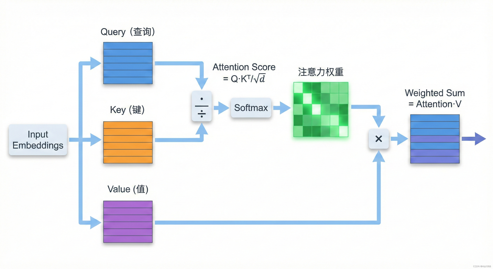

# 注意力机制与现代架构

> **一句话总结**: 注意力机制与现代架构的详细讲解与实战指南

> **难度等级**: ⭐⭐⭐ (进阶级)
> **预计学习时间**: 1-2天
> **前置知识**: 待补充
> **学习目标**:
> - 理论: 待补充
> - 实践: 待补充
> - 应用: 待补充

---


> SE-Net → CBAM → ConvNeXt → Swin Transformer → ViT




## 📚 目录

- [SE-Net (2017)](#1-se-netsqueeze-and-excitation2017)
- [CBAM (2018)](#2-cbamconvolutional-block-attention-module2018)
- [ConvNeXt (2022)](#3-convnext2022)
- [Swin Transformer (2021)](#4-swin-transformer2021)
- [Vision Transformer (2020)](#5-vision-transformer-vit2020)

---

## 1. SE-Net (Squeeze-and-Excitation) (2017)

**核心思想**：通道注意力机制

```python
class SEBlock(nn.Module):
    """Squeeze-and-Excitation块"""
    def __init__(self, channels, reduction=16):
        super(SEBlock, self).__init__()
        self.squeeze = nn.AdaptiveAvgPool2d(1)
        
        self.excitation = nn.Sequential(
            nn.Linear(channels, channels // reduction, bias=False),
            nn.ReLU(inplace=True),
            nn.Linear(channels // reduction, channels, bias=False),
            nn.Sigmoid(),
        )
    
    def forward(self, x):
        b, c, _, _ = x.size()
        
        # Squeeze: 全局平均池化
        y = self.squeeze(x).view(b, c)
        
        # Excitation: 通道权重
        y = self.excitation(y).view(b, c, 1, 1)
        
        # Scale: 重新加权
        return x * y

# 集成到ResNet中

class SEBasicBlock(nn.Module):
    expansion = 1
    
    def __init__(self, in_channels, out_channels, stride=1):
        super(SEBasicBlock, self).__init__()
        self.conv1 = nn.Conv2d(in_channels, out_channels, 3, stride, 1, bias=False)
        self.bn1 = nn.BatchNorm2d(out_channels)
        self.conv2 = nn.Conv2d(out_channels, out_channels, 3, 1, 1, bias=False)
        self.bn2 = nn.BatchNorm2d(out_channels)
        
        self.shortcut = nn.Sequential()
        if stride != 1 or in_channels != out_channels:
            self.shortcut = nn.Sequential(
                nn.Conv2d(in_channels, out_channels, 1, stride, bias=False),
                nn.BatchNorm2d(out_channels)
            )
        
        self.se = SEBlock(out_channels)
    
    def forward(self, x):
        out = F.relu(self.bn1(self.conv1(x)))
        out = self.bn2(self.conv2(out))
        out = self.se(out)  # SE注意力
        out += self.shortcut(x)
        out = F.relu(out)
        return out
```

---

## 2. CBAM (Convolutional Block Attention Module) (2018)

**核心思想**：通道注意力 + 空间注意力

```python
class ChannelAttention(nn.Module):
    """通道注意力模块"""
    def __init__(self, in_channels, reduction=16):
        super(ChannelAttention, self).__init__()
        
        self.avg_pool = nn.AdaptiveAvgPool2d(1)
        self.max_pool = nn.AdaptiveMaxPool2d(1)
        
        self.fc = nn.Sequential(
            nn.Conv2d(in_channels, in_channels // reduction, 1, bias=False),
            nn.ReLU(inplace=True),
            nn.Conv2d(in_channels // reduction, in_channels, 1, bias=False)
        )
        self.sigmoid = nn.Sigmoid()
    
    def forward(self, x):
        avg_out = self.fc(self.avg_pool(x))
        max_out = self.fc(self.max_pool(x))
        out = avg_out + max_out
        return self.sigmoid(out)

class SpatialAttention(nn.Module):
    """空间注意力模块"""
    def __init__(self, kernel_size=7):
        super(SpatialAttention, self).__init__()
        
        padding = kernel_size // 2
        self.conv = nn.Conv2d(2, 1, kernel_size, padding=padding, bias=False)
        self.sigmoid = nn.Sigmoid()
    
    def forward(self, x):
        avg_out = torch.mean(x, dim=1, keepdim=True)
        max_out, _ = torch.max(x, dim=1, keepdim=True)
        x = torch.cat([avg_out, max_out], dim=1)
        x = self.conv(x)
        return self.sigmoid(x)

class CBAM(nn.Module):
    """CBAM模块"""
    def __init__(self, in_channels, reduction=16):
        super(CBAM, self).__init__()
        self.channel_att = ChannelAttention(in_channels, reduction)
        self.spatial_att = SpatialAttention()
    
    def forward(self, x):
        x = x * self.channel_att(x)
        x = x * self.spatial_att(x)
        return x

# 集成到ResNet中

class CBAMBasicBlock(nn.Module):
    expansion = 1
    
    def __init__(self, in_channels, out_channels, stride=1):
        super(CBAMBasicBlock, self).__init__()
        self.conv1 = nn.Conv2d(in_channels, out_channels, 3, stride, 1, bias=False)
        self.bn1 = nn.BatchNorm2d(out_channels)
        self.conv2 = nn.Conv2d(out_channels, out_channels, 3, 1, 1, bias=False)
        self.bn2 = nn.BatchNorm2d(out_channels)
        
        self.shortcut = nn.Sequential()
        if stride != 1 or in_channels != out_channels:
            self.shortcut = nn.Sequential(
                nn.Conv2d(in_channels, out_channels, 1, stride, bias=False),
                nn.BatchNorm2d(out_channels)
            )
        
        self.cbam = CBAM(out_channels)
    
    def forward(self, x):
        out = F.relu(self.bn1(self.conv1(x)))
        out = self.bn2(self.conv2(out))
        out = self.cbam(out)  # CBAM注意力
        out += self.shortcut(x)
        out = F.relu(out)
        return out
```

---

## 3. ConvNeXt (2022)

**核心创新**：现代CNN架构，向Transformer学习

```python
class ConvNeXtBlock(nn.Module):
    """ConvNeXt块"""
    def __init__(self, dim, drop_path=0.0, layer_scale_init_value=1e-6):
        super(ConvNeXtBlock, self).__init__()
        
        self.dwconv = nn.Conv2d(dim, dim, kernel_size=7, padding=3, groups=dim)
        self.norm = nn.LayerNorm(dim, eps=1e-6)
        self.pwconv1 = nn.Linear(dim, 4 * dim)
        self.act = nn.GELU()
        self.pwconv2 = nn.Linear(4 * dim, dim)
        self.drop_path = nn.Identity() if drop_path == 0.0 else nn.Dropout(drop_path)
        
        self.gamma = nn.Parameter(layer_scale_init_value * torch.ones(dim)) if layer_scale_init_value > 0 else None
    
    def forward(self, x):
        input = x
        x = self.dwconv(x)
        x = x.permute(0, 2, 3, 1)  # (B, C, H, W) -> (B, H, W, C)
        x = self.norm(x)
        x = self.pwconv1(x)
        x = self.act(x)
        x = self.pwconv2(x)
        x = x.permute(0, 3, 1, 2)  # (B, H, W, C) -> (B, C, H, W)
        
        if self.gamma is not None:
            x = x * self.gamma.view(1, -1, 1, 1)
        
        x = input + self.drop_path(x)
        return x

class ConvNeXt(nn.Module):
    """ConvNeXt实现"""
    def __init__(self, num_classes=1000, dims=[96, 192, 384, 768], 
                 depths=[3, 3, 9, 3], drop_path_rate=0.0):
        super(ConvNeXt, self).__init__()
        
        # 初始卷积
        self.stem = nn.Sequential(
            nn.Conv2d(3, dims[0], kernel_size=4, stride=4),
            nn.LayerNorm(dims[0], eps=1e-6)
        )
        
        # 构建阶段
        self.stages = nn.ModuleList()
        dp_rates = [x.item() for x in torch.linspace(0, drop_path_rate, sum(depths))]
        
        cur = 0
        for i in range(4):
            stage = nn.Sequential(
                *[ConvNeXtBlock(dims[i], dp_rates[cur + j]) for j in range(depths[i])]
            )
            self.stages.append(stage)
            cur += depths[i]
            
            # 下采样（除了最后一个阶段）
            if i < 3:
                self.stages.append(nn.Sequential(
                    nn.LayerNorm(dims[i], eps=1e-6),
                    nn.Conv2d(dims[i], dims[i+1], kernel_size=2, stride=2)
                ))
        
        # 分类器
        self.norm = nn.LayerNorm(dims[-1], eps=1e-6)
        self.head = nn.Linear(dims[-1], num_classes)
        
        # 初始化
        self._init_weights()
    
    def _init_weights(self):
        for m in self.modules():
            if isinstance(m, nn.Conv2d):
                nn.init.kaiming_normal_(m.weight, mode='fan_out')
                if m.bias is not None:
                    nn.init.constant_(m.bias, 0)
            elif isinstance(m, nn.LayerNorm):
                nn.init.constant_(m.bias, 0)
                nn.init.constant_(m.weight, 1.0)
    
    def forward(self, x):
        x = self.stem(x)
        
        for stage in self.stages:
            x = stage(x)
        
        x = self.norm(x)
        x = x.mean([2, 3])  # Global Average Pooling
        x = self.head(x)
        return x

def convnext_tiny():
    return ConvNeXt(dims=[96, 192, 384, 768], depths=[3, 3, 9, 3])
```

### 设计特点

- ✅ 深度可分离卷积 + LayerNorm + GELU
- ✅ 大卷积核（7×7）替代Transformer的注意力
- ✅ 在ImageNet上达到82.1%准确率

---

## 4. Swin Transformer (2021)

**核心创新**：分层Transformer，引入窗口注意力

```python
class WindowAttention(nn.Module):
    """窗口注意力"""
    def __init__(self, dim, window_size, num_heads, qkv_bias=True, attn_drop=0.1, proj_drop=0.1):
        super(WindowAttention, self).__init__()
        self.dim = dim
        self.window_size = window_size
        self.num_heads = num_heads
        self.scale = (dim // num_heads) ** -0.5
        
        self.relative_position_bias_table = nn.Parameter(
            torch.zeros((2 * window_size[0] - 1) * (2 * window_size[1] - 1), num_heads)
        )
        
        self.qkv = nn.Linear(dim, dim * 3, bias=qkv_bias)
        self.attn_drop = nn.Dropout(attn_drop)
        self.proj = nn.Linear(dim, dim)
        self.proj_drop = nn.Dropout(proj_drop)
        
        nn.init.trunc_normal_(self.relative_position_bias_table, std=.02)
    
    def forward(self, x, mask=None):
        B_, N, C = x.shape
        qkv = self.qkv(x).reshape(B_, N, 3, self.num_heads, C // self.num_heads).permute(2, 0, 3, 1, 4)
        q, k, v = qkv[0], qkv[1], qkv[2]
        
        attn = (q @ k.transpose(-2, -1)) * self.scale
        
        # 相对位置偏置
        relative_position_bias = self.relative_position_bias_table[
            self.relative_position_index.view(-1)
        ].view(self.window_size[0] * self.window_size[1], 
               self.window_size[0] * self.window_size[1], -1)
        relative_position_bias = relative_position_bias.permute(2, 0, 1).contiguous()
        attn = attn + relative_position_bias.unsqueeze(0)
        
        if mask is not None:
            nW = mask.shape[0]
            attn = attn.view(B_ // nW, nW, self.num_heads, N, N) + mask.unsqueeze(1).unsqueeze(0)
            attn = attn.view(-1, self.num_heads, N, N)
        
        attn = attn.softmax(dim=-1)
        attn = self.attn_drop(attn)
        
        x = (attn @ v).transpose(1, 2).reshape(B_, N, C)
        x = self.proj(x)
        x = self.proj_drop(x)
        return x

class SwinTransformerBlock(nn.Module):
    """Swin Transformer块"""
    def __init__(self, dim, num_heads, window_size=7, shift_size=0, mlp_ratio=4.0, qkv_bias=True, drop=0.0, attn_drop=0.0, drop_path=0.0):
        super(SwinTransformerBlock, self).__init__()
        self.norm1 = nn.LayerNorm(dim)
        self.attn = WindowAttention(dim, window_size, num_heads, qkv_bias, attn_drop, drop)
        self.drop_path = nn.Identity() if drop_path == 0.0 else nn.Dropout(drop_path)
        
        self.norm2 = nn.LayerNorm(dim)
        mlp_hidden_dim = int(dim * mlp_ratio)
        self.mlp = nn.Sequential(
            nn.Linear(dim, mlp_hidden_dim),
            nn.GELU(),
            nn.Dropout(drop),
            nn.Linear(mlp_hidden_dim, dim),
            nn.Dropout(drop)
        )
        
        self.shift_size = shift_size
        self.window_size = window_size
    
    def forward(self, x):
        B, C, H, W = x.shape
        x = x.view(B, H*W, C)
        
        # 窗口注意力
        if self.shift_size > 0:
            shifted_x = torch.roll(x, shifts=(-self.shift_size, -self.shift_size), dims=(1, 2))
        else:
            shifted_x = x
        
        # 窗口划分
        nW = (H // self.window_size) * (W // self.window_size)
        x_windows = shifted_x.view(B, H // self.window_size, self.window_size, W // self.window_size, self.window_size, C)
        x_windows = x_windows.permute(0, 1, 3, 2, 4, 5).reshape(-1, self.window_size * self.window_size, C)
        
        # 注意力
        attn_windows = self.attn(x_windows)
        
        # 还原
        attn_windows = attn_windows.view(-1, H // self.window_size, W // self.window_size, self.window_size, self.window_size, C)
        shifted_x = attn_windows.permute(0, 1, 3, 2, 4, 5).reshape(B, H * W, C)
        
        if self.shift_size > 0:
            x = torch.roll(shifted_x, shifts=(self.shift_size, self.shift_size), dims=(1, 2))
        else:
            x = shifted_x
        
        # 残差连接
        x = x + self.drop_path(self.norm1(x.view(B, H, W, C).permute(0, 3, 1, 2)))
        x = x + self.drop_path(self.norm2(x.permute(0, 2, 3, 1).reshape(B, H*W, C)).permute(0, 2, 1).reshape(B, C, H, W))
        
        return x

class SwinTransformer(nn.Module):
    """Swin Transformer简化实现"""
    def __init__(self, num_classes=1000, embed_dim=96, depths=[2, 2, 6, 2], num_heads=[3, 6, 12, 24]):
        super(SwinTransformer, self).__init__()
        
        # 初始卷积
        self.stem = nn.Conv2d(3, embed_dim, 7, stride=4, padding=3)
        
        # 分层构建
        self.layers = nn.ModuleList()
        for i, (depth, head) in enumerate(zip(depths, num_heads)):
            layer = nn.Sequential(*[
                SwinTransformerBlock(embed_dim * (2 ** i), head, window_size=7 if i < 2 else 14)
                for _ in range(depth)
            ])
            self.layers.append(layer)
        
        # 分类器
        self.norm = nn.LayerNorm(embed_dim * 8)
        self.avgpool = nn.AdaptiveAvgPool2d(1)
        self.head = nn.Linear(embed_dim * 8, num_classes)
    
    def forward(self, x):
        x = self.stem(x)
        
        for layer in self.layers:
            x = layer(x)
            x = nn.MaxPool2d(2)(x) if x.shape[-1] > 7 else x
        
        x = self.norm(x.permute(0, 2, 3, 1)).permute(0, 3, 1, 2)
        x = self.avgpool(x).flatten(1)
        x = self.head(x)
        return x

def swin_tiny():
    return SwinTransformer(embed_dim=96, depths=[2, 2, 6, 2], num_heads=[3, 6, 12, 24])
```

### 核心创新

- ✅ 分层结构：类似CNN的多尺度特征
- ✅ 窗口注意力：降低计算复杂度
- ✅ 移位窗口：跨窗口信息交互

---

## 5. Vision Transformer (ViT) (2020)

**核心创新**：将Transformer用于图像

```python
class PatchEmbedding(nn.Module):
    """图像分块嵌入"""
    def __init__(self, img_size=224, patch_size=16, in_channels=3, embed_dim=768):
        super(PatchEmbedding, self).__init__()
        num_patches = (img_size // patch_size) ** 2
        
        self.proj = nn.Conv2d(in_channels, embed_dim, 
                             kernel_size=patch_size, stride=patch_size)
        self.cls_token = nn.Parameter(torch.zeros(1, 1, embed_dim))
        self.pos_embed = nn.Parameter(torch.zeros(1, num_patches + 1, embed_dim))
    
    def forward(self, x):
        x = self.proj(x)  # (B, E, H', W')
        x = x.flatten(2).transpose(1, 2)  # (B, N, E)
        
        cls_token = self.cls_token.expand(x.shape[0], -1, -1)
        x = torch.cat([cls_token, x], dim=1)
        
        x = x + self.pos_embed
        return x

class TransformerBlock(nn.Module):
    """Transformer编码器块"""
    def __init__(self, embed_dim, num_heads, mlp_ratio=4.0, dropout=0.1):
        super(TransformerBlock, self).__init__()
        
        self.norm1 = nn.LayerNorm(embed_dim)
        self.attn = nn.MultiheadAttention(embed_dim, num_heads, dropout)
        
        self.norm2 = nn.LayerNorm(embed_dim)
        mlp_hidden_dim = int(embed_dim * mlp_ratio)
        self.mlp = nn.Sequential(
            nn.Linear(embed_dim, mlp_hidden_dim),
            nn.GELU(),
            nn.Dropout(dropout),
            nn.Linear(mlp_hidden_dim, embed_dim),
            nn.Dropout(dropout),
        )
    
    def forward(self, x):
        # 多头注意力 + 残差
        x = x + self.attn(self.norm1(x), self.norm1(x), self.norm1(x))[0]
        
        # MLP + 残差
        x = x + self.mlp(self.norm2(x))
        return x

class VisionTransformer(nn.Module):
    """Vision Transformer"""
    def __init__(self, img_size=224, patch_size=16, in_channels=3, 
                 num_classes=1000, embed_dim=768, depth=12, num_heads=12):
        super(VisionTransformer, self).__init__()
        
        self.patch_embed = PatchEmbedding(img_size, patch_size, in_channels, embed_dim)
        
        self.blocks = nn.ModuleList([
            TransformerBlock(embed_dim, num_heads)
            for _ in range(depth)
        ])
        
        self.norm = nn.LayerNorm(embed_dim)
        self.head = nn.Linear(embed_dim, num_classes)
    
    def forward(self, x):
        x = self.patch_embed(x)
        
        for block in self.blocks:
            x = block(x)
        
        x = self.norm(x)
        cls_token = x[:, 0]
        x = self.head(cls_token)
        return x

# 创建不同规模的ViT

def vit_base():
    return VisionTransformer(patch_size=16, embed_dim=768, depth=12, num_heads=12)

def vit_large():
    return VisionTransformer(patch_size=16, embed_dim=1024, depth=24, num_heads=16)
```

---

## 📊 注意力机制架构对比

| 架构 | 年份 | 参数量 | 计算量 | Top-1 | 核心创新 | 适用场景 |
|------|------|--------|--------|-------|----------|----------|
| SE-Net | 2017 | + | + | + | 通道注意力 | 通用增强 |
| CBAM | 2018 | + | + | + | 通道+空间 | 通用增强 |
| ConvNeXt-T | 2022 | 29M | 4.5G | 82.1% | 现代CNN | 高精度 |
| Swin-Tiny | 2021 | 29M | 4.5G | 81.2% | 分层Transformer | 通用视觉 |
| ViT-Base | 2020 | 86.6M | 17.6G | 81.8% | Transformer | 大数据 |

---

## 🎯 学习检查清单

### 理解层面

- [ ] 理解注意力机制的工作方式
- [ ] 掌握通道注意力和空间注意力的区别
- [ ] 了解Transformer在视觉中的应用

### 实践层面

- [ ] 能实现SE-Block和CBAM
- [ ] 会将注意力机制集成到现有网络
- [ ] 能使用预训练的ViT/Swin模型

---

**上一章：[02-高效架构.md](02-高效架构.md)**  
**下一章：[04-架构对比与选择指南.md](04-架构对比与选择指南.md)**

---

*最后更新: 2026-01-15*
