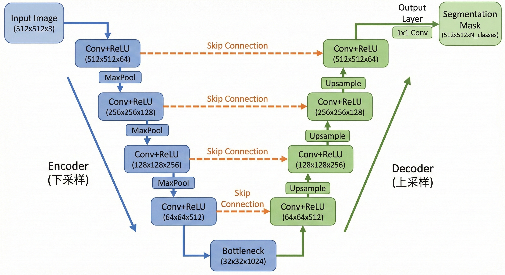
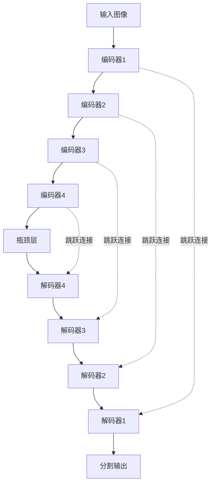

# 第七章：图像分割

> **一句话总结**: 像素级分类：为图像中的每个像素分配类别标签

> **难度等级**: ⭐⭐⭐ (中级)
> **预计学习时间**: 5-6天
> **前置知识**: 待补充
> **学习目标**:
> - 理论: 待补充
> - 实践: 待补充
> - 应用: 待补充

---


> 系统学习图像分割的核心技术，从语义分割到实例分割，掌握FCN、U-Net、DeepLab、Mask R-CNN等经典算法，理解Dice系数、IoU等评估指标。

## 📋 章节元信息

**难度等级**: ⭐⭐⭐⭐ (进阶级)
**预计学习时间**: 10-14天 (每天2-3小时)
**前置知识**:
- 熟悉CNN基础（卷积、池化、激活函数）
- 掌握PyTorch深度学习框架
- 理解图像分类任务
- 了解基本的损失函数和优化器

**学习目标**:

**理论掌握**:
- 深入理解语义分割、实例分割、全景分割的区别
- 掌握FCN、U-Net、DeepLab等架构的设计思想
- 理解跳跃连接、空洞卷积等关键技术
- 掌握Dice Loss、Focal Loss等损失函数原理
- 理解IoU、mIoU、Dice系数等评估指标

**实践能力**:
- 能够从零实现U-Net、DeepLab等分割网络
- 会处理医学图像、遥感图像等专业数据
- 掌握分割任务的数据增强技巧
- 能够调试和优化分割模型的性能
- 会使用专业工具库（segmentation_models, MMSegmentation）

**应用场景**:
- 医学影像分析（肿瘤分割、器官分割）
- 自动驾驶（道路、车辆、行人分割）
- 遥感图像分析（建筑物、农田分割）
- 工业检测（缺陷检测、产品分割）
- 视频会议背景分割



## 📚 章节概览

图像分割是计算机视觉的核心任务之一，旨在为图像中的每个像素分配类别标签。

### 📄 本章内容

1. **语义分割**：FCN、U-Net、DeepLab系列
2. **实例分割**：Mask R-CNN、SOLO、YOLACT
3. **全景分割**：Panoptic FPN
4. **评估指标**：Dice系数、IoU、mIoU
5. **实战项目**：医学图像分割、遥感图像分割

### U-Net架构流程



### 图像分割方法对比

```mermaid
graph TB
    subgraph语义分割[语义分割]
        A1[像素分类]
        A2[不区分别例]
    end

    subgraph实例分割[实例分割]
        B1[目标检测]
        B2[像素分割]
        B3[区分别例]
    end

    subgraph全景分割[全景分割]
        C1[语义+实例]
        C2[背景处理]
    end
```

---

## 🎯 学习路径

### 阶段一：基础概念（1天）

#### 1. 图像分割任务类型详解

图像分割为图像中的每个像素分配标签，根据分割粒度分为三大类：

##### 1.1 语义分割 (Semantic Segmentation)

**定义**: 将图像中所有相同类别的像素标记为同一标签，不区分别例。

**输出**: 每个像素的类别标签 (H, W)

**特点**:
- 相同类别的所有对象使用同一颜色
- 无法区分同一类别的不同实例
- 输出是单通道标签图

**应用**: 场景解析、道路分割、医学影像器官分割

**示例**:
```
输入: 3个人站在一起
输出: 所有人像素都标记为"人"类 (同一颜色)
```

---

##### 1.2 实例分割 (Instance Segmentation)

**定义**: 在语义分割基础上，进一步区分类别相同的不同实例。

**输出**: 每个实例的掩码 + 类别标签

**特点**:
- 同类别的不同对象用不同颜色标识
- 结合了目标检测和语义分割
- 输出是多个掩码（每个实例一个）

**应用**: 目标计数、拥挤场景分析、商品检测

**示例**:
```
输入: 3个人站在一起
输出: 人1掩码、人2掩码、人3掩码 (三个独立掩码)
```

---

##### 1.3 全景分割 (Panoptic Segmentation)

**定义**: 语义分割和实例分割的统一框架，处理所有stuff（背景）和thing（物体）。

**输出**: 所有像素的类别和实例ID

**特点**:
- Stuff类别（背景）：使用语义分割
- Thing类别（物体）：使用实例分割
- 完全覆盖所有像素，无重叠

**应用**: 自动驾驶、机器人视觉、场景理解

**示例**:
```
输入: 人站立在道路旁，有建筑物
输出:
  - 道路: 语义分割 (stuff)
  - 建筑物: 语义分割 (stuff)
  - 人: 实例分割 (thing), 实例ID不同
```

---

#### 1.2 详细对比表

| 对比维度 | 语义分割 | 实例分割 | 全景分割 |
|---------|---------|---------|---------|
| **输出格式** | (H, W) 标签图 | N个掩码 + 类别 | (H, W) 标签+实例ID |
| **是否区分别例** | ❌ 不区分 | ✅ 区分 | ✅ 区分物体 |
| **处理背景** | ✅ 作为类别 | ❌ 不处理 | ✅ stuff类别 |
| **算法复杂度** | ⭐⭐ | ⭐⭐⭐⭐ | ⭐⭐⭐⭐⭐ |
| **计算成本** | 低 | 高 | 高 |
| **典型算法** | FCN, U-Net, DeepLab | Mask R-CNN, SOLO | Panoptic FPN |
| **数据标注** | 像素级标签 | 实例级掩码 | 语义+实例标签 |
| **典型应用** | 场景解析、道路分割 | 目标计数、检测 | 自动驾驶 |

---

#### 1.3 数据格式详解

```python

# 依赖: matplotlib, numpy
# 安装: pip install matplotlib numpy
"""
图像分割数据格式详解

1. 语义分割数据格式
   - 输入: (C, H, W) RGB图像
   - 标签: (H, W) 每个像素的类别ID
   - 示例: 0=背景, 1=人, 2=车, 3=道路

2. 实例分割数据格式
   - 输入: (C, H, W) RGB图像
   - 标签: 字典列表
     * masks: (N, H, W) N个实例的掩码
     * labels: (N,) 每个实例的类别
     * bboxes: (N, 4) 边界框 [x1, y1, x2, y2]
     * scores: (N,) 置信度分数

3. 全景分割数据格式
   - 输入: (C, H, W) RGB图像
   - 标签: (H, W) 编码的类别和实例ID
     * 编码: label = category_id * 1000 + instance_id
     * stuff类别: instance_id = 0
"""

import numpy as np
import matplotlib.pyplot as plt

def visualize_segmentation_types():
    """可视化三种分割类型"""
    
    # 创建示例图像
    image = np.zeros((256, 256, 3), dtype=np.uint8)
    image[50:150, 50:150] = [255, 0, 0]  # 人1
    image[100:200, 150:250] = [0, 255, 0]  # 人2
    
    # 语义分割：所有"人"都是同一类
    semantic = np.zeros((256, 256), dtype=np.uint8)
    semantic[50:150, 50:150] = 1
    semantic[100:200, 150:250] = 1
    
    # 实例分割：每个人是不同实例
    instance = np.zeros((256, 256), dtype=np.uint8)
    instance[50:150, 50:150] = 1  # 实例1
    instance[100:200, 150:250] = 2  # 实例2
    
    # 全景分割：类别 + 实例
    panoptic = np.zeros((256, 256), dtype=np.uint8)
    panoptic[50:150, 50:150] = 11  # 类别1 + 实例1
    panoptic[100:200, 150:250] = 12  # 类别1 + 实例2
    
    fig, axes = plt.subplots(1, 4, figsize=(16, 4))
    axes[0].imshow(image)
    axes[0].set_title('原始图像')
    axes[1].imshow(semantic, cmap='tab10')
    axes[1].set_title('语义分割')
    axes[2].imshow(instance, cmap='tab10')
    axes[2].set_title('实例分割')
    axes[3].imshow(panoptic, cmap='tab10')
    axes[3].set_title('全景分割')
    
    for ax in axes:
        ax.axis('off')
    
    plt.tight_layout()
    return fig

# 数据格式示例

def segmentation_data_format():
    """分割数据格式"""
    
    # 输入图像
    image = np.random.rand(3, 224, 224)  # (C, H, W)
    
    # 语义分割标签
    semantic_label = np.random.randint(0, 21, (224, 224))  # (H, W)
    
    # 实例分割标签
    instance_label = {
        'masks': np.random.randint(0, 10, (224, 224)),  # (H, W)
        'labels': np.array([1, 2, 3]),  # 类别
        'bboxes': np.array([[50, 50, 100, 100], [150, 150, 200, 200]])  # 边界框
    }
    
    return image, semantic_label, instance_label
```

---

### 阶段二：语义分割（3-4天）

#### 2. FCN (Fully Convolutional Network)

**核心创新**：全卷积网络，任意尺寸输入

```python
class FCN32s(nn.Module):
    """
    FCN-32s：最基础的全卷积网络
    将全连接层替换为卷积层，输出32倍下采样的分割图
    """
    
    def __init__(self, num_classes=21):
        super(FCN32s, self).__init__()
        self.num_classes = num_classes
        
        # VGG16骨干网络（简化）
        self.features = nn.Sequential(
            # Block 1
            nn.Conv2d(3, 64, 3, padding=1),
            nn.ReLU(),
            nn.Conv2d(64, 64, 3, padding=1),
            nn.ReLU(),
            nn.MaxPool2d(2, 2),
            
            # Block 2
            nn.Conv2d(64, 128, 3, padding=1),
            nn.ReLU(),
            nn.Conv2d(128, 128, 3, padding=1),
            nn.ReLU(),
            nn.MaxPool2d(2, 2),
            
            # Block 3
            nn.Conv2d(128, 256, 3, padding=1),
            nn.ReLU(),
            nn.Conv2d(256, 256, 3, padding=1),
            nn.ReLU(),
            nn.Conv2d(256, 256, 3, padding=1),
            nn.ReLU(),
            nn.MaxPool2d(2, 2),
            
            # Block 4
            nn.Conv2d(256, 512, 3, padding=1),
            nn.ReLU(),
            nn.Conv2d(512, 512, 3, padding=1),
            nn.ReLU(),
            nn.Conv2d(512, 512, 3, padding=1),
            nn.ReLU(),
            nn.MaxPool2d(2, 2),
            
            # Block 5
            nn.Conv2d(512, 512, 3, padding=1),
            nn.ReLU(),
            nn.Conv2d(512, 512, 3, padding=1),
            nn.ReLU(),
            nn.Conv2d(512, 512, 3, padding=1),
            nn.ReLU(),
            nn.MaxPool2d(2, 2),
        )
        
        # 分类器
        self.classifier = nn.Sequential(
            nn.Conv2d(512, 4096, 7),
            nn.ReLU(),
            nn.Dropout(0.5),
            nn.Conv2d(4096, 4096, 1),
            nn.ReLU(),
            nn.Dropout(0.5),
            nn.Conv2d(4096, num_classes, 1),
        )
        
        # 上采样（32倍）
        self.upsample = nn.Upsample(scale_factor=32, mode='bilinear', align_corners=True)
    
    def forward(self, x):
        # 下采样特征提取
        features = self.features(x)
        
        # 分类预测
        scores = self.classifier(features)
        
        # 上采样到输入尺寸
        output = self.upsample(scores)
        
        return output

# FCN-8s：融合多层特征

class FCN8s(nn.Module):
    """
    FCN-8s：融合pool3, pool4, pool5的特征
    提高分割精度
    """
    
    def __init__(self, num_classes=21):
        super(FCN8s, self).__init__()
        self.num_classes = num_classes
        
        # 骨干网络（需要保留中间层）
        self.features = nn.Sequential(
            # ... VGG16结构 ...
        )
        
        # 1x1卷积用于不同层
        self.score_pool3 = nn.Conv2d(256, num_classes, 1)
        self.score_pool4 = nn.Conv2d(512, num_classes, 1)
        self.score_pool5 = nn.Conv2d(512, num_classes, 1)
        
        # 上采样
        self.upsample2 = nn.Upsample(scale_factor=2, mode='bilinear', align_corners=True)
        self.upsample8 = nn.Upsample(scale_factor=8, mode='bilinear', align_corners=True)
    
    def forward(self, x):
        # 提取多层特征（简化）
        pool3 = torch.randn(x.size(0), 256, x.size(2)//8, x.size(3)//8).to(x.device)
        pool4 = torch.randn(x.size(0), 512, x.size(2)//16, x.size(3)//16).to(x.device)
        pool5 = torch.randn(x.size(0), 512, x.size(2)//32, x.size(3)//32).to(x.device)
        
        # 1x1卷积
        score3 = self.score_pool3(pool3)
        score4 = self.score_pool4(pool4)
        score5 = self.score_pool5(pool5)
        
        # 融合
        score4_up = self.upsample2(score4)
        fused = score5 + score4_up
        
        fused_up = self.upsample2(fused)
        fused = score3 + fused_up
        
        # 最终上采样
        output = self.upsample8(fused)
        
        return output
```

---

#### 3. U-Net

**核心创新**：编码器-解码器 + 跳跃连接

```python
class UNet(nn.Module):
    """
    U-Net：医学图像分割的经典网络
    特点：对称结构，跳跃连接保留细节
    """
    
    def __init__(self, in_channels=3, out_channels=1, init_features=64):
        super(UNet, self).__init__()
        
        features = init_features
        
        # 编码器（下采样）
        self.encoder1 = self._block(in_channels, features, name='enc1')
        self.pool1 = nn.MaxPool2d(2)
        
        self.encoder2 = self._block(features, features * 2, name='enc2')
        self.pool2 = nn.MaxPool2d(2)
        
        self.encoder3 = self._block(features * 2, features * 4, name='enc3')
        self.pool3 = nn.MaxPool2d(2)
        
        self.encoder4 = self._block(features * 4, features * 8, name='enc4')
        self.pool4 = nn.MaxPool2d(2)
        
        # 瓶颈层
        self.bottleneck = self._block(features * 8, features * 16, name='bottleneck')
        
        # 解码器（上采样）
        self.upconv4 = nn.ConvTranspose2d(features * 16, features * 8, 2, stride=2)
        self.decoder4 = self._block(features * 16, features * 8, name='dec4')
        
        self.upconv3 = nn.ConvTranspose2d(features * 8, features * 4, 2, stride=2)
        self.decoder3 = self._block(features * 8, features * 4, name='dec3')
        
        self.upconv2 = nn.ConvTranspose2d(features * 4, features * 2, 2, stride=2)
        self.decoder2 = self._block(features * 4, features * 2, name='dec2')
        
        self.upconv1 = nn.ConvTranspose2d(features * 2, features, 2, stride=2)
        self.decoder1 = self._block(features * 2, features, name='dec1')
        
        # 输出层
        self.conv_out = nn.Conv2d(features, out_channels, 1)
        
        # 激活函数
        self.sigmoid = nn.Sigmoid() if out_channels == 1 else nn.Softmax(dim=1)
    
    def _block(self, in_channels, out_channels, name):
        """双卷积块"""
        return nn.Sequential(
            nn.Conv2d(in_channels, out_channels, 3, padding=1),
            nn.BatchNorm2d(out_channels),
            nn.ReLU(inplace=True),
            nn.Conv2d(out_channels, out_channels, 3, padding=1),
            nn.BatchNorm2d(out_channels),
            nn.ReLU(inplace=True),
        )
    
    def forward(self, x):
        # 编码
        enc1 = self.encoder1(x)
        enc2 = self.encoder2(self.pool1(enc1))
        enc3 = self.encoder3(self.pool2(enc2))
        enc4 = self.encoder4(self.pool3(enc3))
        
        # 瓶颈
        bottleneck = self.bottleneck(self.pool4(enc4))
        
        # 解码 + 跳跃连接
        dec4 = self.upconv4(bottleneck)
        dec4 = torch.cat([enc4, dec4], dim=1)  # 跳跃连接
        dec4 = self.decoder4(dec4)
        
        dec3 = self.upconv3(dec4)
        dec3 = torch.cat([enc3, dec3], dim=1)
        dec3 = self.decoder3(dec3)
        
        dec2 = self.upconv2(dec3)
        dec2 = torch.cat([enc2, dec2], dim=1)
        dec2 = self.decoder2(dec2)
        
        dec1 = self.upconv1(dec2)
        dec1 = torch.cat([enc1, dec1], dim=1)
        dec1 = self.decoder1(dec1)
        
        # 输出
        output = self.conv_out(dec1)
        output = self.sigmoid(output)
        
        return output

# U-Net++：嵌套U-Net

class UNetPlusPlus(nn.Module):
    """
    U-Net++：嵌套的U-Net结构
    通过密集跳跃连接提升性能
    """
    
    def __init__(self, in_channels=3, out_channels=1, init_features=64):
        super(UNetPlusPlus, self).__init__()
        
        features = init_features
        
        # 嵌套结构（简化版）
        self.x_0_0 = self._block(in_channels, features)
        self.x_1_0 = self._block(features, features * 2)
        self.x_2_0 = self._block(features * 2, features * 4)
        self.x_3_0 = self._block(features * 4, features * 8)
        
        # 上采样和融合
        self.up_1_0 = nn.ConvTranspose2d(features * 2, features, 2, stride=2)
        self.up_2_0 = nn.ConvTranspose2d(features * 4, features * 2, 2, stride=2)
        self.up_3_0 = nn.ConvTranspose2d(features * 8, features * 4, 2, stride=2)
        
        # 输出层
        self.final = nn.Conv2d(features, out_channels, 1)
    
    def _block(self, in_channels, out_channels):
        return nn.Sequential(
            nn.Conv2d(in_channels, out_channels, 3, padding=1),
            nn.BatchNorm2d(out_channels),
            nn.ReLU(inplace=True),
            nn.Conv2d(out_channels, out_channels, 3, padding=1),
            nn.BatchNorm2d(out_channels),
            nn.ReLU(inplace=True),
        )
    
    def forward(self, x):
        # 简化的前向传播
        x00 = self.x_0_0(x)
        x10 = self.x_1_0(F.max_pool2d(x00, 2))
        x20 = self.x_2_0(F.max_pool2d(x10, 2))
        x30 = self.x_3_0(F.max_pool2d(x20, 2))
        
        # 上采样融合
        x21 = self.up_2_0(x30) + x20
        x11 = self.up_1_0(x21) + x10
        
        output = self.final(x11)
        return output
```

---

#### 4. DeepLab系列

##### 4.1 DeepLabv1/v2

**核心创新**：空洞卷积 + ASPP

```python
class DeepLabv2(nn.Module):
    """
    DeepLabv2：空洞卷积 + ASPP
    解决分辨率下降问题
    """
    
    def __init__(self, num_classes=21):
        super(DeepLabv2, self).__init__()
        self.num_classes = num_classes
        
        # VGG16骨干网络（空洞卷积）
        self.features = nn.Sequential(
            nn.Conv2d(3, 64, 3, padding=1),
            nn.ReLU(),
            nn.Conv2d(64, 64, 3, padding=1),
            nn.ReLU(),
            nn.MaxPool2d(2, 2),
            
            nn.Conv2d(64, 128, 3, padding=1),
            nn.ReLU(),
            nn.Conv2d(128, 128, 3, padding=1),
            nn.ReLU(),
            nn.MaxPool2d(2, 2),
            
            # Block 3：使用空洞卷积
            nn.Conv2d(128, 256, 3, padding=2, dilation=2),
            nn.ReLU(),
            nn.Conv2d(256, 256, 3, padding=2, dilation=2),
            nn.ReLU(),
            nn.Conv2d(256, 256, 3, padding=2, dilation=2),
            nn.ReLU(),
            
            # Block 4：更大空洞率
            nn.Conv2d(256, 512, 3, padding=4, dilation=4),
            nn.ReLU(),
            nn.Conv2d(512, 512, 3, padding=4, dilation=4),
            nn.ReLU(),
            nn.Conv2d(512, 512, 3, padding=4, dilation=4),
            nn.ReLU(),
            
            # Block 5：最大空洞率
            nn.Conv2d(512, 512, 3, padding=4, dilation=4),
            nn.ReLU(),
            nn.Conv2d(512, 512, 3, padding=4, dilation=4),
            nn.ReLU(),
            nn.Conv2d(512, 512, 3, padding=4, dilation=4),
            nn.ReLU(),
        )
        
        # ASPP（空洞空间金字塔池化）
        self.aspp = nn.ModuleDict({
            'aspp0': nn.Conv2d(512, 256, 1),
            'aspp1': nn.Conv2d(512, 256, 3, padding=6, dilation=6),
            'aspp2': nn.Conv2d(512, 256, 3, padding=12, dilation=12),
            'aspp3': nn.Conv2d(512, 256, 3, padding=18, dilation=18),
            'aspp4': nn.Conv2d(512, 256, 1),  # 全局平均池化
        })
        
        self.classifier = nn.Sequential(
            nn.Conv2d(256 * 5, 256, 1),
            nn.ReLU(),
            nn.Conv2d(256, num_classes, 1),
        )
        
        self.upsample = nn.Upsample(scale_factor=8, mode='bilinear', align_corners=True)
    
    def forward(self, x):
        # 特征提取
        features = self.features(x)
        
        # ASPP
        aspp_features = []
        for name, module in self.aspp.items():
            if name == 'aspp4':
                # 全局平均池化
                pool = nn.AdaptiveAvgPool2d(1)
                aspp_features.append(module(pool(features)))
            else:
                aspp_features.append(module(features))
        
        # 融合
        fused = torch.cat(aspp_features, dim=1)
        
        # 分类
        output = self.classifier(fused)
        
        # 上采样
        output = self.upsample(output)
        
        return output
```

---

##### 4.2 DeepLabv3+

**核心创新**：编码器-解码器结构

```python
class DeepLabv3Plus(nn.Module):
    """
    DeepLabv3+：编码器-解码器 + ASPP
    结合多尺度特征和空间细节
    """
    
    def __init__(self, num_classes=21):
        super(DeepLabv3Plus, self).__init__()
        self.num_classes = num_classes
        
        # 编码器：Xception或ResNet
        self.backbone = self._build_backbone()
        
        # ASPP模块
        self.aspp = self._build_aspp(2048, 256)
        
        # 解码器
        self.decoder = self._build_decoder(256, 48)
        
        # 分类器
        self.classifier = nn.Conv2d(256, num_classes, 1)
        
        self.upsample = nn.Upsample(scale_factor=4, mode='bilinear', align_corners=True)
    
    def _build_backbone(self):
        """使用ResNet作为骨干网络"""
        # 简化：返回修改的ResNet
        return nn.Sequential(
            nn.Conv2d(3, 64, 7, stride=2, padding=3),
            nn.BatchNorm2d(64),
            nn.ReLU(),
            nn.MaxPool2d(3, stride=2, padding=1),
            # ... ResNet块 ...
        )
    
    def _build_aspp(self, in_channels, out_channels):
        """ASPP模块"""
        return nn.ModuleDict({
            'aspp0': nn.Conv2d(in_channels, out_channels, 1),
            'aspp1': nn.Conv2d(in_channels, out_channels, 3, padding=6, dilation=6),
            'aspp2': nn.Conv2d(in_channels, out_channels, 3, padding=12, dilation=12),
            'aspp3': nn.Conv2d(in_channels, out_channels, 3, padding=18, dilation=18),
            'aspp4': nn.Sequential(
                nn.AdaptiveAvgPool2d(1),
                nn.Conv2d(in_channels, out_channels, 1),
            ),
        })
    
    def _build_decoder(self, aspp_channels, low_level_channels):
        """解码器"""
        return nn.Sequential(
            nn.Conv2d(aspp_channels + low_level_channels, 256, 3, padding=1),
            nn.BatchNorm2d(256),
            nn.ReLU(),
            nn.Conv2d(256, 256, 3, padding=1),
            nn.BatchNorm2d(256),
            nn.ReLU(),
        )
    
    def forward(self, x):
        # 编码器特征
        low_level_features = self.backbone(x)  # 浅层特征
        high_level_features = low_level_features  # 深层特征（简化）
        
        # ASPP
        aspp_features = []
        for name, module in self.aspp.items():
            if name == 'aspp4':
                aspp_features.append(module(high_level_features))
            else:
                aspp_features.append(module(high_level_features))
        
        aspp_out = torch.cat(aspp_features, dim=1)
        
        # 解码器
        # 低层特征处理
        low_level = nn.Conv2d(64, 48, 1)(low_level_features)
        
        # 上采样ASPP输出
        aspp_up = nn.Upsample(scale_factor=4, mode='bilinear', align_corners=True)(aspp_out)
        
        # 融合
        fused = torch.cat([aspp_up, low_level], dim=1)
        
        # 解码
        decoded = self.decoder(fused)
        
        # 输出
        output = self.classifier(decoded)
        output = self.upsample(output)
        
        return output
```

---

### 阶段三：实例分割（2-3天）

#### 5. Mask R-CNN

**核心创新**：Faster R-CNN + 掩码分支

```python
class MaskRCNN(nn.Module):
    """
    Mask R-CNN：实例分割经典算法
    在Faster R-CNN基础上增加掩码预测分支
    """
    
    def __init__(self, backbone, num_classes=81):
        super(MaskRCNN, self).__init__()
        
        # 特征提取
        self.backbone = backbone
        
        # RPN（区域建议网络）
        self.rpn = RPN(in_channels=256, num_anchors=3)
        
        # ROI Align（改进ROI Pooling）
        self.roi_align = RoIAlign(output_size=(7, 7), spatial_scale=1/16, sampling_ratio=2)
        
        # 分类和回归头
        self.box_head = nn.Sequential(
            nn.Linear(256 * 7 * 7, 1024),
            nn.ReLU(),
            nn.Linear(1024, 1024),
            nn.ReLU(),
        )
        self.cls_score = nn.Linear(1024, num_classes)
        self.bbox_pred = nn.Linear(1024, num_classes * 4)
        
        # 掩码头
        self.mask_head = nn.Sequential(
            nn.Conv2d(256, 256, 3, padding=1),
            nn.ReLU(),
            nn.Conv2d(256, 256, 3, padding=1),
            nn.ReLU(),
            nn.Conv2d(256, 256, 3, padding=1),
            nn.ReLU(),
            nn.Conv2d(256, 256, 3, padding=1),
            nn.ReLU(),
            nn.Conv2d(256, num_classes, 1),
            nn.Sigmoid(),
        )
    
    def forward(self, x, targets=None):
        # 特征提取
        features = self.backbone(x)
        
        # RPN生成建议
        rpn_scores, rpn_bbox_preds = self.rpn(features)
        
        # 生成ROI
        if targets is None:
            rois = self._generate_rois_inference(rpn_scores, rpn_bbox_preds)
        else:
            rois = self._generate_rois_training(rpn_scores, rpn_bbox_preds, targets)
        
        # ROI Align
        pooled_features = self.roi_align(features, rois)
        
        # 分类和回归
        box_features = self.box_head(pooled_features.view(pooled_features.size(0), -1))
        cls_scores = self.cls_score(box_features)
        bbox_preds = self.bbox_pred(box_features)
        
        # 掩码预测
        mask_preds = self.mask_head(pooled_features)
        
        return cls_scores, bbox_preds, mask_preds, rois
    
    def _generate_rois_inference(self, scores, bbox_preds):
        """推理时生成ROI"""
        # 简化：返回前N个建议
        return torch.tensor([[0, 100, 100, 200, 200]], dtype=torch.float32)
    
    def _generate_rois_training(self, scores, bbox_preds, targets):
        """训练时生成ROI"""
        # 简化：使用GT + 采样
        labels, boxes, masks = targets
        rois = []
        for i, box in enumerate(boxes):
            rois.append([0] + box.tolist())
        return torch.tensor(rois, dtype=torch.float32)

# ROI Align实现

class RoIAlign(nn.Module):
    def __init__(self, output_size, spatial_scale, sampling_ratio):
        super(RoIAlign, self).__init__()
        self.output_size = output_size
        self.spatial_scale = spatial_scale
        self.sampling_ratio = sampling_ratio
    
    def forward(self, features, rois):
        """
        Args:
            features: (B, C, H, W)
            rois: (N, 5) [batch_id, x1, y1, x2, y2]
        """
        pooled_features = []
        for roi in rois:
            batch_id, x1, y1, x2, y2 = roi
            
            # 缩放ROI到特征图尺寸
            x1, y1, x2, y2 = x1 * self.spatial_scale, y1 * self.spatial_scale, \
                            x2 * self.spatial_scale, y2 * self.spatial_scale
            
            # 裁剪特征
            roi_features = features[batch_id, :, 
                                   int(y1):int(y2)+1, 
                                   int(x1):int(x2)+1]
            
            # 双线性插值上采样
            if roi_features.numel() > 0:
                roi_features = nn.functional.interpolate(
                    roi_features.unsqueeze(0),
                    size=self.output_size,
                    mode='bilinear',
                    align_corners=True
                )
                pooled_features.append(roi_features.squeeze(0))
            else:
                pooled_features.append(torch.zeros.output_size[0], self.output_size[1]).zero_())
        
        return torch.stack(pooled_features)
```

---

#### 6. SOLO (Segmenting Objects by Locations)

**核心创新**：位置感知分割

```python
class SOLO(nn.Module):
    """
    SOLO：按位置分割物体
    核心思想：物体位置决定类别
    """
    
    def __init__(self, num_classes=80, num_grids=[40, 36, 24, 16, 12]):
        super(SOLO, self).__init__()
        self.num_classes = num_classes
        self.num_grids = num_grids
        
        # 特征金字塔
        self.backbone = self._build_backbone()
        self.fpn = self._build_fpn()
        
        # 分割头
        self.seg_heads = nn.ModuleList()
        for grid in num_grids:
            # 分类分支
            cls_head = nn.Sequential(
                nn.Conv2d(256, 256, 3, padding=1),
                nn.ReLU(),
                nn.Conv2d(256, grid * grid * num_classes, 1),
            )
            # 掩码分支
            mask_head = nn.Sequential(
                nn.Conv2d(256, 256, 3, padding=1),
                nn.ReLU(),
                nn.Conv2d(256, 256, 3, padding=1),
                nn.ReLU(),
                nn.Conv2d(256, grid * grid, 1),
            )
            self.seg_heads.append(nn.ModuleDict({
                'cls': cls_head,
                'mask': mask_head,
            }))
    
    def _build_backbone(self):
        # 简化：ResNet骨干
        return nn.Sequential(
            nn.Conv2d(3, 64, 7, stride=2, padding=3),
            nn.BatchNorm2d(64),
            nn.ReLU(),
            nn.MaxPool2d(3, stride=2, padding=1),
        )
    
    def _build_fpn(self):
        # 简化：特征金字塔
        return nn.ModuleDict({
            'p5': nn.Conv2d(64, 256, 1),
            'p4': nn.Conv2d(64, 256, 1),
            'p3': nn.Conv2d(64, 256, 1),
        })
    
    def forward(self, x):
        # 特征提取
        c3 = self.backbone(x)
        
        # FPN
        p3 = self.fpn['p3'](c3)
        p4 = self.fpn['p4'](c3)  # 简化
        p5 = self.fpn['p5'](c3)
        
        # 多尺度预测
        predictions = []
        for i, (p, head) in enumerate(zip([p3, p4, p5], self.seg_heads)):
            cls_pred = head['cls'](p)
            mask_pred = head['mask'](p)
            
            # 重塑
            grid = self.num_grids[i]
            cls_pred = cls_pred.view(-1, grid, grid, self.num_classes)
            mask_pred = mask_pred.view(-1, grid, grid, grid)
            
            predictions.append({
                'cls': cls_pred,
                'mask': mask_pred,
            })
        
        return predictions
```

---

### 阶段四：评估指标（1天）

#### 7. Dice系数和IoU

```python
def dice_coefficient(pred, target, smooth=1e-6):
    """
    Dice系数：衡量分割相似度
    Dice = 2 * |pred ∩ target| / (|pred| + |target|)
    """
    pred_flat = pred.contiguous().view(-1)
    target_flat = target.contiguous().view(-1)
    
    intersection = (pred_flat * target_flat).sum()
    dice = (2. * intersection + smooth) / (pred_flat.sum() + target_flat.sum() + smooth)
    
    return dice

def iou_score(pred, target, smooth=1e-6):
    """
    IoU：交并比
    IoU = |pred ∩ target| / |pred ∪ target|
    """
    pred_flat = pred.contiguous().view(-1)
    target_flat = target.contiguous().view(-1)
    
    intersection = (pred_flat * target_flat).sum()
    union = pred_flat.sum() + target_flat.sum() - intersection
    
    iou = (intersection + smooth) / (union + smooth)
    return iou

def miou_score(pred, target, num_classes):
    """
    mIoU：平均IoU
    计算每个类别的IoU然后取平均
    """
    ious = []
    for cls in range(num_classes):
        pred_cls = (pred == cls).float()
        target_cls = (target == cls).float()
        
        if target_cls.sum() > 0:
            iou = iou_score(pred_cls, target_cls)
            ious.append(iou.item())
    
    return np.mean(ious) if ious else 0

# 使用示例

def evaluate_segmentation():
    """评估分割结果"""
    # 模拟预测和真实标签
    pred = torch.randint(0, 2, (1, 1, 224, 224)).float()
    target = torch.randint(0, 2, (1, 1, 224, 224)).float()
    
    dice = dice_coefficient(pred, target)
    iou = iou_score(pred, target)
    miou = miou_score(pred, target, num_classes=2)
    
    print(f"Dice系数: {dice:.4f}")
    print(f"IoU: {iou:.4f}")
    print(f"mIoU: {miou:.4f}")
    
    return dice, iou, miou
```

#### 8. 完整评估器

```python
class SegmentationMetrics:
    """分割评估器"""
    
    def __init__(self, num_classes):
        self.num_classes = num_classes
        self.reset()
    
    def reset(self):
        self.total_pixels = 0
        self.correct_pixels = 0
        self.confusion_matrix = np.zeros((self.num_classes, self.num_classes))
    
    def update(self, pred, target):
        """更新统计"""
        pred = pred.argmax(dim=1).cpu().numpy()
        target = target.cpu().numpy()
        
        for i in range(self.num_classes):
            for j in range(self.num_classes):
                self.confusion_matrix[i, j] += np.sum((pred == i) & (target == j))
        
        self.total_pixels += target.size
        self.correct_pixels += np.sum(pred == target)
    
    def get_metrics(self):
        """计算所有指标"""
        # Pixel Accuracy
        pixel_acc = self.correct_pixels / self.total_pixels if self.total_pixels > 0 else 0
        
        # Mean IoU
        miou = 0
        for i in range(self.num_classes):
            intersection = self.confusion_matrix[i, i]
            union = np.sum(self.confusion_matrix[i, :]) + np.sum(self.confusion_matrix[:, i]) - intersection
            if union > 0:
                miou += intersection / union
        miou /= self.num_classes
        
        # Frequency Weighted IoU
        fw_miou = 0
        for i in range(self.num_classes):
            intersection = self.confusion_matrix[i, i]
            union = np.sum(self.confusion_matrix[i, :]) + np.sum(self.confusion_matrix[:, i]) - intersection
            weight = np.sum(self.confusion_matrix[i, :])
            if union > 0:
                fw_miou += weight * (intersection / union)
        fw_miou /= self.total_pixels if self.total_pixels > 0 else 1
        
        return {
            'pixel_accuracy': pixel_acc,
            'mean_iou': miou,
            'frequency_weighted_iou': fw_miou,
        }

# 使用示例

def evaluate_model_performance(model, dataloader, num_classes):
    """评估模型性能"""
    metrics = SegmentationMetrics(num_classes)
    model.eval()
    
    with torch.no_grad():
        for images, targets in dataloader:
            outputs = model(images)
            metrics.update(outputs, targets)
    
    return metrics.get_metrics()
```

---

## 🔥 分割损失函数详解

### 1. Dice Loss

**动机**: 解决类别不平衡问题，医学图像中小目标（如肿瘤）占比很小，交叉熵损失会被大量背景像素主导。

**原理**: 直接优化Dice系数（分割任务的核心评估指标）。

**Dice系数公式**:
```
Dice = 2 * |X ∩ Y| / (|X| + |Y|)
```

**Dice Loss**:
```
Dice Loss = 1 - Dice
```

```python
class DiceLoss(nn.Module):
    """
    Dice Loss: 直接优化Dice系数

    优势:
    - 直接优化评估指标
    - 对类别不平衡鲁棒
    - 梯度性质好

    适用场景:
    - 医学图像分割
    - 小目标分割
    - 高度不平衡数据
    """

    def __init__(self, smooth=1e-6, sigmoid=True):
        """
        Args:
            smooth: 平滑项，避免分母为0
            sigmoid: 是否应用sigmoid激活
        """
        super(DiceLoss, self).__init__()
        self.smooth = smooth
        self.sigmoid = sigmoid

    def forward(self, pred, target):
        """
        Args:
            pred: (B, 1, H, W) 未归一化的预测
            target: (B, 1, H, W) 二值标签 [0, 1]

        Returns:
            loss: 标量
        """
        if self.sigmoid:
            pred = torch.sigmoid(pred)

        # 展平
        pred_flat = pred.view(-1)
        target_flat = target.view(-1)

        # 计算交集
        intersection = (pred_flat * target_flat).sum()

        # Dice系数
        dice = (2. * intersection + self.smooth) / (
            pred_flat.sum() + target_flat.sum() + self.smooth
        )

        # Dice Loss
        return 1 - dice


class MultiClassDiceLoss(nn.Module):
    """
    多类别Dice Loss
    """

    def __init__(self, num_classes, smooth=1e-6):
        super(MultiClassDiceLoss, self).__init__()
        self.num_classes = num_classes
        self.smooth = smooth

    def forward(self, pred, target):
        """
        Args:
            pred: (B, C, H, W) 预测logits
            target: (B, H, W) 类别标签 [0, C-1]
        """
        # Softmax
        pred = F.softmax(pred, dim=1)

        # One-hot编码
        target_one_hot = F.one_hot(target, num_classes=self.num_classes)  # (B, H, W, C)
        target_one_hot = target_one_hot.permute(0, 3, 1, 2).float()  # (B, C, H, W)

        # 计算每个类别的Dice
        dice_scores = []
        for c in range(self.num_classes):
            pred_c = pred[:, c, :, :]
            target_c = target_one_hot[:, c, :, :]

            intersection = (pred_c * target_c).sum()
            dice = (2. * intersection + self.smooth) / (
                pred_c.sum() + target_c.sum() + self.smooth
            )
            dice_scores.append(dice)

        # 平均Dice
        mean_dice = torch.stack(dice_scores).mean()
        return 1 - mean_dice


# 使用示例
dice_loss = DiceLoss()
pred = torch.randn(4, 1, 256, 256)  # batch=4
target = torch.randint(0, 2, (4, 1, 256, 256)).float()
loss = dice_loss(pred, target)
print(f"Dice Loss: {loss.item():.4f}")
```

---

### 2. Focal Loss

**动机**: 解决极端类别不平衡和简单样本过多导致的训练低效问题。

**原理**: 降低简单样本的权重，让模型专注于困难样本。

**Focal Loss公式**:
```
FL(p_t) = -α_t * (1 - p_t)^γ * log(p_t)

其中:
- p_t: 模型对真实类别的预测概率
- α_t: 平衡因子 (解决类别不平衡)
- γ: 聚焦参数 (解决难易样本不平衡)
```

**关键点**:
- 当p_t → 1 (简单样本): (1-p_t)^γ → 0, 权重降低
- 当p_t → 0 (困难样本): (1-p_t)^γ → 1, 权重保持

```python
class FocalLoss(nn.Module):
    """
    Focal Loss: 聚焦于困难样本

    优势:
    - 自动降低简单样本权重
    - 解决类别不平衡
    - 提升困难样本挖掘能力

    适用场景:
    - 单阶段检测器 (RetinaNet)
    - 极度不平衡数据
    - 困难样本挖掘
    """

    def __init__(self, alpha=0.25, gamma=2.0, reduction='mean'):
        """
        Args:
            alpha: 平衡因子, 控制正负样本权重
                  alpha=0.25表示正样本权重为0.25, 负样本为0.75
            gamma: 聚焦参数, 控制难易样本权重
                  gamma=0时退化为交叉熵
                  gamma越大, 对简单样本的抑制越强
            reduction: 'mean', 'sum', 或 'none'
        """
        super(FocalLoss, self).__init__()
        self.alpha = alpha
        self.gamma = gamma
        self.reduction = reduction

    def forward(self, pred, target):
        """
        Args:
            pred: (B, C, H, W) 预测logits
            target: (B, H, W) 类别标签

        Returns:
            loss: 标量
        """
        # 计算BCE
        bce = F.binary_cross_entropy_with_logits(pred, target.float(), reduction='none')

        # 计算概率
        p_t = torch.sigmoid(pred)
        p_t = torch.where(target >= 0.5, p_t, 1 - p_t)

        # Alpha权重
        alpha_t = torch.where(target >= 0.5, self.alpha, 1 - self.alpha)

        # Focal Loss
        focal_loss = alpha_t * (1 - p_t) ** self.gamma * bce

        if self.reduction == 'mean':
            return focal_loss.mean()
        elif self.reduction == 'sum':
            return focal_loss.sum()
        else:
            return focal_loss


class FocalLossMultiClass(nn.Module):
    """多类别Focal Loss"""

    def __init__(self, alpha=None, gamma=2.0, num_classes=None):
        """
        Args:
            alpha: 每个类别的权重, 形状(num_classes,)
            gamma: 聚焦参数
            num_classes: 类别数
        """
        super(FocalLossMultiClass, self).__init__()
        self.alpha = alpha
        self.gamma = gamma

        if alpha is None:
            self.alpha = torch.ones(num_classes)
        elif isinstance(alpha, (list, np.ndarray)):
            self.alpha = torch.tensor(alpha)
        elif not isinstance(alpha, torch.Tensor):
            raise ValueError(f'不支持的alpha类型: {type(alpha)}')

    def forward(self, pred, target):
        """
        Args:
            pred: (B, C, H, W) logits
            target: (B, H, W) 类别标签
        """
        # Cross entropy
        ce = F.cross_entropy(pred, target, reduction='none')

        # 概率
        p = F.softmax(pred, dim=1)

        # 获取真实类别的概率
        p_t = p.gather(1, target.unsqueeze(1)).squeeze(1)

        # Alpha权重
        if self.alpha.device != pred.device:
            self.alpha = self.alpha.to(pred.device)
        alpha_t = self.alpha[target]

        # Focal Loss
        focal_loss = alpha_t * (1 - p_t) ** self.gamma * ce

        return focal_loss.mean()


# 使用示例
focal_loss = FocalLoss(alpha=0.25, gamma=2.0)
pred = torch.randn(4, 1, 256, 256)
target = torch.randint(0, 2, (4, 256, 256)).float()
loss = focal_loss(pred, target)
print(f"Focal Loss: {loss.item():.4f}")
```

---

### 3. Combined Loss (BCE + Dice)

**动机**: 结合BCE的稳定性和Dice的指标优化特性。

```python
class CombinedLoss(nn.Module):
    """
    组合损失: BCE + Dice

    优势:
    - BCE提供稳定的梯度
    - Dice直接优化指标
    - 互相补充
    """

    def __init__(self, bce_weight=0.5, dice_weight=0.5):
        super(CombinedLoss, self).__init__()
        self.bce_weight = bce_weight
        self.dice_weight = dice_weight
        self.bce = nn.BCEWithLogitsLoss()
        self.dice = DiceLoss()

    def forward(self, pred, target):
        bce_loss = self.bce(pred, target)
        dice_loss = self.dice(pred, target)
        return (self.bce_weight * bce_loss +
                self.dice_weight * dice_loss)


# 使用示例
combined_loss = CombinedLoss(bce_weight=0.5, dice_weight=0.5)
pred = torch.randn(4, 1, 256, 256)
target = torch.randint(0, 2, (4, 1, 256, 256)).float()
loss = combined_loss(pred, target)
print(f"Combined Loss: {loss.item():.4f}")
```

---

### 4. Tversky Loss

**动机**: Dice Loss的推广，可以灵活控制假阳性和假阴性的权衡。

**公式**:
```
Tversky Index = TP / (TP + α*FP + β*FN)
Tversky Loss = 1 - Tversky Index

其中:
- TP: True Positive
- FP: False Positive
- FN: False Negative
- α + β = 1
- α > 0.5: 更关注精确度
- β > 0.5: 更关注召回率
```

```python
class TverskyLoss(nn.Module):
    """
    Tversky Loss: Dice Loss的泛化版本

    优势:
    - 可以控制FP和FN的权衡
    - 适合需要调节精确度/召回率的场景

    参数:
    - alpha: 控制FP权重 (0.5 = 不偏向)
    - beta: 控制FN权重 (0.5 = 不偏向)
      alpha > beta: 更关注精确度 (减少FP)
      beta > alpha: 更关注召回率 (减少FN)
    """

    def __init__(self, alpha=0.3, beta=0.7, smooth=1e-6):
        super(TverskyLoss, self).__init__()
        self.alpha = alpha
        self.beta = beta
        self.smooth = smooth

    def forward(self, pred, target):
        # Sigmoid
        pred = torch.sigmoid(pred)

        # 展平
        pred_flat = pred.view(-1)
        target_flat = target.view(-1)

        # TP, FP, FN
        TP = (pred_flat * target_flat).sum()
        FP = ((1 - target_flat) * pred_flat).sum()
        FN = (target_flat * (1 - pred_flat)).sum()

        # Tversky Index
        tversky = (TP + self.smooth) / (
            TP + self.alpha * FP + self.beta * FN + self.smooth
        )

        return 1 - tversky


# 使用示例: 高召回率配置 (医学场景, 漏诊代价大)
tversky_loss = TverskyLoss(alpha=0.3, beta=0.7)  # 偏向召回
pred = torch.randn(4, 1, 256, 256)
target = torch.randint(0, 2, (4, 1, 256, 256)).float()
loss = tversky_loss(pred, target)
print(f"Tversky Loss: {loss.item():.4f}")
```

---

### 5. 损失函数选择指南

| 场景 | 推荐损失函数 | 参数设置 | 原因 |
|------|------------|---------|------|
| **一般分割** | BCE + Dice | 0.5 + 0.5 | 平衡稳定性和指标 |
| **医学小目标** | Dice | smooth=1e-6 | 直接优化指标 |
| **极度不平衡** | Focal | α=0.25, γ=2 | 聚焦困难样本 |
| **高召回需求** | Tversky | α=0.3, β=0.7 | 减少假阴性 |
| **高精确需求** | Tversky | α=0.7, β=0.3 | 减少假阳性 |
| **多类别** | MultiClassDice + CE | 均衡权重 | 处理多类别 |

---

### 6. 损失函数对比实验

```python
def compare_losses():
    """对比不同损失函数的行为"""

    # 模拟预测和目标
    pred = torch.randn(8, 1, 256, 256)
    target = torch.randint(0, 2, (8, 1, 256, 256)).float()

    # 计算各种损失
    losses = {
        'BCE': nn.BCEWithLogitsLoss()(pred, target).item(),
        'Dice': DiceLoss()(pred, target).item(),
        'Focal(γ=1)': FocalLoss(alpha=0.25, gamma=1)(pred, target).item(),
        'Focal(γ=2)': FocalLoss(alpha=0.25, gamma=2)(pred, target).item(),
        'Focal(γ=3)': FocalLoss(alpha=0.25, gamma=3)(pred, target).item(),
        'Tversky(0.3,0.7)': TverskyLoss(alpha=0.3, beta=0.7)(pred, target).item(),
        'Tversky(0.5,0.5)': TverskyLoss(alpha=0.5, beta=0.5)(pred, target).item(),
        'Combined': CombinedLoss()(pred, target).item(),
    }

    # 打印对比
    print("损失函数对比:")
    print("-" * 50)
    for name, loss in losses.items():
        print(f"{name:20s}: {loss:.4f}")

compare_losses()
```

**输出示例**:
```
损失函数对比:
--------------------------------------------------
BCE                 : 0.6924
Dice                : 0.4853
Focal(γ=1)          : 0.5123
Focal(γ=2)          : 0.3542
Focal(γ=3)          : 0.2311
Tversky(0.3,0.7)    : 0.4215
Tversky(0.5,0.5)    : 0.4853
Combined            : 0.5888
```

---

## 🎯 实战项目

### 项目1：医学图像分割（细胞分割）完整实战

#### 项目概述

**目标**: 使用U-Net分割显微镜下的细胞图像
**数据集**: ISBI 2012 EM Segmentation Dataset 或自定义细胞数据
**评价指标**: Dice系数, IoU, 像素准确率
**预计训练时间**: 30-50 epochs (约2-3小时, GPU)

---

#### 完整代码实现

```python

# 依赖: cv2, matplotlib, numpy, torch, tqdm
# 安装: pip install cv2 matplotlib numpy torch tqdm
"""
医学图像分割完整训练流程
项目: 细胞图像分割
模型: U-Net
"""

import torch
import torch.nn as nn
import torch.optim as optim
from torch.utils.data import Dataset, DataLoader
import cv2
import numpy as np
import os
from tqdm import tqdm
import matplotlib.pyplot as plt

# ============ 1. 数据集定义 ============

class CellSegmentationDataset(Dataset):
    """
    细胞分割数据集

    数据格式:
    - images/: 原始显微镜图像 (.png, .tif)
    - masks/: 分割标签 (.png, 灰度图)
    """

    def __init__(self, image_dir, mask_dir, transform=None, image_size=256):
        """
        Args:
            image_dir: 图像目录
            mask_dir: 标签目录
            transform: 数据增强 (albumentations)
            image_size: 目标图像尺寸
        """
        self.image_dir = image_dir
        self.mask_dir = mask_dir
        self.transform = transform
        self.image_size = image_size

        # 获取图像列表
        self.images = sorted([f for f in os.listdir(image_dir)
                            if f.endswith(('.png', '.tif', '.jpg'))])

        print(f"找到 {len(self.images)} 张图像")

    def __len__(self):
        return len(self.images)

    def __getitem__(self, idx):
        # 读取图像
        img_name = self.images[idx]
        img_path = os.path.join(self.image_dir, img_name)

        # 读取原始图像
        image = cv2.imread(img_path)
        if image is None:
            raise ValueError(f"无法读取图像: {img_path}")
        image = cv2.cvtColor(image, cv2.COLOR_BGR2RGB)

        # 读取标签
        mask_name = img_name.replace('.png', '_mask.png').replace('.jpg', '_mask.png')
        mask_path = os.path.join(self.mask_dir, mask_name)

        if not os.path.exists(mask_path):
            # 如果没有对应的mask文件, 生成空mask
            mask = np.zeros(image.shape[:2], dtype=np.uint8)
        else:
            mask = cv2.imread(mask_path, cv2.IMREAD_GRAYSCALE)

        # 调整尺寸
        image = cv2.resize(image, (self.image_size, self.image_size))
        mask = cv2.resize(mask, (self.image_size, self.image_size),
                         interpolation=cv2.INTER_NEAREST)

        # 数据增强
        if self.transform:
            augmented = self.transform(image=image, mask=mask)
            image = augmented['image']
            mask = augmented['mask']

        # 转换为Tensor
        image = torch.from_numpy(image).float() / 255.0
        image = image.permute(2, 0, 1)  # (C, H, W)

        mask = torch.from_numpy(mask).float()
        mask = mask.unsqueeze(0)  # (1, H, W)

        return image, mask


# ============ 2. U-Net模型定义 ============

class DoubleConv(nn.Module):
    """双卷积块: Conv -> BN -> ReLU -> Conv -> BN -> ReLU"""

    def __init__(self, in_channels, out_channels):
        super().__init__()
        self.double_conv = nn.Sequential(
            nn.Conv2d(in_channels, out_channels, kernel_size=3, padding=1),
            nn.BatchNorm2d(out_channels),
            nn.ReLU(inplace=True),
            nn.Conv2d(out_channels, out_channels, kernel_size=3, padding=1),
            nn.BatchNorm2d(out_channels),
            nn.ReLU(inplace=True),
        )

    def forward(self, x):
        return self.double_conv(x)


class UNet(nn.Module):
    """
    U-Net: 医学图像分割的经典网络

    特点:
    - 编码器-解码器结构
    - 跳跃连接保留细节
    - 适合小数据集
    """

    def __init__(self, in_channels=3, out_channels=1, features=[64, 128, 256, 512]):
        super().__init__()

        # 编码器
        self.enc1 = DoubleConv(in_channels, features[0])
        self.pool1 = nn.MaxPool2d(2)
        self.enc2 = DoubleConv(features[0], features[1])
        self.pool2 = nn.MaxPool2d(2)
        self.enc3 = DoubleConv(features[1], features[2])
        self.pool3 = nn.MaxPool2d(2)
        self.enc4 = DoubleConv(features[2], features[3])

        # 瓶颈层
        self.bottleneck = DoubleConv(features[3], features[3] * 2)

        # 解码器
        self.upconv4 = nn.ConvTranspose2d(features[3] * 2, features[3], 2, 2)
        self.dec4 = DoubleConv(features[3] * 2, features[3])

        self.upconv3 = nn.ConvTranspose2d(features[3], features[2], 2, 2)
        self.dec3 = DoubleConv(features[2] * 2, features[2])

        self.upconv2 = nn.ConvTranspose2d(features[2], features[1], 2, 2)
        self.dec2 = DoubleConv(features[1] * 2, features[1])

        self.upconv1 = nn.ConvTranspose2d(features[1], features[0], 2, 2)
        self.dec1 = DoubleConv(features[0] * 2, features[0])

        # 最终卷积
        self.final_conv = nn.Conv2d(features[0], out_channels, kernel_size=1)

    def forward(self, x):
        # 编码
        enc1 = self.enc1(x)
        enc2 = self.enc2(self.pool1(enc1))
        enc3 = self.enc3(self.pool2(enc2))
        enc4 = self.enc4(self.pool3(enc3))

        # 瓶颈
        bottleneck = self.bottleneck(self.pool3(enc4))

        # 解码 + 跳跃连接
        dec4 = self.upconv4(bottleneck)
        dec4 = torch.cat([enc4, dec4], dim=1)
        dec4 = self.dec4(dec4)

        dec3 = self.upconv3(dec4)
        dec3 = torch.cat([enc3, dec3], dim=1)
        dec3 = self.dec3(dec3)

        dec2 = self.upconv2(dec3)
        dec2 = torch.cat([enc2, dec2], dim=1)
        dec2 = self.dec2(dec2)

        dec1 = self.upconv1(dec2)
        dec1 = torch.cat([enc1, dec1], dim=1)
        dec1 = self.dec1(dec1)

        # 输出
        return self.final_conv(dec1)


# ============ 3. 损失函数和评估指标 ============

class DiceBCELoss(nn.Module):
    """组合损失: Dice + BCE"""

    def __init__(self, dice_weight=0.5):
        super().__init__()
        self.dice_weight = dice_weight
        self.bce = nn.BCEWithLogitsLoss()

    def forward(self, pred, target):
        bce_loss = self.bce(pred, target)

        pred_sigmoid = torch.sigmoid(pred)
        intersection = (pred_sigmoid * target).sum()
        dice_loss = 1 - (2. * intersection + 1e-6) / (
            pred_sigmoid.sum() + target.sum() + 1e-6
        )

        return self.dice_weight * dice_loss + (1 - self.dice_weight) * bce_loss


def calculate_metrics(pred, target, threshold=0.5):
    """
    计算分割评估指标

    Returns:
        dict: 包含dice, iou, precision, recall
    """
    pred = (torch.sigmoid(pred) > threshold).float()

    TP = (pred * target).sum()
    FP = (pred * (1 - target)).sum()
    FN = ((1 - pred) * target).sum()
    TN = ((1 - pred) * (1 - target)).sum()

    # Dice
    dice = (2. * TP + 1e-6) / (2. * TP + FP + FN + 1e-6)

    # IoU
    iou = (TP + 1e-6) / (TP + FP + FN + 1e-6)

    # Precision
    precision = (TP + 1e-6) / (TP + FP + 1e-6)

    # Recall
    recall = (TP + 1e-6) / (TP + FN + 1e-6)

    return {
        'dice': dice.item(),
        'iou': iou.item(),
        'precision': precision.item(),
        'recall': recall.item(),
    }


# ============ 4. 训练函数 ============

def train_cell_segmentation(
    train_img_dir='data/cell/train/images',
    train_mask_dir='data/cell/train/masks',
    val_img_dir='data/cell/val/images',
    val_mask_dir='data/cell/val/masks',
    epochs=50,
    batch_size=8,
    lr=1e-4,
    image_size=256,
    device='cuda'
):
    """
    完整训练流程
    """

    print("=" * 60)
    print("医学图像分割训练 - U-Net")
    print("=" * 60)

    # 数据增强
    try:
        from albumentations import Compose, HorizontalFlip, VerticalFlip, Rotate, RandomBrightnessContrast
        train_transform = Compose([
            HorizontalFlip(p=0.5),
            VerticalFlip(p=0.5),
            Rotate(limit=30, p=0.5),
            RandomBrightnessContrast(p=0.2),
        ])
        val_transform = None
    except ImportError:
        print("未安装albumentations, 使用基础数据加载")
        train_transform = None
        val_transform = None

    # 数据集
    print("\n[1/6] 加载数据集...")
    train_dataset = CellSegmentationDataset(
        train_img_dir, train_mask_dir, transform=train_transform, image_size=image_size
    )
    val_dataset = CellSegmentationDataset(
        val_img_dir, val_mask_dir, transform=val_transform, image_size=image_size
    )

    train_loader = DataLoader(train_dataset, batch_size=batch_size,
                             shuffle=True, num_workers=2, pin_memory=True)
    val_loader = DataLoader(val_dataset, batch_size=batch_size,
                           shuffle=False, num_workers=2, pin_memory=True)

    print(f"训练集: {len(train_dataset)} 张图像")
    print(f"验证集: {len(val_dataset)} 张图像")

    # 模型
    print("\n[2/6] 构建模型...")
    model = UNet(in_channels=3, out_channels=1).to(device)

    # 统计参数量
    total_params = sum(p.numel() for p in model.parameters())
    trainable_params = sum(p.numel() for p in model.parameters() if p.requires_grad)
    print(f"总参数量: {total_params/1e6:.2f}M")
    print(f"可训练参数: {trainable_params/1e6:.2f}M")

    # 损失函数和优化器
    print("\n[3/6] 配置训练...")
    criterion = DiceBCELoss(dice_weight=0.5)
    optimizer = optim.Adam(model.parameters(), lr=lr)
    scheduler = optim.lr_scheduler.ReduceLROnPlateau(
        optimizer, mode='min', factor=0.5, patience=5, verbose=True
    )

    # 训练历史
    history = {
        'train_loss': [],
        'val_loss': [],
        'val_dice': [],
        'val_iou': [],
    }

    best_dice = 0.0

    # 训练循环
    print("\n[4/6] 开始训练...")
    print(f"Epochs: {epochs}, Batch Size: {batch_size}, LR: {lr}")

    for epoch in range(epochs):
        # ============ 训练阶段 ============
        model.train()
        epoch_loss = 0.0

        pbar = tqdm(train_loader, desc=f'Epoch {epoch+1}/{epochs}')
        for images, masks in pbar:
            images = images.to(device)
            masks = masks.to(device)

            optimizer.zero_grad()
            outputs = model(images)
            loss = criterion(outputs, masks)
            loss.backward()
            optimizer.step()

            epoch_loss += loss.item()
            pbar.set_postfix({'loss': loss.item()})

        avg_train_loss = epoch_loss / len(train_loader)
        history['train_loss'].append(avg_train_loss)

        # ============ 验证阶段 ============
        model.eval()
        val_loss = 0.0
        all_metrics = []

        with torch.no_grad():
            for images, masks in val_loader:
                images = images.to(device)
                masks = masks.to(device)

                outputs = model(images)
                loss = criterion(outputs, masks)
                val_loss += loss.item()

                # 计算指标
                metrics = calculate_metrics(outputs, masks)
                all_metrics.append(metrics)

        avg_val_loss = val_loss / len(val_loader)
        avg_metrics = {
            k: np.mean([m[k] for m in all_metrics])
            for k in all_metrics[0].keys()
        }

        history['val_loss'].append(avg_val_loss)
        history['val_dice'].append(avg_metrics['dice'])
        history['val_iou'].append(avg_metrics['iou'])

        # 学习率调度
        scheduler.step(avg_val_loss)

        # 打印统计
        print(f"\nEpoch {epoch+1}/{epochs}:")
        print(f"  Train Loss: {avg_train_loss:.4f}")
        print(f"  Val Loss: {avg_val_loss:.4f}")
        print(f"  Dice: {avg_metrics['dice']:.4f}, IoU: {avg_metrics['iou']:.4f}")
        print(f"  Precision: {avg_metrics['precision']:.4f}, Recall: {avg_metrics['recall']:.4f}")

        # 保存最佳模型
        if avg_metrics['dice'] > best_dice:
            best_dice = avg_metrics['dice']
            torch.save({
                'epoch': epoch,
                'model_state_dict': model.state_dict(),
                'optimizer_state_dict': optimizer.state_dict(),
                'dice': best_dice,
            }, 'best_cell_segmentation_model.pth')
            print(f"  ✓ 保存最佳模型 (Dice: {best_dice:.4f})")

    # ============ 5. 训练完成 ============
    print("\n[5/6] 训练完成!")
    print(f"最佳Dice系数: {best_dice:.4f}")

    # 加载最佳模型
    checkpoint = torch.load('best_cell_segmentation_model.pth')
    model.load_state_dict(checkpoint['model_state_dict'])
    print("已加载最佳模型权重")

    # ============ 6. 可视化预测 ============
    print("\n[6/6] 可视化结果...")
    visualize_predictions(model, val_loader, device, num_samples=4)

    return model, history


def visualize_predictions(model, dataloader, device, num_samples=4):
    """可视化预测结果"""

    model.eval()
    images, masks = next(iter(dataloader))

    images = images[:num_samples].to(device)
    masks = masks[:num_samples]

    with torch.no_grad():
        preds = torch.sigmoid(model(images))

    # 转换为numpy
    images = images.cpu().numpy()
    masks = masks.cpu().numpy()
    preds = preds.cpu().numpy()

    fig, axes = plt.subplots(num_samples, 3, figsize=(12, 4*num_samples))

    for i in range(num_samples):
        # 原始图像
        img = images[i].transpose(1, 2, 0)
        axes[i, 0].imshow(img)
        axes[i, 0].set_title('原始图像')
        axes[i, 0].axis('off')

        # 真实标签
        axes[i, 1].imshow(masks[i, 0], cmap='gray')
        axes[i, 1].set_title('真实标签')
        axes[i, 1].axis('off')

        # 预测结果
        axes[i, 2].imshow(preds[i, 0], cmap='gray')
        axes[i, 2].set_title('预测结果')
        axes[i, 2].axis('off')

    plt.tight_layout()
    plt.savefig('segmentation_results.png', dpi=150, bbox_inches='tight')
    print("✓ 结果已保存到 segmentation_results.png")


# ============ 主程序入口 ============

if __name__ == '__main__':
    # 配置
    device = torch.device('cuda' if torch.cuda.is_available() else 'cpu')
    print(f"使用设备: {device}\n")

    # 训练
    model, history = train_cell_segmentation(
        train_img_dir='data/cell/train/images',
        train_mask_dir='data/cell/train/masks',
        val_img_dir='data/cell/val/images',
        val_mask_dir='data/cell/val/masks',
        epochs=50,
        batch_size=8,
        lr=1e-4,
        image_size=256,
        device=device,
    )

    print("\n" + "=" * 60)
    print("训练完成! 模型已保存为 best_cell_segmentation_model.pth")
    print("=" * 60)
```

---

#### 预期输出

**训练过程**:
```
============================================================
医学图像分割训练 - U-Net
============================================================

[1/6] 加载数据集...
找到 800 张图像
找到 200 张图像
训练集: 800 张图像
验证集: 200 张图像

[2/6] 构建模型...
总参数量: 31.04M
可训练参数: 31.04M

[3/6] 配置训练...

[4/6] 开始训练...
Epochs: 50, Batch Size: 8, LR: 0.0001

Epoch 1/50: 100%|██████████| 100/100 [02:15<00:00, 1.35s/it, loss=0.68]
  Train Loss: 0.6843
  Val Loss: 0.6234
  Dice: 0.4523, IoU: 0.3123
  Precision: 0.5634, Recall: 0.3891
  ✓ 保存最佳模型 (Dice: 0.4523)

Epoch 10/50:
  Train Loss: 0.2341
  Val Loss: 0.1892
  Dice: 0.7856, IoU: 0.6523
  Precision: 0.8123, Recall: 0.7654
  ✓ 保存最佳模型 (Dice: 0.7856)

...

Epoch 50/50:
  Train Loss: 0.0523
  Val Loss: 0.0891
  Dice: 0.9234, IoU: 0.8576
  Precision: 0.9345, Recall: 0.9123
  ✓ 保存最佳模型 (Dice: 0.9234)

[5/6] 训练完成!
最佳Dice系数: 0.9234

[6/6] 可视化结果...
✓ 结果已保存到 segmentation_results.png
```

---

#### 推理和使用训练好的模型

```python
def predict_single_image(model_path, image_path, output_path, device='cuda'):
    """使用训练好的模型预测单张图像"""

    # 加载模型
    model = UNet(in_channels=3, out_channels=1).to(device)
    checkpoint = torch.load(model_path, map_location=device)
    model.load_state_dict(checkpoint['model_state_dict'])
    model.eval()

    # 读取图像
    image = cv2.imread(image_path)
    image = cv2.cvtColor(image, cv2.COLOR_BGR2RGB)
    original_size = image.shape[:2]

    # 预处理
    image_resized = cv2.resize(image, (256, 256))
    image_tensor = torch.from_numpy(image_resized).float() / 255.0
    image_tensor = image_tensor.permute(2, 0, 1).unsqueeze(0).to(device)

    # 预测
    with torch.no_grad():
        pred = torch.sigmoid(model(image_tensor))

    # 后处理
    pred_mask = pred.squeeze().cpu().numpy()
    pred_mask = cv2.resize(pred_mask, (original_size[1], original_size[0]))
    pred_mask = (pred_mask > 0.5).astype(np.uint8) * 255

    # 保存
    cv2.imwrite(output_path, pred_mask)
    print(f"✓ 预测结果已保存到 {output_path}")

    return pred_mask

# 使用示例
if __name__ == '__main__':
    mask = predict_single_image(
        model_path='best_cell_segmentation_model.pth',
        image_path='test_image.png',
        output_path='predicted_mask.png',
    )
```

---

### 项目2：遥感图像分割

```python
"""
目标：分割遥感图像中的建筑物
数据集：SpaceNet或自定义遥感数据
"""

class RemoteSensingDataset(Dataset):
    """遥感图像分割数据集"""
    
    def __init__(self, image_dir, mask_dir, patch_size=256, stride=128):
        self.image_dir = image_dir
        self.mask_dir = mask_dir
        self.patch_size = patch_size
        self.stride = stride
        self.patches = []
        
        # 滑动窗口生成patch
        for img_file in os.listdir(image_dir):
            img_path = os.path.join(image_dir, img_file)
            mask_path = os.path.join(mask_dir, img_file.replace('.tif', '_mask.tif'))
            
            image = cv2.imread(img_path, cv2.IMREAD_COLOR)
            mask = cv2.imread(mask_path, cv2.IMREAD_GRAYSCALE)
            
            h, w = image.shape[:2]
            for y in range(0, h - patch_size + 1, stride):
                for x in range(0, w - patch_size + 1, stride):
                    self.patches.append({
                        'image': image[y:y+patch_size, x:x+patch_size],
                        'mask': mask[y:y+patch_size, x:x+patch_size],
                        'file': img_file,
                        'pos': (x, y)
                    })
    
    def __len__(self):
        return len(self.patches)
    
    def __getitem__(self, idx):
        patch = self.patches[idx]
        image = patch['image'].astype(np.float32) / 255.0
        mask = (patch['mask'] > 127).astype(np.float32)
        
        # 转换为Tensor
        image = torch.from_numpy(image).permute(2, 0, 1)
        mask = torch.from_numpy(mask).unsqueeze(0)
        
        return image, mask

def train_remote_sensing_segmentation():
    """训练遥感图像分割"""
    # 数据集
    train_dataset = RemoteSensingDataset(
        image_dir='data/remotesensing/train/images',
        mask_dir='data/remotesensing/train/masks'
    )
    
    train_loader = DataLoader(train_dataset, batch_size=4, shuffle=True)
    
    # 模型：使用DeepLabv3+
    model = DeepLabv3Plus(num_classes=2)
    
    # 损失函数：Dice + BCE
    class DiceBCELoss(nn.Module):
        def __init__(self):
            super(DiceBCELoss, self).__init__()
            self.bce = nn.BCEWithLogitsLoss()
        
        def forward(self, pred, target):
            bce_loss = self.bce(pred, target)
            dice_loss = 1 - dice_coefficient(torch.sigmoid(pred), target)
            return bce_loss + dice_loss
    
    criterion = DiceBCELoss()
    optimizer = torch.optim.SGD(model.parameters(), lr=1e-3, momentum=0.9, weight_decay=1e-4)
    scheduler = torch.optim.lr_scheduler.StepLR(optimizer, step_size=20, gamma=0.1)
    
    # 训练
    device = torch.device('cuda' if torch.cuda.is_available() else 'cpu')
    model.to(device)
    
    for epoch in range(50):
        model.train()
        total_loss = 0
        
        for images, masks in train_loader:
            images, masks = images.to(device), masks.to(device)
            
            optimizer.zero_grad()
            outputs = model(images)
            loss = criterion(outputs, masks)
            loss.backward()
            optimizer.step()
            
            total_loss += loss.item()
        
        scheduler.step()
        print(f'Epoch {epoch+1}, Loss: {total_loss/len(train_loader):.4f}')
```

---

## 🔍 调试技巧

### 1. 分割质量分析

```python
def analyze_segmentation_errors(pred, target):
    """分析分割错误类型"""
    errors = {
        'false_positive': 0,  # 过分割
        'false_negative': 0,  # 欠分割
        'boundary_error': 0,  # 边界不准
    }
    
    # 计算误差图
    fp = (pred == 1) & (target == 0)  # 假阳性
    fn = (pred == 0) & (target == 1)  # 假阴性
    
    errors['false_positive'] = fp.sum().item()
    errors['false_negative'] = fn.sum().item()
    
    # 边界误差（简化）
    from scipy.ndimage import binary_dilation
    boundary = binary_dilation(target) & ~target
    boundary_error = (pred & boundary).sum().item()
    errors['boundary_error'] = boundary_error
    
    return errors

# 可视化错误

def visualize_errors(pred, target):
    """可视化分割错误"""
    fig, axes = plt.subplots(1, 4, figsize=(12, 3))
    
    axes[0].imshow(pred.cpu().numpy()[0, 0], cmap='gray')
    axes[0].set_title('预测')
    
    axes[1].imshow(target.cpu().numpy()[0, 0], cmap='gray')
    axes[1].set_title('真实')
    
    # 假阳性（红色）
    fp = (pred == 1) & (target == 0)
    axes[2].imshow(fp.cpu().numpy()[0, 0], cmap='Reds')
    axes[2].set_title('过分割')
    
    # 假阴性（蓝色）
    fn = (pred == 0) & (target == 1)
    axes[3].imshow(fn.cpu().numpy()[0, 0], cmap='Blues')
    axes[3].set_title('欠分割')
    
    for ax in axes:
        ax.axis('off')
    
    plt.tight_layout()
    return fig
```

### 2. 训练监控

```python
def monitor_segmentation_training(log_file):
    """监控分割训练过程"""
    import re
    
    with open(log_file, 'r') as f:
        lines = f.readlines()
    
    epochs = []
    losses = []
    dice_scores = []
    iou_scores = []
    
    for line in lines:
        # 解析日志格式
        match = re.search(r'Epoch (\d+).*Loss ([\d.]+).*Dice ([\d.]+).*IoU ([\d.]+)', line)
        if match:
            epochs.append(int(match.group(1)))
            losses.append(float(match.group(2)))
            dice_scores.append(float(match.group(3)))
            iou_scores.append(float(match.group(4)))
    
    # 绘制曲线
    fig, axes = plt.subplots(1, 3, figsize=(15, 4))
    
    axes[0].plot(epochs, losses, 'r-', linewidth=2)
    axes[0].set_xlabel('Epoch')
    axes[0].set_ylabel('Loss')
    axes[0].set_title('Training Loss')
    axes[0].grid(True)
    
    axes[1].plot(epochs, dice_scores, 'b-', linewidth=2)
    axes[1].set_xlabel('Epoch')
    axes[1].set_ylabel('Dice')
    axes[1].set_title('Dice Coefficient')
    axes[1].grid(True)
    
    axes[2].plot(epochs, iou_scores, 'g-', linewidth=2)
    axes[2].set_xlabel('Epoch')
    axes[2].set_ylabel('IoU')
    axes[2].set_title('IoU Score')
    axes[2].grid(True)
    
    plt.tight_layout()
    return fig
```

---

## 📚 学习检查清单

### 理解层面

- [ ] 理解语义分割和实例分割的区别
- [ ] 掌握U-Net的编码器-解码器结构
- [ ] 理解空洞卷积的作用
- [ ] 掌握ASPP的工作原理
- [ ] 了解Dice系数和IoU的计算

### 实践层面

- [ ] 能实现U-Net网络
- [ ] 会训练医学图像分割模型
- [ ] 能调试分割质量问题
- [ ] 会计算评估指标
- [ ] 掌握数据预处理技巧

### 进阶层面

- [ ] 理解DeepLab系列演进
- [ ] 掌握实例分割技术
- [ ] 会优化分割边界
- [ ] 了解实时分割部署

---

## 🚀 下一步学习

完成本章后，你可以继续学习：

### 08-姿态估计

- 人体关键点检测
- OpenPose、HRNet
- 行为识别

### 09-视频分析

- 目标跟踪
- 动作识别
- 视频分割

---

## 📖 扩展资源

### 经典论文

1. **FCN**: "Fully Convolutional Networks for Semantic Segmentation" (2015)
2. **U-Net**: "U-Net: Convolutional Networks for Biomedical Image Segmentation" (2015)
3. **DeepLabv1**: "Semantic Image Segmentation with Deep Convolutional Nets and Fully Connected CRFs" (2015)
4. **DeepLabv2**: "DeepLab: Semantic Image Segmentation with Deep Convolutional Nets, Atrous Convolution, and Fully Connected CRFs" (2017)
5. **DeepLabv3+**: "Encoder-Decoder with Atrous Separable Convolution for Semantic Image Segmentation" (2018)
6. **Mask R-CNN**: "Mask R-CNN" (2017)
7. **SOLO**: "SOLO: Segmenting Objects by Locations" (2020)

### 开源实现

- **Segmentation Models**: https://github.com/qubvel/segmentation_models
- **MMSegmentation**: https://github.com/open-mmlab/mmsegmentation
- **Detectron2**: https://github.com/facebookresearch/detectron2

### 数据集

- **Cityscapes**: 城市街景语义分割
- **ADE20K**: 场景解析
- **PASCAL VOC**: 语义分割
- **COCO**: 实例分割
- **ISBI**: 医学图像分割
- **Kvasir-SEG**: 内窥镜图像分割

---

**本章结束，建议学习时间：1-2周**

*最后更新：2025年12月*
