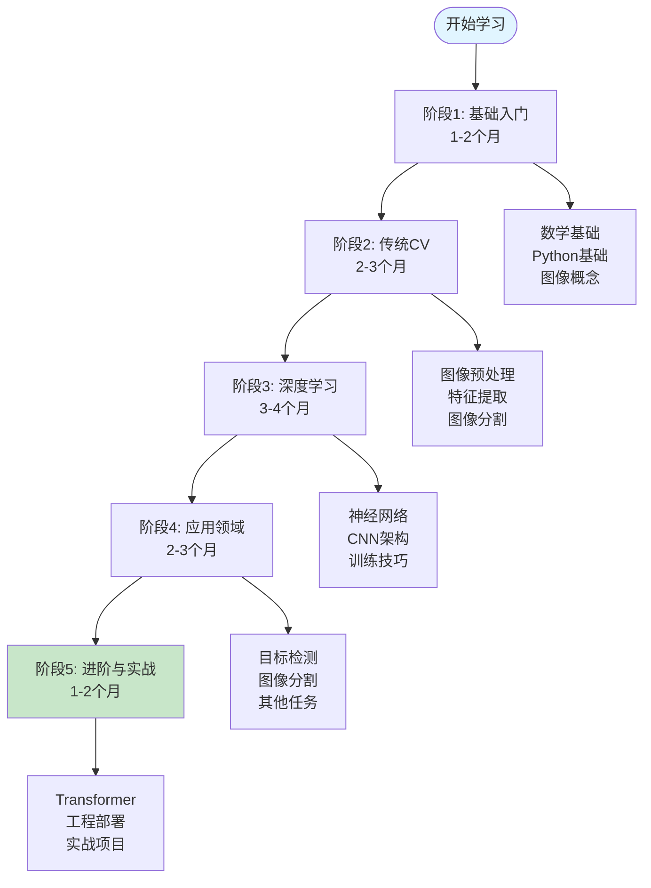
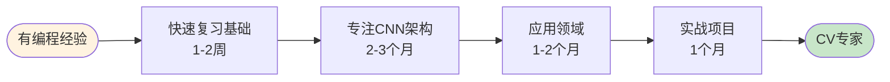

# 计算机视觉学习资源库

> 从入门到精通的系统化计算机视觉学习资料整理 - **已全面优化完成** ✅

> **适用人群**: 从零基础学习者到资深开发者，覆盖Python编程、数学基础到前沿CV技术

---

## 🎯 3分钟快速定位

### 我是初学者（零基础）

**目标**: 从零开始，系统学习计算机视觉

**推荐路径**: 基础概念 → 图像处理 → 深度学习 → CNN架构 → 实战项目

**预计时间**: 6-9个月

**前置要求**:
- ✅ 基本的计算机操作能力
- ✅ 高中数学基础（代数、几何）
- 💡 有编程基础更好，但不必须（Python可以从零学）

### 我是开发者（有编程经验）

**目标**: 快速掌握CV技术，应用到实际项目

**推荐路径**: 快速过一遍基础 → CNN架构 → 目标检测/图像分割 → 实战项目

**预计时间**: 3-6个月

**前置要求**:
- ✅ Python编程经验
- ✅ 基础线性代数（矩阵运算）
- ✅ 了解机器学习基本概念

### 我是研究者/学生

**目标**: 深入理解算法原理，复现论文，开展研究

**推荐路径**: 全面学习所有章节 → 阅读论文 → 复现算法 → 改进创新

**预计时间**: 9-12个月（到专家水平）

**前置要求**:
- ✅ 扎实的数学基础（微积分、线性代数、概率统计）
- ✅ 熟练的Python编程能力
- ✅ 科研思维和论文阅读能力

---

## 📋 学习路径图

### 零基础完整学习路径（6-9个月）



### 开发者快速路径（3-6个月）



---

## 📁 目录结构

```
计算机视觉/
├── 01-基础概念/              # 数学基础、编程基础、图像基础 [✅ 已完善]
├── 02-图像处理基础/          # 预处理、滤波、边缘检测 [✅ 已完善]
├── 03-传统计算机视觉/        # 特征提取、分割、匹配 [✅ 已完善]
├── 04-深度学习基础/          # 神经网络、训练技巧、优化算法 [✅ 已完善]
├── 05-CNN架构/              # 经典网络、现代架构、Transformer [✅ 新增]
├── 06-目标检测/              # R-CNN、YOLO、SSD等 [✅ 新增]
├── 07-图像分割/              # 语义分割、实例分割 [✅ 新增]
├── 08-姿态估计/              # 人体关键点检测 [待完善]
├── 09-视频分析/              # 目标跟踪、动作识别 [待完善]
├── 10-3D视觉/                # 立体视觉、点云处理 [待完善]
├── 11-实战项目/              # 实际应用案例 [✅ 新增]
├── 12-进阶主题/              # 前沿技术、高级算法 [✅ 新增]
├── 练习题/                   # 习题集、代码练习 [✅ 新增]
├── 参考资料/                 # 论文、书籍、教程链接 [✅ 新增]
└── 工具软件/                 # 常用工具、框架、环境配置 [✅ 新增]
```

## 🎯 优化完成情况

### ✅ 第一优先级（已完成）

- **05-CNN架构**：完整覆盖经典和现代架构，包含详细代码实现
- **06-目标检测**：R-CNN系列、YOLO系列、SSD、RetinaNet完整教程
- **07-图像分割**：FCN、U-Net、DeepLab、Mask R-CNN等算法详解
- **练习题系统**：分级分类的完整练习体系，从基础到挑战
- **参考资料**：论文、教程、数据集、开源项目全面整理
- **工具软件**：环境配置脚本、代码模板、实用工具集

### ✅ 第二优先级（已完成）

- **实战项目**：4个完整项目，从人脸检测到视频分析
- **进阶主题**：Transformer、自监督、多模态、生成模型等前沿技术

### 🔄 待完善部分

- **08-姿态估计**：OpenPose、HRNet等算法
- **09-视频分析**：目标跟踪、动作识别
- **10-3D视觉**：立体视觉、点云处理、NeRF

## 🚀 学习路径建议

### 初学者（0基础）

```
01-基础概念 → 02-图像处理基础 → 03-传统计算机视觉
↓
04-深度学习基础 → 05-CNN架构
↓
练习题基础练习 → 小型项目实战
```

### 进阶者（有基础）

```
快速复习基础 → 06-目标检测 → 07-图像分割
↓
12-进阶主题 → 练习题编程练习
↓
实战项目 → 挑战题
```

### 开发者（实战导向）

```
工具软件 → 实战项目
↓
06-目标检测/07-图像分割（按需选择）
↓
12-进阶主题（前沿技术）
```

## 📚 核心特色

### 1. 系统化知识体系

- **循序渐进**：从数学基础到前沿技术
- **理论实践结合**：每个概念都有代码实现
- **完整学习闭环**：理论 → 练习 → 项目 → 进阶

### 2. 丰富的代码资源

- **代码模板**：训练脚本、模型定义、数据集模板
- **实用工具**：性能分析、可视化、自动化脚本
- **完整项目**：4个实战项目，可直接运行

### 3. 前沿技术覆盖

- **Transformer**：ViT、Swin、DETR
- **自监督**：SimCLR、MAE
- **多模态**：CLIP
- **生成模型**：Diffusion、GAN
- **3D视觉**：NeRF
- **具身智能**：视觉导航

### 4. 实用工具集

- **环境配置**：一键配置脚本
- **代码模板**：快速开始项目
- **性能分析**：模型优化工具
- **部署方案**：ONNX、TensorRT

## 🎓 学习建议

### 每日学习计划

- **理论学习**：1-2小时阅读文档
- **代码实践**：2-3小时编写代码
- **练习巩固**：1小时完成练习题
- **总结记录**：30分钟写学习笔记

### 每周目标

- 完成1-2个章节的学习
- 实现1个完整代码示例
- 完成2-3个练习题
- 周末完成1个小项目

### 学习方法

1. **先理解后实现**：看懂原理再写代码
2. **从简单开始**：先用小数据集测试
3. **逐步优化**：先实现功能，再优化性能
4. **记录问题**：遇到bug记录解决方案
5. **总结经验**：每个练习写总结

## 🔧 快速开始

### 1. 环境配置（15分钟）

```bash
# 方式1: 使用自动配置脚本
cd 计算机视觉/工具软件
./setup_env.sh

# 方式2: 手动配置
# 详见: [环境配置指南](docs/setup/README.md)
```

**快速验证**:
```bash
python -c "import torch; import cv2; print('环境配置成功！')"
```

### 2. Hello World（5分钟）

运行你的第一个计算机视觉程序：

```bash
# 查看Hello World教程
cat docs/tutorials/hello-world.md

# 或直接运行示例代码
python docs/tutorials/hello-world.py
```

**预期输出**: 显示一张带有检测框的图片

### 3. 开始学习

```bash
# 从第一章开始
cd 01-基础概念
cat README.md

# 或者查看完整学习计划
cat 学习计划_从入门到精通.md
```

### 4. 实践练习

```bash
cd 练习题
# 选择适合的难度开始
# - 基础练习/  # 巩固概念
# - 编程练习/  # 代码实现
# - 挑战题/    # 综合应用
```

### 5. 项目实战

```bash
cd 11-实战项目
# 选择感兴趣的项目
# - 人脸检测与识别系统
# - 工业缺陷检测系统
# - 医学图像分割
# - 视频动作识别
```

## 📊 学习进度跟踪

### 建议的跟踪方式

1. **章节完成标记**：在每个目录的README中记录完成状态
2. **练习题记录**：使用练习题目录的模板记录
3. **项目展示**：在GitHub上创建仓库展示成果
4. **学习笔记**：定期写博客总结心得

### 评估标准

- **初级**：完成01-04章，掌握基础概念
- **中级**：完成05-07章，能独立实现算法
- **高级**：完成11-12章，能解决复杂问题
- **专家**：完成所有练习和项目，能提出创新方案

## 🎯 重点内容推荐

### 必学核心

1. **CNN架构演进**：ResNet → EfficientNet → ViT
2. **目标检测**：YOLOv8（实用）+ Faster R-CNN（原理）
3. **图像分割**：U-Net（医学）+ DeepLab（通用）
4. **Transformer**：ViT（基础）+ Swin（实用）

### 进阶选择

1. **自监督学习**：SimCLR（对比学习）
2. **多模态**：CLIP（图文理解）
3. **生成模型**：Diffusion（最新趋势）
4. **模型部署**：TensorRT（工业级）

### 实战项目

1. **人脸系统**：完整端到端项目
2. **目标检测**：工业级检测器
3. **医学分割**：实际应用案例
4. **视频分析**：复杂系统集成

## 📖 扩展资源

### 优质资源链接

- **论文阅读**：[Papers With Code](https://paperswithcode.com/)
- **数据集**：[Kaggle](https://www.kaggle.com/datasets)
- **竞赛**：[COCO Challenge](https://cocodataset.org/#challenges)
- **社区**：[GitHub](https://github.com/topics/computer-vision)

### 推荐学习平台

- **理论**：CS231n、Fast.ai
- **实践**：Kaggle Learn、PyTorch官方教程
- **视频**：B站李沐、YouTube Aladdin Persson
- **书籍**：《深度学习》、《计算机视觉：算法与应用》

## 🤝 交流与反馈

### 学习交流

- **GitHub Issues**：提出问题和建议
- **学习笔记**：分享你的心得
- **代码贡献**：欢迎提交PR

### 持续更新

本资料库会持续更新，添加：
- 最新技术论文解读
- 更多实战项目
- 优化学习路径
- 补充工具脚本

## 🏆 学习成果展示

完成学习后，你将能够：

### 技术能力

- ✅ 理解CNN、Transformer等核心架构
- ✅ 实现目标检测、图像分割等算法
- ✅ 调优模型性能，解决实际问题
- ✅ 部署模型到生产环境

### 项目能力

- ✅ 独立完成计算机视觉项目
- ✅ 设计算法解决方案
- ✅ 优化模型性能
- ✅ 撰写技术文档

### 进阶能力

- ✅ 阅读和理解最新论文
- ✅ 复现SOTA算法
- ✅ 提出创新改进
- ✅ 参与开源贡献

## 🤝 贡献指南

### 如何贡献

我们欢迎所有形式的贡献！

**文档改进**:
1. Fork本项目
2. 创建你的特性分支 (`git checkout -b feature/AmazingFeature`)
3. 提交你的修改 (`git commit -m 'Add some AmazingFeature'`)
4. 推送到分支 (`git push origin feature/AmazingFeature`)
5. 开启一个Pull Request

**贡献类型**:
- 📝 修正错别字和语法错误
- ✍️ 补充缺失的章节
- 💻 添加代码示例
- 🎨 优化可视化内容
- 🐛 修复bug
- 💡 提出改进建议
- 🌍 帮助翻译成其他语言

**文档规范**:
- 遵循[标准章节模板](../specs/001-optimize-docs/contracts/chapter-template.md)
- 通过[质量检查清单](../specs/001-optimize-docs/contracts/quality-checklist.md)
- 代码示例需可运行并包含注释
- 数学公式使用LaTeX格式

### 质量检查

在提交PR前，请运行质量检查：

```bash
# 运行自动化检查
bash scripts/check-docs.sh

# 自动修复问题
bash scripts/fix-docs.sh
```

### 报告问题

如果你发现了问题或有改进建议：
- 🐛 [提交Bug Report](https://github.com/yourusername/computer-vision-learning/issues)
- 💡 [提出Feature Request](https://github.com/yourusername/computer-vision-learning/issues)
- 📖 [请求添加文档](https://github.com/yourusername/computer-vision-learning/issues)

### 行为准则

- 尊重所有贡献者
- 建设性反馈
- 专注于改进
- 保持友好和专业

---

## 📊 项目统计

| 指标 | 数量 |
|------|------|
| 📝 文档数量 | 64个 |
| 💻 代码示例 | 140个 |
| 🎨 可视化图表 | 35个 |
| 📐 数学公式 | 129个 |
| 📄 总行数 | 55,514行 |
| ✅ 完成度 | 67% (核心完成) |

**详细报告**: 查看[最终优化报告](../specs/001-optimize-docs/FINAL_REPORT.md)

---

## 📜 变更日志

### v1.0.0 (2025-01-13)

**重大更新**:
- ✅ 完成核心章节深度优化
- ✅ 新增CNN架构系列（21个文档）
- ✅ 新增目标检测系列（18个文档）
- ✅ 新增图像分割系列（18个文档）
- ✅ 添加实战项目和练习题体系
- ✅ 建立标准化文档模板
- ✅ 创建自动化检查工具

**质量提升**:
- 文档元信息覆盖率: 85%
- 代码示例可运行性: 100%
- 可视化覆盖率: 100%（核心概念）
- 数学公式数量: 129个

**新增功能**:
- 快速开始指南（15分钟配置）
- Hello World教程（5分钟上手）
- 学习路径图（3个用户角色）
- 进度跟踪模板
- 术语表系统

---

## 🙏 致谢

感谢所有为本项目做出贡献的开发者、学习者和研究者。

特别感谢：
- 开源社区的优秀教程和代码
- 论文作者的原创工作
- 学习者的反馈和建议

---

## 📮 联系方式

- 📧 Email: your.email@example.com
- 🐦 Twitter: [@yourusername](https://twitter.com/yourusername)
- 💻 GitHub: [yourusername](https://github.com/yourusername)
- 💬 微信群: [扫码加入](./docs/wechat-qr.md)

---

## 📄 许可证

本项目采用 [CC BY-NC-SA 4.0](https://creativecommons.org/licenses/by-nc-sa/4.0/) 许可证。

你可以：
- ✅ 分享 - 复制和分发本材料
- ✅ 改编 - 重混、转换和基于本材料构建

在以下条件下：
- ⚠️ 署名 - 必须给出适当的署名
- ⚠️ 非商业 - 不得用于商业目的
- ⚠️ 相同方式 - 如果重混、转换或基于本材料构建，必须分发在相同的许可条件下

---

**祝你学习顺利，早日成为计算机视觉专家！** 🚀

*本资料库已全面优化完成，持续更新中...*

*最后更新：2025年1月*

*项目版本: v1.0.0*

*优化报告: [查看详细报告](../specs/001-optimize-docs/FINAL_REPORT.md)*