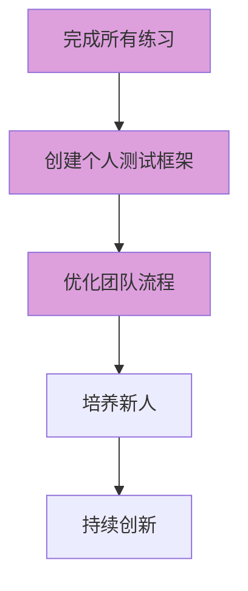

# 🎯 软件测试实践练习模块

> 将理论知识转化为实战能力的系统化练习

---

## 📋 模块概览

本模块提供**4个核心练习** + **配套工具**，帮助你从测试新手成长为测试专家。

| 练习 | 难度 | 时间 | 核心技能 | 配套工具 |
|------|------|------|---------|---------|
| [练习01](./练习01-测试用例设计.md) | ⭐⭐ | 60-90分钟 | 等价类/边界值/场景法 | 模板生成器/自动评估脚本 |
| [练习02](./练习02-缺陷报告编写.md) | ⭐⭐⭐ | 90-120分钟 | 缺陷分析/根因分析 | 检查清单/决策树 |
| [练习03](./练习03-测试策略设计.md) | ⭐⭐⭐⭐ | 120-180分钟 | 测试金字塔/风险评估 | 资源计算器/决策树 |
| [练习04](./练习04-单元测试框架.md) | ⭐⭐⭐⭐ | 150-180分钟 | TDD/Mock/并发测试 | 代码生成器/覆盖率可视化 |

---

## 🗺️ 学习路径图

### 🟢 初学者路径（2-3天）


**目标**：掌握测试基础技能
**建议**：每天完成1个练习，周末复习

---

### 🔵 进阶路径（1周）


**目标**：掌握高级测试技能
**建议**：结合实际项目练习

---

### 🟣 专家路径（持续）



**目标**：成为测试专家
**建议**：每日练习，持续改进

---

## 📊 进度追踪

### 个人进度表

```markdown
# 我的练习进度

## 基础阶段
- [ ] 练习01: 测试用例设计
  - 完成时间: ______
  - 自评分数: ______
  - 收获总结: ______

- [ ] 练习02: 缺陷报告编写
  - 完成时间: ______
  - 自评分数: ______
  - 收获总结: ______

## 进阶阶段
- [ ] 练习03: 测试策略设计
  - 完成时间: ______
  - 自评分数: ______
  - 收获总结: ______

- [ ] 练习04: 单元测试框架
  - 完成时间: ______
  - 自评分数: ______
  - 收获总结: ______

## 实战应用
- [ ] 在真实项目中应用
- [ ] 分享给团队成员
- [ ] 编写个人最佳实践
```

### 团队进度追踪

```markdown
# 团队练习进度

## 成员进度
| 姓名 | 练习01 | 练习02 | 练习03 | 练习04 | 总进度 |
|------|--------|--------|--------|--------|--------|
| 张三 | ✅     | ✅     | ⏳     | ⌛     | 50%   |
| 李四 | ✅     | ⏳     | ⌛     | ⌛     | 25%   |
| 王五 | ✅     | ✅     | ✅     | ⏳     | 75%   |

## 团队目标
- [ ] 所有成员完成基础阶段
- [ ] 80%成员完成进阶阶段
- [ ] 建立团队测试规范
- [ ] 定期分享交流
```

---

## 🎯 练习分类

### 基础技能练习
- [练习01](./练习01-测试用例设计.md) - 测试用例设计基础 ✅
  - 等价类划分法
  - 边界值分析法
  - 场景法设计
  - **配套工具**：模板生成器 + 自动评估

- [练习02](./练习02-缺陷报告编写.md) - 缺陷报告编写 ✅
  - 缺陷报告要素
  - 根因分析方法
  - 缺陷分级策略
  - **配套工具**：检查清单 + 决策树

- [练习03](./练习03-测试策略设计.md) - 测试策略设计 ✅
  - 测试金字塔
  - 专项测试策略
  - 风险管理
  - **配套工具**：资源计算器 + 风险矩阵

### 自动化测试练习
- [练习04](./练习04-单元测试框架.md) - 单元测试框架 ✅
  - TDD开发
  - Mockito使用
  - 并发测试
  - **配套工具**：代码生成器 + 覆盖率可视化

---

## 🛠️ 配套工具集

每个练习都提供**实用工具**，帮助你高效学习：

### 📊 测试用例工具
- ✅ 测试用例模板生成器
- ✅ 等价类划分检查表
- ✅ 自动评估脚本（Python）
- ✅ 质量快速检查清单

### 🐛 缺陷报告工具
- ✅ 缺陷报告模板生成器
- ✅ 缺陷分级决策树
- ✅ 质量检查清单
- ✅ 示例对比库

### 📈 测试策略工具
- ✅ 测试金字塔设计模板
- ✅ 策略决策树
- ✅ 风险评估矩阵
- ✅ 资源分配计算器

### 💻 单元测试工具
- ✅ 测试代码生成器（Java）
- ✅ Mockito最佳实践模板
- ✅ 覆盖率可视化工具（Python）
- ✅ 并发测试辅助类

---

## 🎓 学习建议

### 每日练习计划

**周一到周五**（每天30分钟）：
```
18:00-18:30: 完成一个小练习或一个练习的一部分
- 周一：练习01 题目1
- 周二：练习01 题目2
- 周三：练习01 题目3 + 对照答案
- 周四：练习02 题目1
- 周五：练习02 题目2 + 工具使用
```

**周末**（2-3小时）：
```
周六：完成剩余练习 + 使用评估工具
周日：总结本周收获 + 制定下周计划
```

### 高效学习技巧

1. **番茄工作法**：25分钟专注练习 + 5分钟休息
2. **费曼技巧**：用自己的话解释学到的概念
3. **刻意练习**：针对薄弱环节重复练习
4. **项目结合**：将练习应用到实际工作中
5. **分享交流**：在团队内分享学习心得

---

## 📈 效果评估

### 个人能力提升

| 能力维度 | 练习前 | 练习后 | 提升 |
|---------|--------|--------|------|
| 测试用例设计 | ⭐⭐ | ⭐⭐⭐⭐ | +2 |
| 缺陷分析 | ⭐⭐ | ⭐⭐⭐⭐ | +2 |
| 测试策略 | ⭐ | ⭐⭐⭐ | +2 |
| 单元测试 | ⭐ | ⭐⭐⭐⭐ | +3 |

### 团队质量指标

- **测试用例质量**：从60分提升到85分
- **缺陷报告质量**：从50分提升到80分
- **测试覆盖率**：从40%提升到75%
- **缺陷逃逸率**：从15%降低到5%

---

## 🔗 相关资源

### 理论知识
- [软件测试基础](../README.md)
- [测试最佳实践](../21-测试最佳实践.md)
- [实战案例分析](../22-实战案例分析.md)
- [测试团队管理](../20-测试团队管理.md)

### 扩展练习（计划中）
- 练习05 - 接口自动化测试
- 练习06 - UI自动化测试
- 练习07 - 性能测试实践
- 练习08 - 安全测试实践
- 练习09 - CI/CD集成
- 练习10 - 项目实战

---

## 💬 交流反馈

### 如何获得帮助？
1. **查阅文档**：每个练习都有详细说明和参考答案
2. **使用工具**：配套工具可以自动评估和生成模板
3. **团队讨论**：在团队内组织练习评审会
4. **Issue反馈**：发现问题请提交Issue

### 如何贡献？
1. 分享你的练习心得
2. 提交改进建议
3. 贡献新的练习题目
4. 完善现有练习内容

---

## 🚀 开始学习

### 快速开始（3步）

**第一步：查看快速指南**
```bash
# 打开快速开始指南
open README_FIRST.md
```

**第二步：启动练习助手**
```bash
# 使用Python启动
python practice_assistant.py

# 或使用Shell脚本（Mac/Linux）
./track_progress.sh
```

**第三步：开始第一个练习**
```bash
# 在练习助手中选择：
# 1. 开始新练习
# 2. 选择练习01
# 3. 打开练习文件开始练习
```

---

### 详细步骤

#### 1. 选择练习
根据你的水平选择：
- **新手**：从练习01开始
- **有经验**：从练习03开始
- **需要提升**：选择薄弱环节

#### 2. 准备环境
- ✅ Markdown编辑器（推荐Typora或VS Code）
- ✅ Python（用于评估工具，可选）
- ✅ Java（练习04需要，可选）

#### 3. 开始练习
1. 独立完成练习题目
2. 对照参考答案
3. 使用配套工具评估
4. 记录进度和收获

---

### 📁 文件说明

| 文件 | 用途 |
|------|------|
| `README.md` | 主文档（你正在看的） |
| `README_FIRST.md` | 快速开始指南 |
| `practice_assistant.py` | 练习助手（Python） |
| `track_progress.sh` | 进度追踪脚本（Shell） |
| `OPTIMIZATION_SUMMARY.md` | 优化说明 |
| `练习01-测试用例设计.md` | 练习1（含工具） |
| `练习02-缺陷报告编写.md` | 练习2（含工具） |
| `练习03-测试策略设计.md` | 练习3（含工具） |
| `练习04-单元测试框架.md` | 练习4（含工具） |

---

### 💡 学习建议

**每日计划**：
```
18:00-18:30: 练习30分钟
- 周一：练习01 题目1
- 周二：练习01 题目2
- 周三：练习01 题目3 + 评估
- 周四：练习02 题目1
- 周五：练习02 题目2 + 工具
```

**周末计划**：
```
周六：完成剩余练习 + 使用助手评估
周日：总结收获 + 制定下周计划
```

---

### 🎯 目标与口号

**🎯 目标**：通过系统化练习，掌握软件测试核心技能！

**💡 口号**：每天练习30分钟，2周成为测试高手！

**🚀 开始吧**：现在就打开 [README_FIRST.md](./README_FIRST.md) ！

**祝您学习愉快！** 🎉