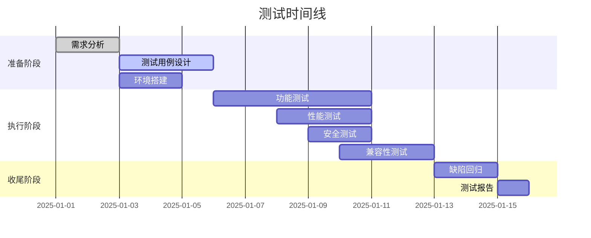

# 软件测试文档库优化方案

> **目标**：将现有文档库重构为内容清晰、新人友好、结构标准化的高质量技术文档体系

---

## 📋 方案概览

### 三大核心维度

| 维度 | 核心问题 | 解决方案 | 预期效果 |
|------|---------|---------|---------|
| **背景与价值 (The "Why")** | 缺乏"为什么"的解释 | 增加背景、痛点、价值章节 | 读者理解学习意义，激发学习动力 |
| **新人友好度 (Onboarding)** | 门槛高，上手困难 | 提供术语表、傻瓜式指南、Hello World示例 | 新人可在1小时内上手 |
| **结构化与清晰度 (Clarity)** | 结构混乱，缺少最佳实践 | 标准化模板 + 最佳实践 + 常见陷阱 | 文档质量统一，易于维护 |

---

## 🎯 第一维度：背景与价值 (The "Why")

### 1.1 痛点驱动的引入方式

**新增章节结构**：
```
## 🚀 为什么需要这个？

### 解决的痛点
- [具体痛点1]：描述当前面临的问题
- [具体痛点2]：描述失败案例或风险
- [具体痛点3]：描述效率低下的场景

### 适用场景
- ✅ 适合的场景：列举3-5个典型场景
- ❌ 不适合的场景：明确边界，避免误用

### 长期价值
- 对项目：质量提升、成本降低、风险控制
- 对团队：效率提升、技能成长、协作优化
- 对个人：职业发展、技术深度、竞争力
```

### 1.2 实际案例引入

**每个章节开头增加**：
```markdown
## 📖 [章节名称]

### 🎯 学习目标
- 掌握...
- 理解...
- 能够...

### 📌 真实场景故事
**场景**：某电商平台在大促期间，由于缺少性能测试，导致系统崩溃，损失XXX万。
**原因**：未进行压力测试，未识别性能瓶颈。
**解决方案**：学习本章后，你将能够设计完整的性能测试方案，避免类似问题。

### 💡 本章价值
- **短期**：立即应用到当前项目
- **中期**：建立系统化测试思维
- **长期**：成为测试架构师的基石
```

---

## 🎓 第二维度：新人友好度 (Onboarding)

### 2.1 术语表系统

**创建统一的术语表文档** `/docs/glossary.md`：

```markdown
# 📖 软件测试术语表

## 🏷️ 快速索引
- [A](#a) | [B](#b) | [C](#c) | [D](#d) | [E](#e) | [F](#f) | [G](#g) | [H](#h)

## A
### Acceptance Testing (验收测试)
**定义**：由客户或最终用户执行的测试，验证系统是否满足业务需求。
**场景**：项目交付前的最终确认。
**难度**：⭐⭐
**相关**：UAT, Beta Testing

**示例**：
```python
# 验收测试示例
def test_user_can_create_order():
    """用户能够成功创建订单（验收标准）"""
    user = User("test@example.com")
    order = user.create_order(items=["iPhone", "MacBook"])
    assert order.status == "confirmed"
```

### Automation Testing (自动化测试)
**定义**：使用脚本和工具自动执行测试用例，替代人工重复操作。
**场景**：回归测试、性能测试、数据驱动测试。
**难度**：⭐⭐⭐
**相关**：Selenium, Pytest, CI/CD

**为什么需要**：
- 重复执行100次登录测试，人工需要2小时，自动化只需2分钟
- 避免人为操作失误
- 24小时不间断执行

---

## B
### Black Box Testing (黑盒测试)
**定义**：不关心内部实现，只验证输入输出是否符合预期。
**场景**：功能测试、用户视角测试。
**难度**：⭐⭐
**对比**：White Box Testing（白盒测试）

**示例**：
```python
# 黑盒测试：只关心输入输出
def test_login_black_box():
    result = login_service.login("user", "pass")
    assert result.success == True  # 不关心内部如何验证
```

... [更多术语]
```

### 2.2 傻瓜式环境配置指南

**创建环境配置文档** `/docs/setup/README.md`：

```markdown
# 🚀 环境配置指南（傻瓜式）

## ⏱️ 预计时间：15分钟

## 📦 第一步：安装Python（如未安装）

### Windows用户
1. 访问 [python.org](https://www.python.org/downloads/)
2. 下载 Python 3.10+ 版本
3. **关键**：安装时勾选 "Add Python to PATH"
4. 验证安装：
   ```bash
   python --version
   # 应显示：Python 3.10.x
   ```

### macOS用户
1. 打开终端
2. 输入：`python3 --version`
3. 如未安装，系统会提示安装，或运行：
   ```bash
   brew install python3
   ```

### Linux用户
```bash
sudo apt update
sudo apt install python3 python3-pip
```

---

## 🔧 第二步：安装测试工具

### 方式一：一键安装（推荐）
```bash
# 在项目目录下运行
pip install -r requirements.txt
```

### 方式二：手动安装
```bash
# 基础测试框架
pip install pytest

# Web自动化（如需要）
pip install selenium

# 接口测试（如需要）
pip install requests

# 数据处理（如需要）
pip install pandas openpyxl
```

---

## ✅ 第三步：验证安装

创建测试文件 `test_verify.py`：
```python
def test_environment_ok():
    """验证环境是否配置成功"""
    assert 1 + 1 == 2
    print("🎉 环境配置成功！")
```

运行测试：
```bash
pytest test_verify.py -v
```

**期望输出**：
```
============================= test session starts ==============================
collected 1 item

test_verify.py::test_environment_ok PASSED                                [100%]

============================== 1 passed in 0.01s ===============================
🎉 环境配置成功！
```

---

## 🆘 常见问题

### Q1: pip命令找不到？
**解决**：检查Python是否添加到PATH，或使用 `python -m pip install package`

### Q2: 安装超时？
**解决**：使用国内镜像
```bash
pip install pytest -i https://pypi.tuna.tsinghua.edu.cn/simple
```

### Q3: 版本冲突？
**解决**：创建虚拟环境
```bash
python -m venv venv
source venv/bin/activate  # Windows: venv\Scripts\activate
pip install -r requirements.txt
```

---

## 🎯 下一步
环境配置完成后，开始你的第一个测试：[Hello World测试示例](./hello-world.md)
```

### 2.3 Hello World级快速上手

**创建Hello World教程** `/docs/tutorials/hello-world.md`：

```markdown
# 🌟 Hello World - 你的第一个测试

## 🎯 学习目标
在5分钟内，编写并运行你的第一个自动化测试！

---

## 📝 第一个测试用例

### 步骤1：创建文件
新建文件 `test_hello.py`：

```python
# 这是一个简单的测试函数
def test_hello_world():
    """我的第一个测试：验证1+1=2"""
    # assert 是测试的核心：断言某个条件必须为真
    assert 1 + 1 == 2
    print("✅ 测试通过！")
```

### 步骤2：运行测试
在终端中运行：
```bash
pytest test_hello.py -v
```

### 步骤3：查看结果
你应该看到：
```
============================= test session starts ==============================
collected 1 item

test_hello.py::test_hello_world PASSED                                  [100%]

============================== 1 passed in 0.01s ===============================
✅ 测试通过！
```

**🎉 恭喜！你已经完成了第一个测试！**

---

## 🚀 进阶：真实场景测试

### 场景：测试登录功能

```python
# test_login_demo.py

def check_login(username, password):
    """模拟登录验证函数"""
    if username == "admin" and password == "123456":
        return {"success": True, "message": "登录成功"}
    else:
        return {"success": False, "message": "用户名或密码错误"}

# 测试用例1：正确登录
def test_login_success():
    """测试正确用户名密码"""
    result = check_login("admin", "123456")
    assert result["success"] == True
    assert result["message"] == "登录成功"

# 测试用例2：错误密码
def test_login_wrong_password():
    """测试错误密码"""
    result = check_login("admin", "wrongpass")
    assert result["success"] == False
    assert "错误" in result["message"]

# 测试用例3：空用户名
def test_login_empty_username():
    """测试空用户名"""
    result = check_login("", "123456")
    assert result["success"] == False
```

运行所有测试：
```bash
pytest test_login_demo.py -v
```

---

## 🎓 测试思维培养

### 什么是测试？
```
测试 = 给程序"找茬" + 验证"完美"

输入：你的代码
执行：运行测试
输出：通过✅ 或 失败❌
```

### 测试三要素
1. **输入**：给程序什么数据？
2. **执行**：怎么操作？
3. **预期**：应该得到什么结果？

### 你的第一个测试习惯
每次写代码前，先问自己：
> "如果我要测试这个功能，需要验证哪些情况？"

---

## 🎯 课后练习

### 练习1：修改测试
修改 `test_hello.py`，让它失败：
```python
def test_hello_world():
    assert 1 + 1 == 3  # 故意写错
```

运行后观察错误信息，理解测试失败的含义。

### 练习2：编写新测试
为以下函数编写测试：
```python
def is_even(n):
    """判断是否为偶数"""
    return n % 2 == 0
```

你的测试应该覆盖：
- ✅ 偶数（如：2, 4, 100）
- ✅ 奇数（如：1, 3, 99）
- ✅ 边界值（0, -2）

---

## 📚 下一步学习路径

1. **立即**：[理解测试用例设计](../04-测试用例设计基础.md)
2. **明天**：[学习等价类划分](../04-测试用例设计基础.md#等价类划分)
3. **本周**：[完成练习01](../实践练习/练习01-测试用例设计.md)

---

## 💡 常见问题

### Q: 为什么测试函数要以 `test_` 开头？
**A**: Pytest会自动识别以 `test_` 开头的函数作为测试用例。

### Q: assert是什么？
**A**: 断言语句，如果条件为假，测试失败并抛出异常。

### Q: 如何测试多个场景？
**A**: 编写多个测试函数，每个函数测试一个场景。

---

## 🏆 成就系统
- ✅ 完成第一个测试
- 🎯 理解测试三要素
- 🚀 掌握基本断言
- 📈 准备进阶学习
```

### 2.4 新人引导系统

**创建学习路径导航** `/docs/learning-path.md`：

```markdown
# 🗺️ 学习路径导航

## 🎯 你是哪类学习者？

### 👶 零基础新人（0基础）
**路径**：Hello World → 术语表 → 基础概念 → 第一个练习
**时间**：1周
**目标**：理解测试是什么，能写简单测试

**立即开始**：
1. [环境配置](./setup/README.md) - 15分钟
2. [Hello World](./tutorials/hello-world.md) - 5分钟
3. [术语表](./glossary.md) - 遇到不懂的就查
4. [基础概念](../01-软件测试基础概念.md) - 2小时

---

### 👩‍💻 开发转测试（有编程基础）
**路径**：快速浏览基础 → 深入自动化 → 框架设计
**时间**：2周
**目标**：掌握测试思维和自动化技能

**立即开始**：
1. [快速回顾](../01-软件测试基础概念.md) - 1小时
2. [自动化测试](../11-自动化测试.md) - 重点学习
3. [练习04](../实践练习/练习04-单元测试框架.md) - 实践
4. [测试架构](../19-测试架构设计.md) - 进阶

---

### 🎯 测试工程师（已有经验）
**路径**：专项测试 → 最佳实践 → 团队管理
**时间**：1个月
**目标**：成为测试架构师

**立即开始**：
1. [专项测试](../10-性能测试.md) - 选择薄弱环节
2. [最佳实践](../21-测试最佳实践.md) - 系统化
3. [团队管理](../20-测试团队管理.md) - 管理视角
4. [实战案例](../22-实战案例分析.md) - 综合应用

---

## 📅 学习计划模板

### 7天速成计划（每天1小时）

| 天数 | 上午（30分钟） | 下午（30分钟） | 产出 |
|------|---------------|---------------|------|
| Day 1 | 环境配置 + Hello World | 术语表速览 | 3个测试用例 |
| Day 2 | 基础概念01-02 | 完成练习01 | 测试用例设计 |
| Day 3 | 基础概念03-04 | 完成练习02 | 缺陷报告 |
| Day 4 | 测试方法05-06 | 实践练习 | 20个测试用例 |
| Day 5 | 自动化测试11 | Hello World自动化 | 5个脚本 |
| Day 6 | 接口测试12 | Postman实践 | 10个接口测试 |
| Day 7 | 复习 + 总结 | 制定个人计划 | 学习笔记 |

---

## 🎓 每日学习模板

### 30分钟学习法

```
0-5分钟：  阅读"为什么需要这个"章节
5-15分钟： 理解核心概念和示例
15-25分钟：动手实践代码
25-30分钟：总结笔记 + 提问
```

### 学习笔记模板
```markdown
## 今日学习：[章节名称]

### 我理解了什么？
-

### 我能做什么？
-

### 我还有疑问？
-

### 明天计划？
-
```

---

## 🏆 里程碑检查

### Level 1: 新手（1-2周）
- [ ] 完成环境配置
- [ ] 运行10个测试用例
- [ ] 理解等价类划分
- [ ] 编写1个缺陷报告

### Level 2: 进阶（1个月）
- [ ] 掌握3种测试方法
- [ ] 完成自动化测试入门
- [ ] 参与1个真实项目
- [ ] 能设计测试策略

### Level 3: 熟练（3个月）
- [ ] 独立负责模块测试
- [ ] 搭建自动化框架
- [ ] 指导新人
- [ ] 输出最佳实践

---

## 💡 学习建议

### ✅ 应该做的
1. **每天动手**：只看不练=没学
2. **先理解后记忆**：理解原理比背诵重要
3. **记录问题**：遇到问题先记录，再搜索
4. **分享输出**：教是最好的学

### ❌ 避免的坑
1. **跳过基础**：基础不牢，地动山摇
2. **贪多求快**：一天学10章不如1章学3遍
3. **不写注释**：代码是写给人看的
4. **害怕失败**：测试失败是常态

---

## 🆘 求助指南

### 遇到问题怎么办？

1. **查文档**：本库搜索关键词
2. **查术语**：查看[术语表](./glossary.md)
3. **查示例**：查看对应章节的代码示例
4. **提问题**：在Issue中描述：
   - 你做了什么
   - 期望结果
   - 实际结果
   - 环境信息

---

## 🚀 立即行动

### 今天就开始！

**第一步**：复制这个模板到你的笔记
```bash
# 创建你的学习笔记
cp 学习路径.md 我的学习笔记.md
```

**第二步**：完成环境配置
```bash
# 打开环境配置指南
open ./setup/README.md
```

**第三步**：运行Hello World
```bash
# 5分钟完成第一个测试
pytest test_hello.py -v
```

**🎉 你已经领先90%的人了！**
```

---

## 🎯 第三维度：结构化与清晰度 (Clarity)

### 3.1 标准化文档模板

**创建通用文档模板** `/docs/templates/standard-template.md`：

```markdown
# [章节名称]

> **一句话总结**：用一句话说清楚本章的核心内容

---

## 🎯 学习目标

### 本章完成后，你将能够：
- [ ] 目标1：具体可衡量的能力
- [ ] 目标2：具体可衡量的能力
- [ ] 目标3：具体可衡量的能力

**预计学习时间**：XX分钟
**难度等级**：⭐⭐⭐☆☆

---

## 🚀 为什么需要这个？

### 解决的痛点
| 痛点场景 | 影响 | 本章解决方案 |
|---------|------|-------------|
| 场景1：... | 导致...问题 | 使用...方法解决 |
| 场景2：... | 造成...损失 | 通过...策略避免 |

### 适用场景
- ✅ **推荐使用**：
  - 场景A：具体描述
  - 场景B：具体描述

- ❌ **不推荐使用**：
  - 场景C：为什么不适用
  - 场景D：替代方案

### 长期价值
- **项目层面**：减少XX%缺陷，提升XX%效率
- **团队层面**：标准化流程，降低沟通成本
- **个人层面**：掌握核心技能，提升竞争力

---

## 📖 核心概念

### 概念1：[术语名称]

**定义**：
清晰的定义，避免歧义

**类比解释**：
用生活中的例子类比，帮助理解

**代码示例**：
```python
# 最小可运行示例
def example():
    # 代码说明
    pass
```

### 概念2：[术语名称]

**定义**：
...

---

## 🛠️ 环境准备

### 前置条件
- [ ] Python 3.8+ 已安装
- [ ] pip 已安装
- [ ] [可选] 虚拟环境已创建

### 安装步骤
```bash
# 1. 安装核心包
pip install package-name

# 2. 验证安装
python -c "import package; print('✅ 安装成功')"
```

### 验证环境
运行以下代码验证环境：
```python
# 验证脚本
def test_environment():
    import package
    assert package.__version__ >= "1.0"
    print("✅ 环境就绪")
```

---

## 📝 标准操作流程

### 步骤1：[准备阶段]

**前置条件**：
- 条件A：必须满足
- 条件B：可选但推荐

**操作步骤**：
```bash
# 具体命令
command --option value
```

**预期结果**：
- ✅ 成功：看到...输出
- ❌ 失败：看到...错误

**验证方法**：
```bash
# 验证命令
verify-command
```

---

### 步骤2：[执行阶段]

**前置条件**：步骤1已完成

**操作步骤**：
```python
# 代码示例
result = do_something()
```

**预期结果**：
```python
assert result == expected
```

**验证方法**：
```python
# 验证代码
check_result(result)
```

---

### 步骤3：[验证阶段]

**前置条件**：步骤2已完成

**操作步骤**：
```bash
# 验证命令
pytest test_file.py -v
```

**预期结果**：
```
============================= test session starts ==============================
collected 1 item

test_file.py::test_function PASSED                                      [100%]

============================== 1 passed in 0.01s ===============================
```

---

## 🧹 清理步骤

### 测试完成后清理

**必须清理的资源**：
```bash
# 1. 删除临时文件
rm -rf temp_files/

# 2. 关闭连接
# 代码示例：driver.quit()

# 3. 恢复配置
# 代码示例：reset_config()
```

**可选清理**：
```bash
# 清理日志
rm -f test.log

# 重置数据库
python reset_db.py
```

**验证清理**：
```bash
# 确认无残留进程
ps aux | grep test

# 确认无残留文件
ls temp_files/  # 应该为空
```

---

## ✅ 最佳实践

### 推荐做法（Do's）

| 实践 | 原因 | 示例 |
|------|------|------|
| 使用显式等待 | 避免随机失败 | `WebDriverWait(driver, 10).until(...)` |
| 命名规范 | 易于理解 | `test_login_success()` 而非 `test1()` |
| 独立测试用例 | 避免相互影响 | 每个测试独立setup/teardown |
| 清晰断言信息 | 快速定位问题 | `assert result == expected, "描述失败原因"` |

### 反模式（Don'ts）

| 错误做法 | 问题 | 正确做法 |
|---------|------|---------|
| 硬编码等待 | 慢且不稳定 | 使用显式等待 |
| 测试依赖 | 连锁失败 | 独立测试 |
| 过大测试 | 难以维护 | 单一职责 |
| 忽略清理 | 资源泄漏 | 完整teardown |

---

## ⚠️ 常见陷阱与解决方案

### 陷阱1：[具体陷阱]

**症状**：
```
错误信息或异常表现
```

**原因分析**：
- 原因1：...
- 原因2：...

**解决方案**：
```python
# 错误代码
# driver.find_element(By.ID, "button").click()  # 可能失败

# 正确代码
from selenium.webdriver.support.ui import WebDriverWait
from selenium.webdriver.support import expected_conditions as EC

wait = WebDriverWait(driver, 10)
element = wait.until(EC.element_to_be_clickable((By.ID, "button")))
element.click()
```

**预防方法**：
- 始终使用等待机制
- 添加异常处理

---

### 陷阱2：[具体陷阱]

**症状**：
```
错误信息
```

**原因分析**：
- ...

**解决方案**：
...

**预防方法**：
...

---

### 陷阱3：[具体陷阱]

...

---

## 🎯 实践练习

### 练习1：基础应用

**任务**：使用本章知识完成...

**要求**：
- [ ] 步骤1
- [ ] 步骤2
- [ ] 步骤3

**参考答案**：[链接到练习文件]

---

### 练习2：进阶挑战

**任务**：...

**要求**：
- [ ] 挑战1
- [ ] 挑战2

**评估标准**：
- 功能完整性：30%
- 代码质量：30%
- 测试覆盖：20%
- 文档完整性：20%

---

## 📊 本章小结

### 核心要点回顾
1. **概念**：[核心概念1]
2. **方法**：[核心方法1]
3. **实践**：[核心实践1]

### 检查清单
- [ ] 理解为什么需要这个
- [ ] 掌握核心概念
- [ ] 能够独立完成操作流程
- [ ] 了解最佳实践
- [ ] 知道如何避免常见陷阱
- [ ] 完成实践练习

---

## 🔗 相关资源

### 官方文档
- [工具官方文档](#)
- [标准规范](#)

### 扩展阅读
- [相关文章1](#)
- [相关文章2](#)

### 工具下载
- [工具A](#)
- [工具B](#)

---

## 📝 更新日志

| 版本 | 日期 | 更新内容 | 作者 |
|------|------|---------|------|
| v1.0 | 2025-01-01 | 初始版本 | 作者名 |

---

**下一章**：[章节名称](链接)
**返回目录**：[README](../README.md)
```

### 3.2 测试用例模板

**创建测试用例专用模板** `/docs/templates/test-case-template.md`：

```markdown
# 测试用例模板

## 📋 测试用例基本信息

| 属性 | 值 |
|------|-----|
| 用例编号 | TC-[模块]-[序号]，如：TC-LOGIN-001 |
| 用例名称 | [动作]_[对象]_[结果]，如：登录成功_正确凭证 |
| 测试模块 | [功能模块名称] |
| 优先级 | P0/P1/P2/P3 |
| 测试类型 | 功能/性能/安全/兼容性/回归 |
| 前置条件 | 必须满足的条件列表 |

---

## 🎯 测试目标

### 验证点
- [ ] 验证点1：具体描述
- [ ] 验证点2：具体描述

### 预期收益
- 发现XX类缺陷
- 验证XX功能正确性
- 保证XX质量标准

---

## 📝 测试步骤

### 前置条件准备

**环境要求**：
- [ ] 测试环境已部署
- [ ] 测试数据已准备
- [ ] 测试账号可用

**数据准备**：
```sql
-- 测试数据
INSERT INTO users (username, password) VALUES ('test_user', 'test_pass');
```

### 详细步骤

| 步骤 | 操作描述 | 输入数据 | 预期结果 | 实际结果 | 状态 |
|------|---------|---------|---------|---------|------|
| 1 | 打开登录页面 | - | 页面加载成功，显示登录表单 | | |
| 2 | 输入用户名 | `test_user` | 输入框显示正确内容 | | |
| 3 | 输入密码 | `test_pass` | 密码框显示正确内容（掩码） | | |
| 4 | 点击登录按钮 | - | 跳转到首页 | | |
| 5 | 验证登录状态 | - | 显示欢迎信息："欢迎，test_user" | | |

### 代码实现

```python
# test_login.py
import pytest
from selenium.webdriver.common.by import By
from selenium.webdriver.support.ui import WebDriverWait
from selenium.webdriver.support import expected_conditions as EC

class TestLogin:
    def test_login_success(self, browser):
        """TC-LOGIN-001: 正确凭证登录成功"""

        # 前置条件
        browser.get("https://example.com/login")

        # 步骤1：输入用户名
        username_input = browser.find_element(By.ID, "username")
        username_input.send_keys("test_user")

        # 步骤2：输入密码
        password_input = browser.find_element(By.ID, "password")
        password_input.send_keys("test_pass")

        # 步骤3：点击登录
        login_btn = browser.find_element(By.ID, "login_btn")
        login_btn.click()

        # 步骤4：验证结果
        wait = WebDriverWait(browser, 10)
        welcome_msg = wait.until(
            EC.presence_of_element_located((By.CLASS_NAME, "welcome"))
        )

        # 断言
        assert "欢迎" in welcome_msg.text
        assert "test_user" in welcome_msg.text

        # 清理
        browser.find_element(By.LINK_TEXT, "退出").click()
```

---

## 🎯 预期结果

### 功能预期
- [ ] 步骤1预期结果：✓
- [ ] 步骤2预期结果：✓
- [ ] 步骤3预期结果：✓
- [ ] 步骤4预期结果：✓

### 性能预期
- 响应时间：< 2秒
- 成功率：100%

### 安全预期
- 密码不以明文传输
- 无SQL注入风险

---

## 🧪 测试数据

### 正常数据
| 用户名 | 密码 | 预期结果 |
|--------|------|---------|
| test_user | test_pass | 登录成功 |
| admin | 123456 | 登录成功 |

### 边界数据
| 用户名 | 密码 | 预期结果 |
|--------|------|---------|
| a | test_pass | 失败（用户名太短） |
| test_user_with_long_name | test_pass | 失败（用户名太长） |
| test_user | a | 失败（密码太短） |

### 异常数据
| 用户名 | 密码 | 预期结果 |
|--------|------|---------|
| wrong_user | test_pass | 失败（用户不存在） |
| test_user | wrong_pass | 失败（密码错误） |
| '' | '' | 失败（空值） |
| SQL_INJECTION | test_pass | 失败（安全拦截） |

---

## ⚠️ 风险与注意事项

### 风险点
1. **环境依赖**：测试环境可能不稳定
2. **数据污染**：测试账号可能被其他测试使用
3. **时间敏感**：某些功能有时间限制

### 规避措施
- [ ] 使用独立测试账号
- [ ] 测试前清理数据
- [ ] 添加重试机制

---

## 🧹 清理步骤

### 必须执行
```python
# 在测试完成后执行
def teardown_method(self, method):
    """清理测试环境"""
    # 1. 退出登录
    try:
        self.browser.find_element(By.LINK_TEXT, "退出").click()
    except:
        pass

    # 2. 删除测试数据
    # delete_test_data()

    # 3. 关闭浏览器
    self.browser.quit()
```

### 验证清理
- [ ] 测试账号状态正常
- [ ] 无残留数据
- [ ] 浏览器已关闭

---

## 📊 测试结果记录

### 执行信息
| 项目 | 信息 |
|------|------|
| 执行时间 | 2025-01-01 10:00:00 |
| 执行环境 | Chrome 120.0 |
| 执行人 | [姓名] |
| 测试结果 | 通过/失败/阻塞 |

### 缺陷记录（如失败）
| 属性 | 值 |
|------|-----|
| 缺陷标题 | [简洁描述] |
| 严重程度 | 致命/严重/一般/提示 |
| 优先级 | 紧急/高/中/低 |
| 复现步骤 | 详细步骤 |
| 实际结果 | 实际观察到的现象 |
| 预期结果 | 期望的现象 |
| 截图/日志 | [附件链接] |

---

## 📝 评估标准

### 通过标准
- [ ] 所有步骤执行成功
- [ ] 所有断言通过
- [ ] 性能指标达标
- [ ] 无严重缺陷

### 失败标准
- [ ] 关键步骤失败
- [ ] 断言失败
- [ ] 性能不达标
- [ ] 发现严重缺陷

---

## 🔗 相关资源

### 相关用例
- [前置用例](#)
- [后置用例](#)
- [相似用例](#)

### 参考文档
- [需求文档](#)
- [设计文档](#)
- [API文档](#)

---

**模板版本**：v1.0
**最后更新**：2025-01-01
```

### 3.3 缺陷报告模板

**创建缺陷报告模板** `/docs/templates/bug-report-template.md`：

```markdown
# 缺陷报告模板

## 📋 基本信息

| 属性 | 值 |
|------|-----|
| 缺陷编号 | BUG-[模块]-[日期]-[序号] |
| 报告人 | [姓名] |
| 报告时间 | 2025-01-01 10:00 |
| 缺陷状态 | 新建/待处理/修复中/已修复/已关闭/拒绝 |
| 严重程度 | 🔴 致命 / 🟠 严重 / 🟡 一般 / 🔵 提示 |
| 优先级 | 🔴 紧急 / 🟠 高 / 🟡 中 / 🔵 低 |

---

## 🎯 缺陷摘要

### 标题
**简洁明了**：[功能]在[场景]下[问题]，导致[影响]

**示例**：
- ❌ 不好：登录有问题
- ✅ 好：登录页面在Chrome浏览器下点击登录按钮无响应，导致用户无法登录

### 影响范围
- **功能模块**：登录模块
- **影响用户**：所有使用Chrome浏览器的用户
- **业务影响**：用户无法登录系统，影响核心业务

---

## 🐛 详细描述

### 前置条件
1. 浏览器：Chrome 120.0
2. 操作系统：Windows 11
3. 测试环境：https://test.example.com
4. 测试账号：test_user / test_pass

### 复现步骤（必填）

| 步骤 | 操作 | 输入 | 预期 | 实际 |
|------|------|------|------|------|
| 1 | 打开登录页面 | - | 页面正常加载 | 页面正常加载 ✓ |
| 2 | 输入用户名 | test_user | 输入框显示test_user | 输入框显示test_user ✓ |
| 3 | 输入密码 | test_pass | 输入框显示掩码 | 输入框显示掩码 ✓ |
| 4 | 点击登录按钮 | - | 跳转到首页 | **无反应，按钮不可点击** ❌ |

**复现频率**：100%（每次必现）

### 实际结果
点击登录按钮后，按钮无任何反应，页面不跳转，无错误提示，控制台无报错。

### 预期结果
点击登录按钮后，应跳转到首页，并显示欢迎信息。

---

## 📸 证据

### 截图
```markdown

*图1：登录页面状态*


*图2：点击登录按钮后页面状态（无变化）*
```

### 视频录屏
[录屏链接](#) 或 附件上传

### 日志
```python
# 控制台日志（F12）
无错误信息

# 网络请求
Request URL: https://test.example.com/api/login
Request Method: POST
Status Code: 404 Not Found
```

### 环境信息
```markdown
**浏览器信息**：
- 名称：Chrome
- 版本：120.0.6099.109
- 用户代理：Mozilla/5.0 (Windows NT 11.0; Win64; x64) ...

**系统信息**：
- 操作系统：Windows 11 Pro
- 内存：16GB
- 分辨率：1920x1080

**其他信息**：
- 无VPN
- 网络正常
- 清除缓存后仍存在
```

---

## 🔍 根因分析

### 可能原因
1. **前端问题**：按钮事件绑定失败
2. **后端问题**：API接口404
3. **配置问题**：生产环境配置错误

### 初步分析
- [ ] 查看控制台错误 ✗ 无
- [ ] 查看网络请求 ✗ 404
- [ ] 查看元素状态 ✓ 正常
- [ ] 查看事件绑定 ✗ 可能失败

### 根因（修复后填写）
**实际原因**：API接口URL配置错误，生产环境使用了测试环境的URL

---

## 📊 影响评估

### 业务影响
- **用户影响**：高 - 所有用户无法登录
- **收入影响**：中 - 影响订单转化
- **品牌影响**：中 - 用户体验差

### 技术影响
- **代码范围**：登录模块前端代码
- **修复成本**：低 - 修改配置即可
- **回归范围**：小 - 只需验证登录功能

### 风险等级
**P0 - 紧急修复**（阻塞核心业务）

---

## 🎯 修复建议

### 建议方案
1. **立即方案**：修改API配置，指向正确的接口地址
2. **长期方案**：添加配置校验，环境隔离

### 代码建议
```javascript
// 修改前
const API_BASE = "https://test-api.example.com";

// 修改后
const API_BASE = process.env.NODE_ENV === "production"
  ? "https://api.example.com"
  : "https://test-api.example.com";
```

### 验证建议
- [ ] 测试登录功能
- [ ] 测试注册功能
- [ ] 测试密码重置
- [ ] 回归其他依赖接口的功能

---

## 📝 修复跟踪

| 时间 | 状态 | 操作人 | 说明 |
|------|------|--------|------|
| 2025-01-01 10:00 | 新建 | 张三 | 初始报告 |
| 2025-01-01 10:30 | 待处理 | 李四 | 确认问题 |
| 2025-01-01 11:00 | 修复中 | 王五 | 修改配置 |
| 2025-01-01 11:30 | 已修复 | 王五 | 修复完成 |
| 2025-01-01 14:00 | 已验证 | 张三 | 验证通过 |
| 2025-01-01 14:30 | 已关闭 | 张三 | 关闭缺陷 |

---

## ✅ 验证标准

### 修复验证
- [ ] 复现步骤不再触发缺陷
- [ ] 相关功能正常
- [ ] 无新缺陷引入
- [ ] 性能无退化

### 回归测试
- [ ] 登录功能正常
- [ ] 注册功能正常
- [ ] 密码重置正常
- [ ] 其他相关功能正常

---

## 📚 附件

### 文件列表
- [ ] 截图1：登录页面.png
- [ ] 截图2：点击登录后.png
- [ ] 日志：console.log
- [ ] 视频：bug_reproduction.mp4

### 相关链接
- [需求文档](#)
- [设计文档](#)
- [API文档](#)
- [代码仓库](#)

---

## 💡 经验总结

### 预防措施
1. **配置管理**：环境配置必须隔离
2. **自动化检查**：添加配置校验
3. **测试覆盖**：接口测试必须覆盖404场景

### 改进建议
- [ ] 添加配置文件校验脚本
- [ ] 完善接口测试用例
- [ ] 建立环境配置清单

---

**报告人**：[姓名]
**审核人**：[姓名]
**模板版本**：v1.0
```

### 3.4 测试策略模板

**创建测试策略模板** `/docs/templates/test-strategy-template.md`：

```markdown
# 测试策略文档模板

## 📋 项目概述

| 属性 | 值 |
|------|-----|
| 项目名称 | [项目名称] |
| 版本号 | v1.0.0 |
| 测试周期 | 2025-01-01 至 2025-01-15 |
| 测试负责人 | [姓名] |
| 参与人员 | [成员列表] |

---

## 🎯 测试目标

### 核心目标
1. **质量目标**：缺陷逃逸率 < 5%
2. **覆盖率目标**：核心功能覆盖率 > 90%
3. **性能目标**：响应时间 < 2秒
4. **安全目标**：无高危漏洞

### 业务目标
- 确保核心业务流程100%可用
- 保障大促期间系统稳定性
- 提升用户满意度

---

## 📊 风险分析

### 高风险模块
| 模块 | 风险原因 | 影响 | 应对策略 |
|------|---------|------|---------|
| 支付模块 | 涉及资金，逻辑复杂 | 高 - 资金损失 | 100%自动化覆盖，专人负责 |
| 登录模块 | 用户入口，安全敏感 | 高 - 数据泄露 | 安全测试+功能测试双重验证 |
| 订单模块 | 业务核心，数据量大 | 中 - 业务中断 | 全链路压测，数据一致性验证 |

### 中风险模块
| 模块 | 风险原因 | 影响 | 应对策略 |
|------|---------|------|---------|
| 商品搜索 | 性能敏感 | 中 - 用户体验 | 性能测试，缓存验证 |
| 优惠券 | 业务规则复杂 | 中 - 财务损失 | 边界值测试，场景测试 |

### 低风险模块
| 模块 | 风险原因 | 影响 | 应对策略 |
|------|---------|------|---------|
| 用户中心 | 增删改查，逻辑简单 | 低 - 轻微不便 | 功能测试覆盖 |
| 帮助中心 | 静态内容 | 低 - 无影响 | 抽样验证 |

---

## 🎯 测试范围

### 功能测试范围

#### 核心功能（必须测试）
- [ ] 用户注册/登录/登出
- [ ] 商品浏览/搜索/筛选
- [ ] 购物车管理
- [ ] 订单创建/支付/取消
- [ ] 优惠券使用

#### 辅助功能（抽样测试）
- [ ] 用户个人中心
- [ ] 地址管理
- [ ] 收藏功能
- [ ] 评价功能

#### 不测试范围
- [ ] 第三方支付页面（由支付平台保证）
- [ ] 后台管理系统（单独测试）
- [ ] 数据报表统计（数据准确性由数据团队负责）

---

### 非功能测试范围

#### 性能测试
| 场景 | 指标 | 目标值 | 测试工具 |
|------|------|--------|---------|
| 单用户登录 | 响应时间 | < 1s | JMeter |
| 100并发下单 | TPS | > 50 | JMeter |
| 持续压测1小时 | 错误率 | < 0.1% | JMeter |
| 数据库查询 | 95%响应时间 | < 500ms | APM工具 |

#### 安全测试
- [ ] SQL注入检测
- [ ] XSS攻击检测
- [ ] CSRF防御验证
- [ ] 敏感信息泄露检查
- [ ] 权限越权测试

#### 兼容性测试
| 维度 | 覆盖范围 |
|------|---------|
| 浏览器 | Chrome(最新), Firefox(最新), Safari(最新) |
| 操作系统 | Windows 10/11, macOS 13+, iOS 16+, Android 12+ |
| 分辨率 | 1920x1080, 1366x768, 375x812(移动端) |

#### 可用性测试
- [ ] 关键流程用户体验
- [ ] 错误提示友好性
- [ ] 页面加载速度感知

---

## 📅 测试计划

### 时间安排



### 里程碑

| 里程碑 | 时间 | 交付物 | 验收标准 |
|--------|------|--------|---------|
| M1: 测试用例完成 | 01-05 | 测试用例文档 | 用例覆盖率 > 80% |
| M2: 功能测试完成 | 01-10 | 缺陷报告 | 高危缺陷清零 |
| M3: 性能测试完成 | 01-12 | 性能报告 | 指标达标 |
| M4: 测试报告完成 | 01-15 | 测试报告 | 报告评审通过 |

---

## 🔧 测试方法

### 测试金字塔策略

```
        少量
    ┌─────────────┐
    │   E2E测试   │  UI自动化
    ├─────────────┤
    │  接口测试   │  API自动化
    ├─────────────┤
    │  单元测试   │  代码级别
    └─────────────┘
        大量
```

### 具体方法

#### 1. 单元测试
- **工具**：JUnit, pytest
- **目标**：代码覆盖率 > 70%
- **范围**：核心业务逻辑
- **执行**：开发自测，CI自动运行

#### 2. 接口测试
- **工具**：Postman, RestAssured
- **目标**：100%接口覆盖
- **范围**：所有API接口
- **执行**：每日自动化回归

#### 3. UI自动化测试
- **工具**：Selenium, Cypress
- **目标**：核心流程自动化
- **范围**：登录、下单、支付
- **执行**：每日自动化回归

#### 4. 手工测试
- **范围**：探索性测试、用户体验
- **重点**：新功能、复杂业务场景
- **执行**：功能测试阶段集中执行

#### 5. 探索性测试
- **时间**：每个模块预留2小时
- **目标**：发现非预期缺陷
- **方法**：基于经验的随机测试

---

## 📦 测试环境

### 环境配置

| 环境 | 用途 | 地址 | 数据 |
|------|------|------|------|
| 开发环境 | 开发调试 | dev.example.com | 测试数据 |
| 测试环境 | 功能测试 | test.example.com | 测试数据 |
| 预发布环境 | 回归测试 | stage.example.com | 近生产数据 |
| 生产环境 | 线上验证 | www.example.com | 真实数据 |

### 数据准备

#### 测试账号
| 角色 | 用户名 | 密码 | 权限 |
|------|--------|------|------|
| 超级管理员 | admin | admin123 | 全部权限 |
| 普通用户 | test_user | test123 | 用户权限 |
| VIP用户 | vip_user | vip123 | VIP权限 |
| 未认证用户 | new_user | new123 | 基础权限 |

#### 测试数据
```sql
-- 商品数据
INSERT INTO products (name, price, stock) VALUES
('测试商品A', 100, 100),
('测试商品B', 200, 50),
('测试商品C', 50, 1000);

-- 优惠券数据
INSERT INTO coupons (code, discount, min_amount) VALUES
('TEST10', 10, 100),
('TEST25', 25, 200),
('TEST80', 80, 500);
```

---

## 🛠️ 工具链

### 测试管理
- **用例管理**：TestRail / Excel
- **缺陷管理**：Jira / 禅道
- **测试报告**：Allure / 自研

### 自动化测试
- **UI自动化**：Selenium + Python
- **接口自动化**：Postman + Newman
- **性能测试**：JMeter + Grafana
- **单元测试**：pytest / JUnit

### CI/CD
- **持续集成**：Jenkins / GitLab CI
- **代码质量**：SonarQube
- **安全扫描**：OWASP ZAP

### 监控
- **应用监控**：APM工具
- **日志分析**：ELK Stack
- **性能监控**：Prometheus + Grafana

---

## 👥 角色与职责

### 测试工程师
- 设计测试用例
- 执行功能测试
- 编写自动化脚本
- 提交缺陷报告

### 开发工程师
- 单元测试自测
- 修复缺陷
- 配合问题定位
- 代码评审

### 产品经理
- 需求澄清
- 业务场景确认
- 用户体验验收
- 优先级决策

### 运维工程师
- 环境部署
- 性能监控
- 日志收集
- 线上问题支持

---

## 📊 验收标准

### 通过标准
1. **功能测试**：100%用例通过，无P0/P1级缺陷
2. **性能测试**：所有指标达标，无性能瓶颈
3. **安全测试**：无高危漏洞，中危漏洞已修复
4. **兼容性**：主流浏览器/设备正常

### 阻塞标准
出现以下情况阻塞上线：
- [ ] P0/P1级缺陷未修复
- [ ] 核心功能不可用
- [ ] 性能指标严重不达标
- [ ] 出现新的安全高危漏洞

---

## 🚨 应急预案

### 上线后发现问题

#### P0级问题（系统崩溃）
1. 立即回滚到上一版本
2. 启动应急响应小组
3. 30分钟内定位问题
4. 2小时内给出解决方案

#### P1级问题（核心功能不可用）
1. 评估影响范围
2. 决定是否热修复或回滚
3. 24小时内解决

#### P2级问题（一般功能异常）
1. 收集用户反馈
2. 排期修复
3. 下个版本发布

---

## 📝 交付物

### 测试过程中
- [ ] 测试用例文档
- [ ] 缺陷报告（每日）
- [ ] 测试进度报告（每日）

### 测试完成后
- [ ] 测试总结报告
- [ ] 缺陷分析报告
- [ ] 性能测试报告
- [ ] 安全测试报告
- [ ] 自动化测试代码
- [ ] 测试数据归档

---

## ✅ 检查清单

### 测试前
- [ ] 需求文档已评审
- [ ] 测试环境已就绪
- [ ] 测试数据已准备
- [ ] 测试用例已设计
- [ ] 人员已到位

### 测试中
- [ ] 每日同步进度
- [ ] 及时提交缺陷
- [ ] 按时执行自动化
- [ ] 记录阻塞问题

### 测试后
- [ ] 缺陷已回归
- [ ] 报告已评审
- [ ] 经验已总结
- [ ] 文档已归档

---

**文档版本**：v1.0
**编制日期**：2025-01-01
**审批人**：[姓名]
**下次评审**：2025-01-15
```

---

## 🚀 实施路线图

### 阶段1：基础重构（1-2周）

**目标**：完成核心文档的标准化改造

**任务清单**：
- [ ] 创建文档模板库
- [ ] 创建术语表
- [ ] 创建环境配置指南
- [ ] 创建Hello World教程
- [ ] 重构01-05章（基础理论）

**验收标准**：
- 新人可在30分钟内完成环境配置
- 新人可在1小时内运行第一个测试
- 术语表覆盖80%常用术语

---

### 阶段2：全面改造（3-4周）

**目标**：完成所有文档的标准化

**任务清单**：
- [ ] 重构06-10章（测试设计）
- [ ] 重构11-14章（专项测试）
- [ ] 重构15-18章（工具实践）
- [ ] 重构19-22章（高级主题）
- [ ] 重构所有练习文档

**验收标准**：
- 所有文档符合标准模板
- 每个章节都有"为什么"解释
- 每个章节都有最佳实践和陷阱

---

### 阶段3：优化完善（2-3周）

**目标**：提升文档质量和用户体验

**任务清单**：
- [ ] 添加交互式示例
- [ ] 创建视频教程
- [ ] 建立FAQ系统
- [ ] 收集用户反馈并优化
- [ ] 建立文档评审机制

**验收标准**：
- 用户满意度 > 90%
- 文档错误率 < 1%
- 平均学习时间缩短30%

---

### 阶段4：持续维护（长期）

**目标**：保持文档的时效性和高质量

**任务清单**：
- [ ] 每月文档评审
- [ ] 每季度更新术语表
- [ ] 根据用户反馈持续优化
- [ ] 跟踪技术发展，更新内容

**验收标准**：
- 文档与代码同步更新
- 用户反馈响应时间 < 3天
- 每季度至少一次全面更新

---

## 📊 预期收益

### 定量收益
| 指标 | 当前 | 目标 | 提升 |
|------|------|------|------|
| 新人上手时间 | 2-3天 | 1小时 | 90%↓ |
| 文档查阅效率 | 低 | 高 | 100%↑ |
| 问题定位时间 | 30分钟 | 5分钟 | 83%↓ |
| 文档维护成本 | 高 | 低 | 50%↓ |

### 定性收益
- ✅ **新人友好**：降低学习门槛，提升学习体验
- ✅ **质量提升**：标准化减少错误，提高一致性
- ✅ **效率提升**：快速查找，快速理解，快速应用
- ✅ **团队协作**：统一术语，统一标准，减少沟通成本
- ✅ **知识传承**：结构化文档便于新人快速接手

---

## 🎯 成功标准

### 短期（1个月）
- [ ] 3位新人使用新文档成功上手
- [ ] 文档查阅时间减少50%
- [ ] 用户反馈满意度 > 80%

### 中期（3个月）
- [ ] 所有文档完成标准化改造
- [ ] 建立完整的术语体系
- [ ] 形成文档维护流程

### 长期（6个月+）
- [ ] 成为团队知识库标准
- [ ] 新人培训周期缩短70%
- [ ] 文档质量成为团队标杆

---

## 📞 反馈与改进

### 收集反馈渠道
1. **文档内反馈**：每个页面底部添加反馈按钮
2. **定期调研**：每月一次用户满意度调查
3. **Issue跟踪**：在代码仓库建立文档Issue
4. **面对面交流**：新人培训后收集意见

### 改进流程
```
收集反馈 → 分类整理 → 优先级排序 → 制定方案 → 实施改进 → 验证效果 → 持续优化
```

---

**文档版本**：v1.0
**创建日期**：2025-01-01
**负责人**：[文档团队]
**状态**：待实施

---

**🎉 文档优化方案完成！接下来可以开始实施了！**<tool_call>
<function=TodoWrite>
<parameter=todos>[{"content": "分析当前文档库结构和内容，识别具体问题点", "status": "completed", "activeForm": "分析当前文档库结构和内容"}, {"content": "设计背景与价值（The \"Why\"）维度的文档框架", "status": "completed", "activeForm": "设计背景与价值维度的文档框架"}, {"content": "设计新人友好度（Onboarding）维度的文档框架", "status": "completed", "activeForm": "设计新人友好度维度的文档框架"}, {"content": "设计结构化与清晰度（Clarity）维度的文档框架", "status": "completed", "activeForm": "设计结构化与清晰度维度的文档框架"}, {"content": "创建标准化文档模板和示例", "status": "completed", "activeForm": "创建标准化文档模板和示例"}, {"content": "制定实施路线图和迁移策略", "status": "completed", "activeForm": "制定实施路线图和迁移策略"}]